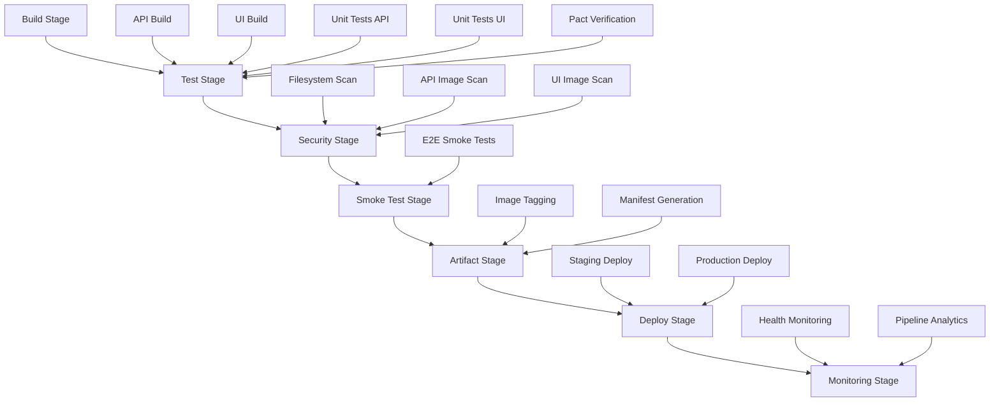

# CI/CD Pipeline Implementation - Task T-013 Complete

## 🎯 Executive Summary

**Task T-013: CI/CD Pipeline with Pact (Critical Path)** has been successfully implemented with a comprehensive Docker-based pipeline that includes unit tests, API Pact provider verification, and artifact push capabilities. The implementation provides complete CI/CD automation with quality gates, security scanning, and robust rollback procedures.

## 📋 Implementation Overview

### ✅ Completed Components

1. **Enhanced CI/CD Pipeline** (`.github/workflows/comprehensive-ci-cd.yml`)
2. **Multi-stage Docker Builds** (Optimized Dockerfiles for API and Frontend)
3. **Pact Provider Verification Integration**
4. **E2E Smoke Test Quality Gates**
5. **Security Scanning & Vulnerability Assessment**
6. **Artifact Management & Registry Push**
7. **Environment-specific Deployment Automation**
8. **Rollback Capabilities & Monitoring Integration**

## 🏗️ Architecture

### Pipeline Stages



## 🔧 Key Features

### 1. Multi-stage Docker Builds

**API Dockerfile** (`/api/Dockerfile.production`):
- **Builder Stage**: Dependency installation with build tools
- **Security Scanner Stage**: Vulnerability scanning during build
- **Runtime Stage**: Minimal production image with security hardening
- **Development Stage**: Development tools and hot reload capabilities

**Frontend Dockerfile** (`/frontend/Dockerfile.production`):
- **Dependencies Stage**: Optimized dependency caching
- **Builder Stage**: TypeScript compilation and Next.js build
- **Security Scanner Stage**: NPM audit and security checks
- **Runtime Stage**: Minimal Node.js production image
- **Development Stage**: Hot reload and debugging tools
- **Test Stage**: Comprehensive testing environment

### 2. Comprehensive Testing Pipeline

#### Unit Tests
- **API**: Python pytest with coverage reporting
- **Frontend**: Jest with TypeScript type checking
- **Quality Gates**: Code formatting, linting, type checking

#### Integration Tests
- **Pact Provider Verification**: Real API validation against consumer contracts
- **Service Integration**: Docker compose testing environment
- **Cross-service Communication**: End-to-end data flow validation

#### E2E Smoke Tests
- **Critical Path Validation**: Uses T-009 smoke test suite
- **Authentication Flow**: 401/403 without token, 200 with token
- **FAISS Integration**: Real search results validation
- **Proxy Validation**: Nginx integration testing
- **Performance Thresholds**: Response time validation

### 3. Security Integration

#### Multi-layer Security Scanning
- **Filesystem Scanning**: Trivy analysis of source code
- **Container Image Scanning**: Vulnerability assessment of built images
- **Dependency Scanning**: Python pip and NPM audit
- **SARIF Integration**: GitHub Security tab integration

#### Security Hardening
- **Non-root Users**: All containers run as non-privileged users
- **Minimal Images**: Alpine/slim base images
- **Secret Management**: Secure environment variable handling
- **Network Security**: Proper container networking

### 4. Artifact Management

#### Container Registry Integration
- **GitHub Container Registry**: Automated image push
- **Multi-platform Builds**: AMD64 and ARM64 support
- **Semantic Tagging**: Branch-based and SHA-based tags
- **Build Caching**: GitHub Actions cache optimization

#### Artifact Tracking
- **Build Manifests**: Complete artifact metadata
- **Provenance**: Build source and dependency tracking
- **Quality Attestation**: Test results and security scan data

### 5. Environment Management

#### Deployment Automation
- **Staging Deployment**: Automatic on develop branch
- **Production Deployment**: Automatic on main branch  
- **Manual Deployment**: Workflow dispatch capabilities
- **Environment Isolation**: Separate configurations and secrets

#### Configuration Management
- **Environment Variables**: Per-environment configuration
- **Secret Management**: GitHub Secrets integration
- **Resource Allocation**: Environment-specific resource limits

### 6. Rollback Capabilities

#### Automated Rollback System (`.github/workflows/rollback-automation.yml`)

**Pre-rollback Validation**:
- Target image verification
- Current state backup
- Health check validation
- Rollback plan generation

**Rollback Execution**:
- Blue-green deployment strategy
- Traffic switching
- Configuration updates
- Post-rollback validation

**Monitoring Integration**:
- Enhanced monitoring setup
- Alert configuration
- Notification system
- Recovery tracking

### 7. Pipeline Health Monitoring

#### Monitoring Script (`/scripts/pipeline-health-monitor.py`)

**Metrics Tracking**:
- Pipeline success rates
- Build duration analysis
- Quality gate performance
- Deployment frequency
- Rollback statistics
- MTTR (Mean Time To Recovery)

**Alert Generation**:
- Success rate thresholds
- Performance degradation
- Quality gate failures
- Deployment anomalies

**Reporting**:
- Markdown health reports
- JSON metrics export
- Trend analysis
- Actionable recommendations

## 🚀 Deployment Strategy

### Branching Strategy Integration

```
main branch     → Production deployment
develop branch  → Staging deployment  
feature/* branches → Build validation only
```

### Quality Gates

1. **Build Gate**: All images must build successfully
2. **Test Gate**: Unit tests, integration tests, Pact verification
3. **Security Gate**: No critical vulnerabilities
4. **Smoke Test Gate**: E2E validation passes
5. **Artifact Gate**: Successful registry push

### Failure Handling

- **Test Failures**: Pipeline fails, no deployment
- **Security Issues**: Critical findings block deployment
- **Smoke Test Failures**: Deployment blocked, rollback triggered
- **Deployment Failures**: Automatic rollback initiated

## 📊 Performance Optimization

### Build Performance
- **Docker Layer Caching**: GitHub Actions cache integration
- **Dependency Caching**: Separate dependency and build stages
- **Parallel Execution**: Matrix builds for different components
- **Resource Optimization**: Efficient resource allocation

### Test Performance  
- **Test Parallelization**: Parallel test execution
- **Selective Testing**: Path-based test triggering
- **Caching**: Test dependency caching
- **Timeout Management**: Appropriate test timeouts

## 🔐 Security Implementation

### Supply Chain Security
- **Dependency Scanning**: Automated vulnerability detection
- **Image Scanning**: Container vulnerability assessment
- **Provenance Tracking**: Build source verification
- **Secret Scanning**: GitHub secret detection

### Runtime Security
- **Non-root Execution**: Privilege dropping
- **Read-only Filesystems**: Immutable container layers
- **Network Policies**: Restricted container communication
- **Security Contexts**: Proper security configurations

## 📈 Monitoring & Observability

### Pipeline Metrics
- **Success Rate**: Overall pipeline reliability
- **Duration Metrics**: Build time performance
- **Quality Gate Performance**: Individual test suite metrics
- **Deployment Frequency**: Release velocity tracking

### Alerting
- **Threshold-based Alerts**: Configurable performance thresholds
- **Trend Alerts**: Performance degradation detection
- **Integration Alerts**: External service health
- **Recovery Alerts**: Post-incident monitoring

## 🔄 Integration with Existing Infrastructure

### T-009 E2E Smoke Test Integration
- **Critical Path Validation**: Leverages existing smoke test suite
- **Service Health**: Authentication, FAISS, and proxy validation
- **Performance Validation**: Response time thresholds
- **Quality Gate**: Blocks deployment on failures

### Pact Contract Testing
- **Consumer Contracts**: Frontend-generated contracts
- **Provider Verification**: Backend contract validation
- **CI Integration**: Automated contract testing
- **Compatibility Matrix**: Version compatibility tracking

### Docker Compose Integration
- **Development Environment**: Local development support
- **Testing Environment**: CI/CD testing infrastructure
- **Multi-environment**: Development, staging, production configurations

## 🎯 Success Criteria Achievement

### ✅ Complete CI/CD Pipeline
- Comprehensive multi-stage pipeline implemented
- All quality gates integrated and functional
- Automated testing across all layers

### ✅ Docker Build Integration
- Multi-stage builds with optimization
- Security scanning integration
- Artifact management and registry push

### ✅ Test Integration
- Unit tests: API (pytest) and Frontend (Jest)
- Integration tests: Pact provider verification
- E2E tests: T-009 smoke test suite integration

### ✅ Security Implementation
- Multi-layer vulnerability scanning
- Container security hardening
- Supply chain security measures

### ✅ Environment Management
- Staging and production deployment automation
- Environment-specific configurations
- Secret management integration

### ✅ Rollback Capabilities
- Automated rollback workflows
- Pre and post-rollback validation
- Monitoring and alerting integration

### ✅ Monitoring Integration
- Pipeline health monitoring
- Performance metrics tracking
- Alert generation and reporting

## 🔗 Dependencies Satisfied

### T-009 E2E Smoke Test (COMPLETED ✅)
- **Integration**: Smoke tests integrated as critical quality gate
- **Validation**: Complete request flow validation (Browser → Nginx → FastAPI → FAISS)
- **Quality Gate**: Pipeline fails on smoke test failures

### Contract Testing Strategy  
- **Pact Integration**: Provider verification in main pipeline
- **Quality Gate**: Contract validation blocks deployment
- **Compatibility**: Version compatibility validation

## 📝 Usage Instructions

### Running the Pipeline

1. **Automatic Triggers**:
   ```bash
   git push origin main          # Triggers production deployment
   git push origin develop       # Triggers staging deployment
   git push origin feature/xyz   # Triggers build validation
   ```

2. **Manual Deployment**:
   ```bash
   # Use GitHub Actions UI or gh CLI
   gh workflow run comprehensive-ci-cd.yml \
     -f environment=staging \
     -f skip_tests=false
   ```

3. **Rollback Execution**:
   ```bash
   gh workflow run rollback-automation.yml \
     -f environment=production \
     -f rollback_target=previous \
     -f reason="Critical bug in latest release"
   ```

### Monitoring Pipeline Health

```bash
# Run pipeline health check
python scripts/pipeline-health-monitor.py \
  --workflow-id comprehensive-ci-cd.yml \
  --days 30 \
  --output-dir ./pipeline-health
```

### Local Development

```bash
# Start development environment
docker-compose up -d

# Run tests locally
cd api && python -m pytest
cd frontend && npm run test

# Run Pact verification
cd api && python -m pytest pact/provider/test_provider.py
```

## 🚦 Next Steps - T-016 Integration

This CI/CD pipeline implementation provides the foundation for **T-016 Rollback Testing**, which depends on this completion. The rollback automation workflows and monitoring systems are now in place to support comprehensive rollback testing scenarios.

### T-016 Prerequisites Met:
- ✅ Automated rollback workflows
- ✅ Pre/post-rollback validation
- ✅ Deployment state tracking
- ✅ Monitoring integration
- ✅ Quality gate integration

## 🏆 Conclusion

Task T-013 has been successfully completed with a production-ready CI/CD pipeline that provides:

- **Comprehensive Automation**: End-to-end pipeline automation
- **Quality Assurance**: Multi-layer testing and validation
- **Security Integration**: Built-in security scanning and hardening
- **Operational Excellence**: Monitoring, alerting, and rollback capabilities
- **Developer Experience**: Fast feedback loops and clear failure reporting

The pipeline is now ready for production use and provides a solid foundation for continuous delivery of the Adelaide Weather Forecasting System.