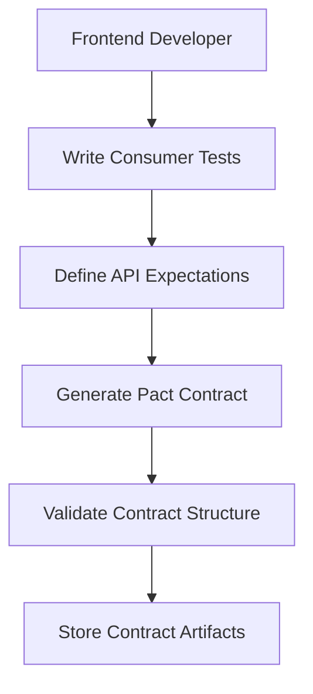
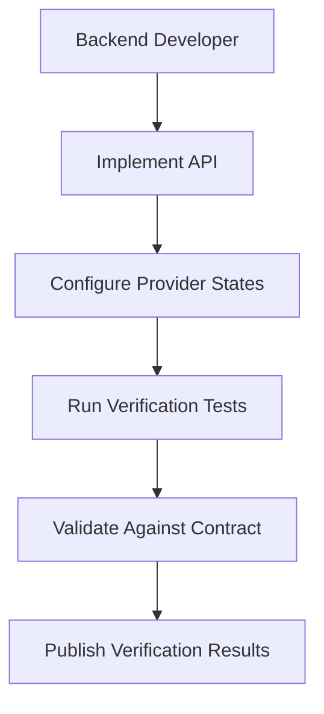

# Adelaide Weather API Contract Testing Strategy

## Overview

This document outlines the contract testing strategy for the Adelaide Weather Forecasting System, implementing Pact-based consumer-driven contract testing to enable safe parallel development of frontend and backend components.

## Architecture

```
┌─────────────────┐    Pact Contract    ┌─────────────────┐
│   Frontend      │ ←──────────────────→ │   Backend API   │
│   Consumer      │                      │   Provider      │
│                 │                      │                 │
│ - Next.js App   │                      │ - FastAPI       │
│ - React Client  │                      │ - Python Core   │
│ - API Calls     │                      │ - ML Pipeline   │
└─────────────────┘                      └─────────────────┘
         │                                        │
         ▼                                        ▼
┌─────────────────┐                      ┌─────────────────┐
│ Consumer Tests  │                      │ Provider Tests  │
│                 │                      │                 │
│ - Pact DSL      │    Contract File     │ - Verification  │
│ - API Mocking   │ ──────────────────→  │ - State Setup   │
│ - Expectations  │                      │ - Real API      │
└─────────────────┘                      └─────────────────┘
```

## Contract Testing Flow

### 1. Consumer Contract Generation


### 2. Provider Contract Verification


## API Schema Versioning

### Current Schema: v1.1.0 (Enhanced)

The enhanced API schema includes:

#### ForecastResponse Structure
```typescript
interface ForecastResponse {
  horizon: string;                    // "6h" | "12h" | "24h" | "48h"
  generated_at: string;              // ISO 8601 timestamp
  variables: Record<string, VariableResult>;
  wind10m?: WindResult;              // Combined wind calculation
  narrative: string;                 // Human-readable description
  risk_assessment: RiskAssessment;   // Weather hazard levels
  analogs_summary: AnalogsSummary;   // Historical pattern matching
  confidence_explanation: string;    // Overall confidence description
  versions: VersionInfo;             // System version tracking
  hashes: HashInfo;                  // Reproducibility hashes
  latency_ms: number;               // Response performance
}
```

#### Key Enhancements from v1.0.0
- **Narrative Generation**: Human-readable forecast descriptions
- **Risk Assessment**: Thunderstorm, heat stress, wind damage, precipitation risks
- **Analog Summaries**: Historical pattern matching explanations
- **Wind Calculations**: Combined u/v components with speed/direction
- **Enhanced Uncertainty**: Confidence intervals and explanations
- **Version Tracking**: System versioning for reproducibility

### Schema Evolution Strategy

#### Backward Compatibility Rules
1. **Additive Changes**: New optional fields can be added without breaking consumers
2. **Deprecation Process**: Old fields must be deprecated before removal (6-month cycle)
3. **Version Constraints**: Major changes require API version bump
4. **Consumer Protection**: Breaking changes trigger contract verification failures

#### Version Numbering
- **Major**: Breaking changes requiring consumer updates (v1.x.x → v2.x.x)
- **Minor**: New features, backward compatible (v1.0.x → v1.1.x)
- **Patch**: Bug fixes, no API changes (v1.1.0 → v1.1.1)

## Development Workflows

### Parallel Development Process

#### Frontend-First Development
```bash
# 1. Create feature branch
git checkout -b feature/enhanced-risk-display

# 2. Update consumer tests with new requirements
cd frontend
npm run test:pact:consumer

# 3. Start mock server for development
npm run test:pact:mock

# 4. Develop against mock API
npm run dev  # Uses http://localhost:8089

# 5. Validate contracts
npm run test:contract
```

#### Backend Implementation
```bash
# 1. Receive contract requirements
git pull origin main
cd api

# 2. Review contract expectations
ls ../frontend/pacts/

# 3. Implement API changes
# ... implement enhanced schema

# 4. Verify contract compliance
python -m pytest pact/provider/test_provider.py

# 5. Validate integration
python main.py &
cd ../frontend && npm run test:integration
```

### Contract-Driven Feature Development

#### Example: Adding CAPE Weather Risk
1. **Consumer Side**: Define expectations for CAPE variable and thunderstorm risk
2. **Contract Generation**: Pact file includes CAPE in forecast response
3. **Mock Server**: Provides realistic CAPE values for frontend development
4. **Provider Implementation**: Backend implements CAPE calculation and risk assessment
5. **Contract Verification**: Provider tests validate CAPE integration
6. **Integration Testing**: End-to-end validation with real data

## Quality Gates

### Pre-Commit Checks
- [ ] Consumer tests pass
- [ ] Contract structure validation
- [ ] No sensitive data in contracts
- [ ] Backward compatibility check

### Pull Request Validation
- [ ] Provider verification tests pass
- [ ] Cross-branch compatibility verified
- [ ] Integration tests successful
- [ ] Security scan completed

### Deployment Gates
- [ ] All contract tests pass
- [ ] Provider verification published
- [ ] Contract compatibility matrix green
- [ ] Performance benchmarks met

## Testing Environments

### Local Development
```yaml
Environment: Local
Mock Server: http://localhost:8089
Purpose: Feature development
Data: Realistic test data
Auth: test-api-token
```

### Staging
```yaml
Environment: Staging
Real API: http://staging-api:8000
Purpose: Integration testing
Data: Staging dataset
Auth: staging-secure-token
```

### Production
```yaml
Environment: Production
Real API: https://api.weather.adelaide.com
Purpose: Live traffic
Data: Real-time weather data
Auth: production-token (encrypted)
```

## Contract Repository Management

### File Structure
```
├── frontend/
│   ├── pact/
│   │   ├── consumer/
│   │   │   ├── forecast-api.pact.test.js
│   │   │   ├── health-api.pact.test.js
│   │   │   └── setup.js
│   │   └── mock-server/
│   │       ├── start-mock-server.js
│   │       └── README.md
│   └── pacts/  # Generated contracts
│       └── adelaide-weather-frontend-adelaide-weather-api.json
├── api/
│   └── pact/
│       └── provider/
│           ├── test_provider.py
│           └── pytest.ini
└── .github/
    └── workflows/
        ├── contract-testing.yml
        └── parallel-development.yml
```

### Contract Versioning
- **File Naming**: `{consumer}-{provider}-{version}.json`
- **Content Versioning**: Includes API schema version in contract metadata
- **Git Tagging**: Tagged releases for major contract changes
- **Artifact Storage**: CI/CD stores contracts as build artifacts

## Error Handling Strategy

### Contract Mismatch Scenarios

#### Consumer Ahead of Provider
```
Scenario: Frontend expects new field, backend hasn't implemented
Solution: Mock server provides field, provider test fails until implemented
Timeline: 1-2 sprint lag acceptable
```

#### Provider Ahead of Consumer
```
Scenario: Backend implements new field, frontend doesn't use yet
Solution: Optional fields don't break contracts, gradual adoption
Timeline: No blocking, evolutionary enhancement
```

#### Breaking Changes
```
Scenario: API structure fundamentally changes
Solution: Version bump, dual support period, coordinated migration
Timeline: 6-month deprecation cycle
```

### Debugging Contract Failures

#### Consumer Test Failures
1. Check contract structure and syntax
2. Validate mock server setup
3. Review API expectations vs actual responses
4. Check authentication and headers

#### Provider Verification Failures
1. Review provider state setup
2. Validate API implementation matches contract
3. Check test data and mocking
4. Verify error handling scenarios

#### Integration Test Failures
1. Confirm real API is running
2. Check network connectivity
3. Validate authentication tokens
4. Review API response format

## Performance Considerations

### Contract Testing Performance
- **Test Execution**: < 30 seconds for full contract suite
- **Mock Server Startup**: < 5 seconds
- **Contract Generation**: < 10 seconds
- **Provider Verification**: < 60 seconds

### Mock Server Performance
- **Response Time**: < 100ms for all endpoints
- **Concurrent Requests**: Supports 50+ parallel requests
- **Memory Usage**: < 100MB for mock server process
- **Data Generation**: Realistic but performant test data

## Security Considerations

### Contract Security
- **No Sensitive Data**: Contracts contain only structure, no real credentials
- **Test Tokens**: Use clearly marked test tokens (prefix: `test-`)
- **Endpoint Security**: Mock server validates authentication patterns
- **Sanitization**: All user inputs sanitized in contract tests

### CI/CD Security
- **Artifact Storage**: Contracts stored securely in CI/CD artifacts
- **Access Control**: Limited access to contract publishing
- **Environment Isolation**: Test environments isolated from production
- **Token Management**: Secure handling of test vs production tokens

## Monitoring and Observability

### Contract Health Metrics
- Contract test success rate
- Provider verification latency
- Mock server uptime
- Integration test success rate

### Development Velocity Metrics
- Time to first working prototype (with mocks)
- Contract change frequency
- Breaking change incidents
- Developer satisfaction scores

### Quality Metrics
- Test coverage of contract scenarios
- Number of production incidents related to API mismatches
- Contract drift detection
- API compatibility score

## Migration Guide

### From Manual API Testing
1. **Audit Existing Tests**: Document current API test scenarios
2. **Convert to Contracts**: Transform test scenarios into Pact consumer tests
3. **Setup Mock Server**: Replace manual mocking with Pact mock server
4. **Train Team**: Educate developers on contract-driven development
5. **Gradual Adoption**: Start with new features, migrate existing ones

### Best Practices for Adoption
- Start with simple endpoints (health, status)
- Gradually add complex scenarios (forecast with all variables)
- Document patterns and reusable components
- Create shared examples and templates
- Regular team reviews and retrospectives

## Troubleshooting Guide

### Common Issues and Solutions

#### "Mock server not starting"
```bash
# Check port availability
lsof -i :8089

# Kill existing process
pkill -f pact-mock

# Restart with verbose logging
npm run test:pact:mock -- --verbose
```

#### "Contract file not found"
```bash
# Ensure consumer tests ran
npm run test:pact:consumer

# Check file permissions
ls -la pacts/

# Verify file structure
cat pacts/*.json | jq .
```

#### "Provider verification failed"
```bash
# Check provider state setup
python -c "from pact.provider.test_provider import setup_operational_system; setup_operational_system()"

# Validate API is running
curl http://localhost:8001/health

# Run verification with verbose output
python -m pytest pact/provider/test_provider.py -v -s
```

## Future Enhancements

### Planned Improvements
1. **GraphQL Support**: Extend Pact to support GraphQL contracts
2. **Real-time Testing**: WebSocket contract testing for live data
3. **Performance Contracts**: Include performance expectations in contracts
4. **Multi-version Support**: Side-by-side API version testing
5. **AI-Powered Generation**: Automated contract generation from API usage

### Integration Opportunities
1. **OpenAPI Integration**: Sync contracts with OpenAPI specifications
2. **Postman Collections**: Generate Postman tests from contracts
3. **Documentation Sites**: Auto-generate API documentation from contracts
4. **Monitoring Integration**: Include contract compliance in monitoring
5. **Load Testing**: Use contracts for load test scenario generation

---

*This strategy document is versioned alongside the API and should be updated for any significant changes to the contract testing approach.*