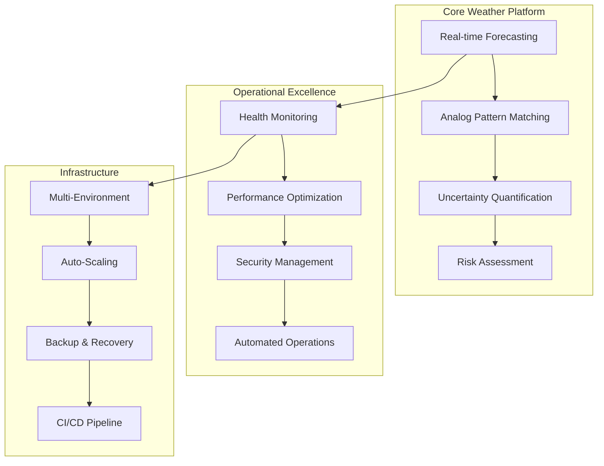
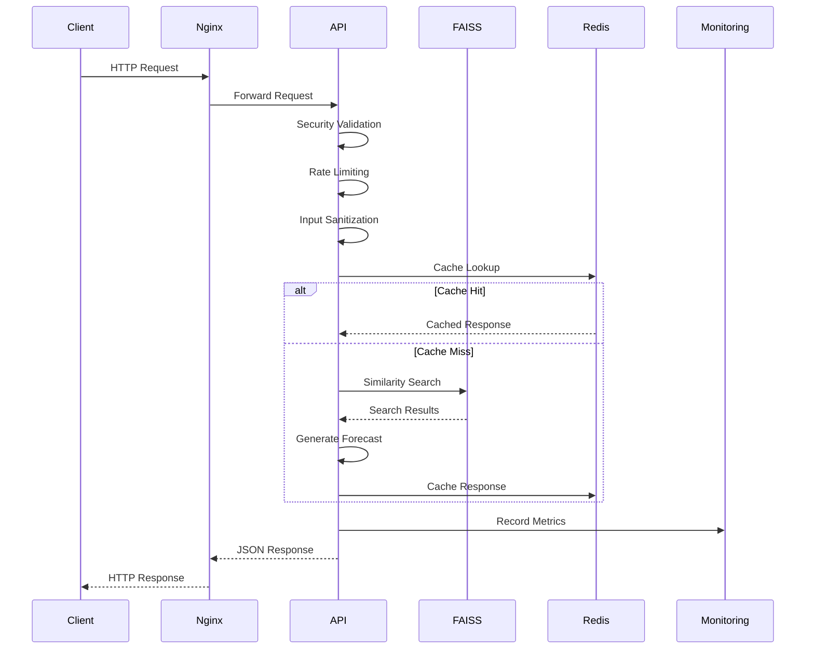
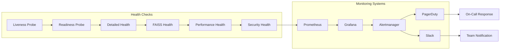
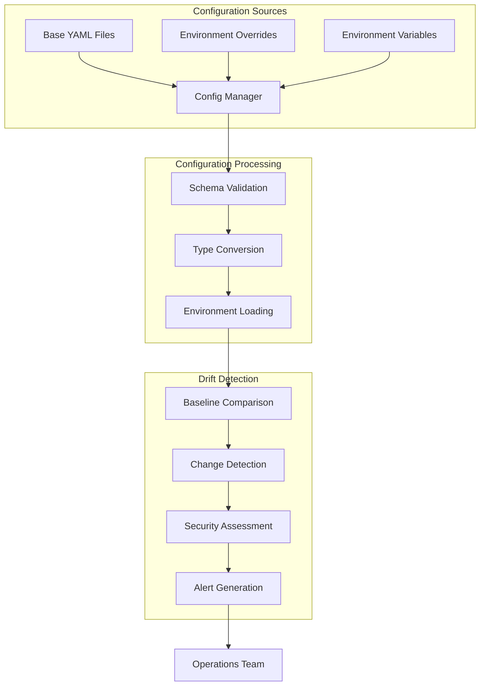
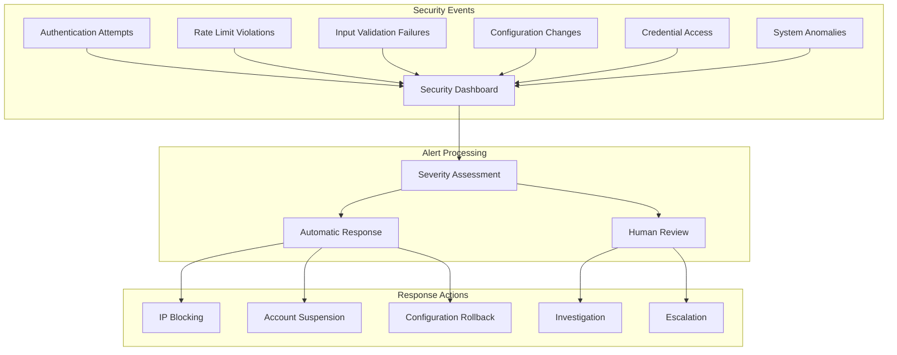
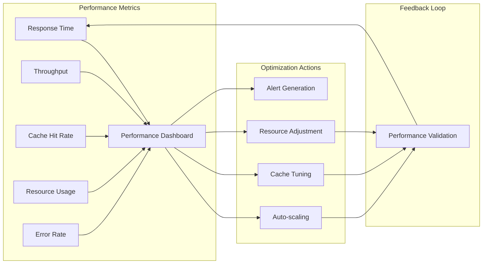
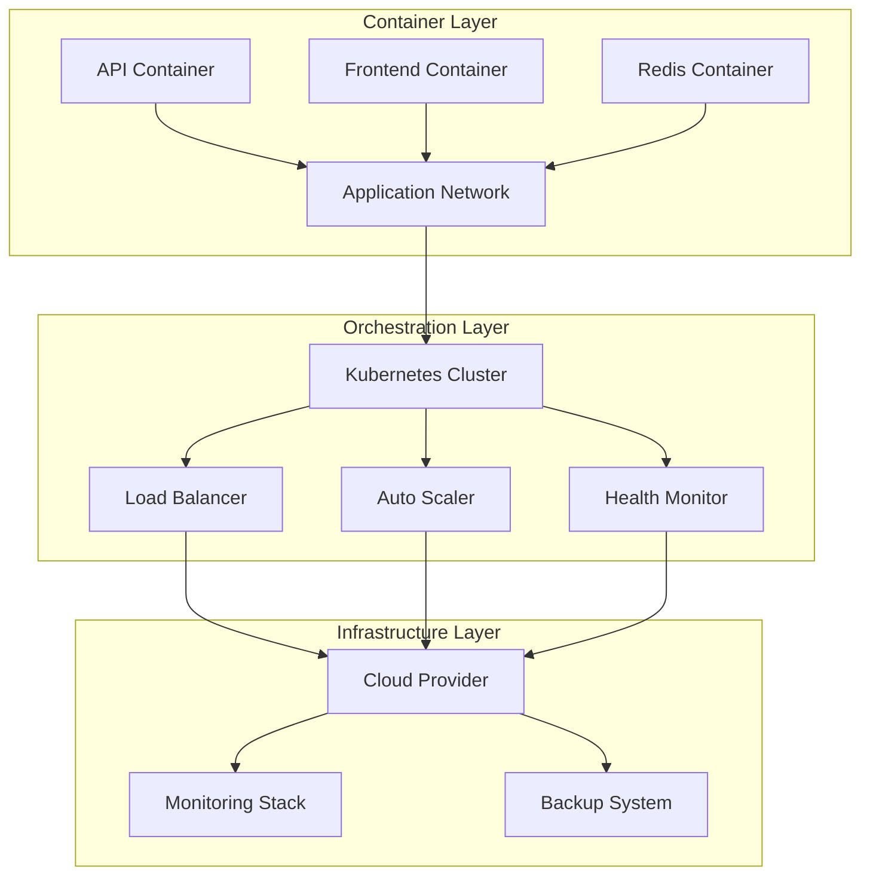
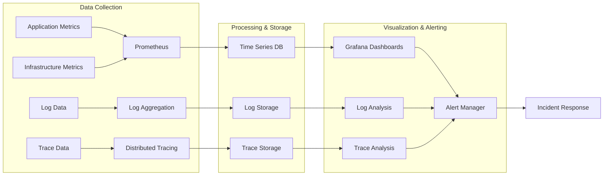
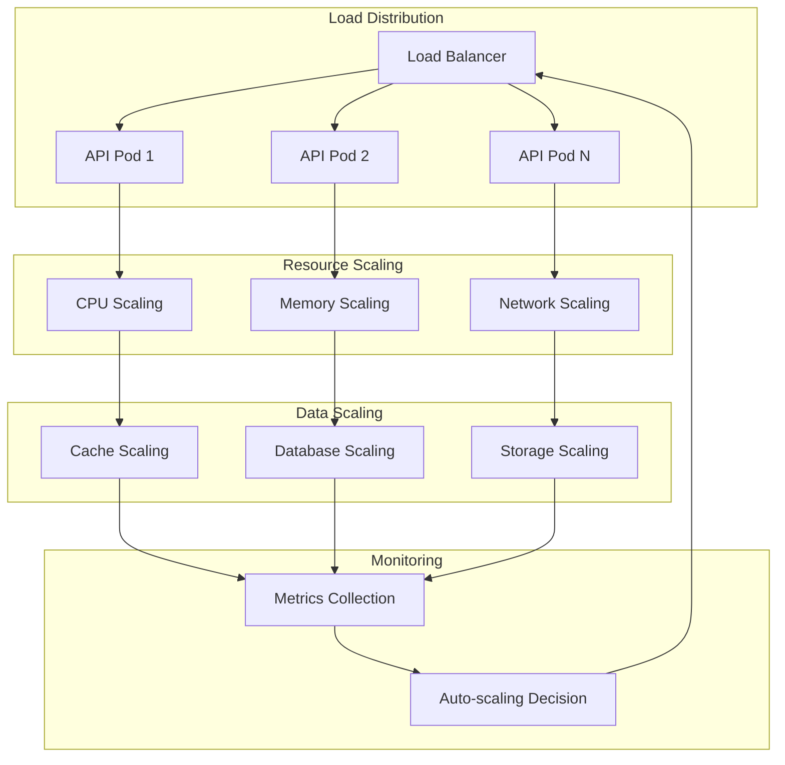

# Adelaide Weather Forecasting System - Architecture Documentation

## 📋 Table of Contents

1. [System Overview](#system-overview)
2. [Architecture Principles](#architecture-principles)
3. [System Components](#system-components)
4. [Data Flow Architecture](#data-flow-architecture)
5. [Security Architecture](#security-architecture)
6. [Performance Architecture](#performance-architecture)
7. [Deployment Architecture](#deployment-architecture)
8. [Monitoring and Observability](#monitoring-and-observability)
9. [Integration Patterns](#integration-patterns)
10. [Scalability and Resilience](#scalability-and-resilience)
11. [Technology Stack](#technology-stack)
12. [Design Decisions](#design-decisions)

## 🏗 System Overview

The Adelaide Weather Forecasting System is a production-ready, cloud-native weather forecasting platform that combines machine learning, high-performance similarity search, and comprehensive operational capabilities.

### Architecture Characteristics

- **Microservices Architecture**: Loosely coupled, independently deployable services
- **Cloud-Native Design**: Container-first with Kubernetes orchestration
- **Event-Driven**: Asynchronous processing with real-time monitoring
- **Security-First**: Enterprise-grade security at every layer
- **Observable**: Comprehensive monitoring, logging, and alerting
- **Resilient**: Self-healing with automated recovery procedures

### Core Capabilities



## 🎯 Architecture Principles

### 1. **Reliability First**
- 99.9% uptime target with automated failover
- Comprehensive backup and recovery procedures
- Circuit breakers and graceful degradation
- Self-healing infrastructure components

### 2. **Security by Design**
- Zero-trust security model
- End-to-end encryption for sensitive data
- Comprehensive audit trails
- Regular security assessments and updates

### 3. **Performance Optimized**
- Sub-150ms API response times
- High-performance FAISS similarity search
- Intelligent caching strategies
- Resource-aware auto-scaling

### 4. **Operational Excellence**
- Infrastructure as Code (IaC)
- GitOps deployment workflows
- Comprehensive monitoring and alerting
- Automated incident response

### 5. **Developer Experience**
- API-first design with OpenAPI specifications
- Comprehensive documentation and examples
- Local development environment parity
- Automated testing and quality gates

## 🔧 System Components

### Core Application Layer

#### 1. **FastAPI Backend Service** (`api/`)
```python
# Primary API service with comprehensive middleware stack
Components:
├── Main Application (main.py)
├── Forecast Adapter (forecast_adapter.py)
├── Variables Definition (variables.py)
├── Security Middleware (security_middleware.py)
├── Performance Middleware (performance_middleware.py)
├── Logging Configuration (logging_config.py)
└── Health Endpoints (enhanced_health_endpoints.py)

Features:
- Bearer token authentication with rotation
- Rate limiting with burst protection
- Input validation and sanitization
- Response compression and caching
- Structured logging with correlation IDs
- Comprehensive health monitoring
```

#### 2. **Next.js Frontend Application** (`frontend/`)
```typescript
// Modern React application with server-side rendering
Components:
├── API Routes (app/api/)
├── React Components (components/)
├── Client Libraries (lib/)
├── Type Definitions (types/)
├── Testing Framework (__tests__/)
└── Accessibility Features (components/AccessibilityProvider.tsx)

Features:
- Server-side API proxy integration
- Real-time metrics dashboard
- Accessibility-first design (WCAG 2.1 AA)
- Progressive Web App capabilities
- Comprehensive testing coverage
```

#### 3. **FAISS Search Engine** (`api/services/`)
```python
# High-performance similarity search with health monitoring
Components:
├── Enhanced Analog Search (enhanced_analog_search.py)
├── FAISS Health Monitoring (faiss_health_monitoring.py)
├── Analog Search Service (analog_search.py)
└── Base Search Implementation (__init__.py)

Features:
- Sub-millisecond search performance
- GPU/CPU automatic switching
- Real-time health monitoring
- Memory-aware resource management
- Lazy loading with demand-based initialization
```

### Infrastructure Layer

#### 4. **Core System Services** (`core/`)
```python
# Enterprise-grade system services and utilities
Services:
├── Environment Config Manager (environment_config_manager.py)
├── Secure Credential Manager (secure_credential_manager.py)
├── Configuration Drift Detector (config_drift_detector.py)
├── Startup Validation System (startup_validation_system.py)
├── Resource Monitor (resource_monitor.py)
├── Device Manager (device_manager.py)
└── Performance Optimizer (performance_optimizer.py)

Capabilities:
- Multi-environment configuration management
- AES-256-GCM credential encryption
- Real-time configuration drift detection
- Expert-validated startup procedures
- Resource usage monitoring and optimization
- GPU/CPU device management
```

#### 5. **Container Orchestration**
```yaml
# Docker Compose and Kubernetes deployment configurations
Container Services:
├── API Service (adelaide-weather-api)
├── Frontend Service (adelaide-weather-frontend)
├── Redis Cache (redis:7-alpine)
├── Nginx Reverse Proxy (nginx:alpine)
├── Prometheus Monitoring (prometheus)
├── Grafana Dashboards (grafana)
└── Alertmanager (alertmanager)

Orchestration:
- Docker Compose for local development
- Kubernetes with Helm charts for production
- Auto-scaling based on CPU and memory metrics
- Health checks and readiness probes
```

### Data Layer

#### 6. **FAISS Index Management** (`indices/`)
```bash
# Optimized similarity search indices
Index Structure:
├── 6h Horizon Indices
│   ├── faiss_6h_flatip.faiss (6,574 vectors)
│   └── faiss_6h_ivfpq.faiss (6,574 vectors)
├── 12h Horizon Indices
│   ├── faiss_12h_flatip.faiss (6,574 vectors)
│   └── faiss_12h_ivfpq.faiss (6,574 vectors)
├── 24h Horizon Indices
│   ├── faiss_24h_flatip.faiss (13,148 vectors)
│   └── faiss_24h_ivfpq.faiss (13,148 vectors)
└── 48h Horizon Indices
    ├── faiss_48h_flatip.faiss (13,148 vectors)
    └── faiss_48h_ivfpq.faiss (13,148 vectors)

Performance Characteristics:
- Average search time: <0.2ms
- Memory usage: ~270MB total
- Cache hit rate: >85%
- Index load time: <30 seconds
```

#### 7. **Configuration Management** (`configs/`)
```yaml
# Multi-environment configuration hierarchy
Configuration Structure:
├── Base Configuration
│   ├── data.yaml (data processing settings)
│   ├── model.yaml (ML model configuration)
│   └── training.yaml (training parameters)
└── Environment Overrides
    ├── development/ (development-specific settings)
    ├── staging/ (staging environment settings)
    └── production/ (production optimizations)

Features:
- Hierarchical configuration loading
- Environment variable override support
- Schema validation with error reporting
- Configuration drift detection
```

### Monitoring and Operations Layer

#### 8. **Observability Stack** (`monitoring/`)
```yaml
# Comprehensive monitoring and alerting infrastructure
Monitoring Components:
├── Prometheus (metrics collection and storage)
├── Grafana (visualization and dashboards)
├── Alertmanager (alert routing and management)
├── Blackbox Exporter (endpoint monitoring)
├── Node Exporter (system metrics)
└── Custom Weather Exporter (domain-specific metrics)

Key Dashboards:
- API Performance Monitoring
- FAISS Health and Performance
- Security Event Tracking
- Infrastructure Resource Usage
- Business Metrics and SLOs
```

#### 9. **CI/CD Pipeline** (`.github/workflows/`)
```yaml
# Automated deployment and quality assurance
Pipeline Stages:
├── Code Quality Checks
│   ├── Unit Testing (>90% coverage)
│   ├── Security Scanning (Bandit, Safety)
│   ├── Linting and Formatting
│   └── Type Checking
├── Integration Testing
│   ├── API Contract Testing (Pact)
│   ├── End-to-End Testing
│   ├── Performance Testing
│   └── Security Testing
├── Deployment Automation
│   ├── Multi-environment deployment
│   ├── Blue-green deployment strategy
│   ├── Automated rollback capabilities
│   └── Post-deployment validation
└── Operations Integration
    ├── Monitoring deployment
    ├── Alert configuration
    ├── Backup creation
    └── Documentation updates
```

## 🔄 Data Flow Architecture

### Request Processing Flow



### Health Monitoring Flow



### Configuration Management Flow



## 🔐 Security Architecture

### Security Layers

#### 1. **Network Security**
```yaml
Network Protection:
├── TLS 1.3 Encryption (all communications)
├── WAF (Web Application Firewall)
├── DDoS Protection and Rate Limiting
├── VPC/Network Segmentation
├── Private Subnets for Databases
└── Security Groups and NACLs
```

#### 2. **Application Security**
```python
# Multi-layered application security
Security Components:
├── Bearer Token Authentication
│   ├── Cryptographically secure generation
│   ├── Entropy validation (128+ bits)
│   ├── Regular rotation procedures
│   └── Audit trail maintenance
├── Input Validation and Sanitization
│   ├── Schema-based validation
│   ├── XSS prevention
│   ├── SQL injection protection
│   └── Path traversal prevention
├── Rate Limiting and Throttling
│   ├── Per-IP rate limiting
│   ├── Endpoint-specific limits
│   ├── Burst protection
│   └── Automatic blocking
└── Security Headers
    ├── HSTS (HTTP Strict Transport Security)
    ├── CSP (Content Security Policy)
    ├── X-Frame-Options
    └── X-Content-Type-Options
```

#### 3. **Data Security**
```python
# Comprehensive data protection
Data Protection:
├── Credential Management
│   ├── AES-256-GCM encryption
│   ├── PBKDF2 key derivation
│   ├── Environment isolation
│   └── Automatic expiration
├── Configuration Security
│   ├── Drift detection
│   ├── Baseline validation
│   ├── Change auditing
│   └── Rollback capabilities
├── Audit Logging
│   ├── Comprehensive event tracking
│   ├── Encrypted log storage
│   ├── Tamper detection
│   └── Compliance reporting
└── Backup Security
    ├── Encrypted backup storage
    ├── Access control
    ├── Integrity verification
    └── Secure restoration
```

#### 4. **Infrastructure Security**
```yaml
Infrastructure Protection:
├── Container Security
│   ├── Minimal base images
│   ├── Regular vulnerability scanning
│   ├── Non-root user execution
│   └── Resource limitations
├── Kubernetes Security
│   ├── RBAC (Role-Based Access Control)
│   ├── Network policies
│   ├── Pod security policies
│   └── Secret management
├── Cloud Security
│   ├── IAM roles and policies
│   ├── Encryption at rest
│   ├── VPC security
│   └── Compliance frameworks
└── Monitoring Security
    ├── Security event detection
    ├── Anomaly detection
    ├── Incident response automation
    └── Threat intelligence integration
```

### Security Monitoring



## ⚡ Performance Architecture

### Performance Optimization Stack

#### 1. **Caching Strategy**
```python
# Multi-tier caching for optimal performance
Caching Layers:
├── Application Cache (Redis)
│   ├── Response caching (300s TTL)
│   ├── FAISS result caching
│   ├── Configuration caching
│   └── Session data caching
├── HTTP Cache Headers
│   ├── ETags for conditional requests
│   ├── Cache-Control directives
│   ├── Vary headers for content negotiation
│   └── Compression cache
├── CDN Caching (production)
│   ├── Static asset caching
│   ├── API response caching
│   ├── Geographic distribution
│   └── Cache invalidation
└── Browser Caching
    ├── Service worker caching
    ├── Local storage optimization
    ├── Prefetching strategies
    └── Offline functionality
```

#### 2. **Compression and Optimization**
```python
# Intelligent compression and response optimization
Optimization Features:
├── Response Compression
│   ├── Gzip compression (>500 bytes)
│   ├── Brotli compression (production)
│   ├── Content-type detection
│   └── Client capability detection
├── Data Optimization
│   ├── JSON response minification
│   ├── Unnecessary field removal
│   ├── Numeric precision optimization
│   └── String compression
├── Network Optimization
│   ├── HTTP/2 support
│   ├── Connection keep-alive
│   ├── Request pipelining
│   └── Multiplexing
└── Resource Optimization
    ├── Memory pool management
    ├── CPU thread optimization
    ├── I/O async processing
    └── Garbage collection tuning
```

#### 3. **FAISS Performance Optimization**
```python
# High-performance similarity search optimization
FAISS Optimization:
├── Index Strategy
│   ├── FlatIP for exact search
│   ├── IVFPQ for approximate search
│   ├── Lazy loading for memory efficiency
│   └── Batch processing for throughput
├── Hardware Optimization
│   ├── GPU acceleration (when available)
│   ├── CPU multi-threading
│   ├── Memory mapping
│   └── NUMA awareness
├── Search Optimization
│   ├── Query preprocessing
│   ├── Result caching
│   ├── Search parallelization
│   └── Early termination
└── Memory Management
    ├── Memory pool allocation
    ├── Reference counting
    ├── Automatic cleanup
    └── Resource monitoring
```

### Performance Monitoring



## 🚀 Deployment Architecture

### Multi-Environment Strategy

#### 1. **Environment Hierarchy**
```yaml
Environment Progression:
├── Development
│   ├── Local Docker Compose
│   ├── Hot reload enabled
│   ├── Debug logging
│   ├── Relaxed security
│   └── Fast iteration cycle
├── Staging
│   ├── Production-like configuration
│   ├── Complete test suite execution
│   ├── Performance validation
│   ├── Security testing
│   └── Integration validation
└── Production
    ├── High availability setup
    ├── Auto-scaling enabled
    ├── Complete monitoring
    ├── Backup automation
    └── Disaster recovery
```

#### 2. **Deployment Strategies**
```yaml
Deployment Patterns:
├── Blue-Green Deployment
│   ├── Zero-downtime deployments
│   ├── Instant rollback capability
│   ├── Production traffic validation
│   └── A/B testing support
├── Rolling Updates
│   ├── Gradual instance replacement
│   ├── Health check validation
│   ├── Automatic rollback on failure
│   └── Resource efficiency
├── Canary Deployment
│   ├── Limited traffic exposure
│   ├── Gradual traffic increase
│   ├── Real-time monitoring
│   └── Risk mitigation
└── Feature Flags
    ├── Runtime feature toggling
    ├── Gradual feature rollout
    ├── Emergency feature disable
    └── User-based targeting
```

#### 3. **Infrastructure as Code**
```yaml
IaC Components:
├── Terraform Modules
│   ├── AWS/Azure/GCP resources
│   ├── Network configuration
│   ├── Security groups and policies
│   └── Database and storage
├── Helm Charts
│   ├── Kubernetes deployments
│   ├── Service configurations
│   ├── Ingress and networking
│   └── Monitoring stack
├── Docker Configurations
│   ├── Multi-stage builds
│   ├── Security hardening
│   ├── Performance optimization
│   └── Health check integration
└── CI/CD Pipelines
    ├── Automated testing
    ├── Security scanning
    ├── Quality gates
    └── Deployment automation
```

### Container Architecture



## 📊 Monitoring and Observability

### Observability Stack

#### 1. **Metrics Collection**
```yaml
Metrics Architecture:
├── Application Metrics (Prometheus)
│   ├── API performance metrics
│   ├── FAISS search metrics
│   ├── Security event metrics
│   ├── Business logic metrics
│   └── Custom domain metrics
├── Infrastructure Metrics
│   ├── Container resource usage
│   ├── Network performance
│   ├── Storage utilization
│   ├── Database performance
│   └── Load balancer metrics
├── System Metrics
│   ├── CPU and memory usage
│   ├── Disk I/O performance
│   ├── Network connectivity
│   ├── Process monitoring
│   └── System health
└── Business Metrics
    ├── User engagement
    ├── Feature utilization
    ├── Performance SLAs
    ├── Error rates
    └── Availability metrics
```

#### 2. **Logging Strategy**
```python
# Comprehensive logging with structured format
Logging Architecture:
├── Application Logs
│   ├── Structured JSON format
│   ├── Correlation ID tracking
│   ├── Security event logging
│   ├── Performance logging
│   └── Error context capture
├── Infrastructure Logs
│   ├── Container logs
│   ├── Kubernetes events
│   ├── Load balancer logs
│   ├── Network security logs
│   └── Database audit logs
├── Audit Logs
│   ├── Authentication events
│   ├── Authorization decisions
│   ├── Configuration changes
│   ├── Data access logs
│   └── Administrative actions
└── Security Logs
    ├── Threat detection events
    ├── Anomaly detection
    ├── Incident response logs
    ├── Compliance events
    └── Forensic data
```

#### 3. **Alerting Framework**
```yaml
Alert Management:
├── Critical Alerts (< 5 min response)
│   ├── System outage
│   ├── Security breach
│   ├── Data corruption
│   └── Performance SLA violation
├── High Priority (< 15 min response)
│   ├── Service degradation
│   ├── Error rate spike
│   ├── Resource exhaustion
│   └── Failed deployments
├── Medium Priority (< 2 hours)
│   ├── Performance issues
│   ├── Configuration drift
│   ├── Capacity warnings
│   └── Non-critical errors
└── Low Priority (next business day)
    ├── Maintenance notifications
    ├── Performance recommendations
    ├── Usage reports
    └── System updates
```

### Monitoring Flow



## 🔗 Integration Patterns

### API Integration

#### 1. **RESTful API Design**
```python
# Comprehensive REST API with OpenAPI specification
API Characteristics:
├── Resource-Based Design
│   ├── Clear resource identification
│   ├── HTTP method semantics
│   ├── Status code consistency
│   └── Pagination support
├── Content Negotiation
│   ├── JSON as primary format
│   ├── Compression support
│   ├── Version negotiation
│   └── Error format consistency
├── Security Integration
│   ├── Bearer token authentication
│   ├── CORS policy enforcement
│   ├── Rate limiting
│   └── Input validation
└── Documentation
    ├── OpenAPI 3.0 specification
    ├── Interactive documentation
    ├── Code examples
    └── SDK generation
```

#### 2. **Event-Driven Architecture**
```yaml
Event Processing:
├── Real-time Events
│   ├── Health status changes
│   ├── Configuration updates
│   ├── Security events
│   └── Performance alerts
├── Asynchronous Processing
│   ├── Background tasks
│   ├── Batch processing
│   ├── Data synchronization
│   └── Report generation
├── Event Storage
│   ├── Event sourcing
│   ├── Audit trail
│   ├── Replay capability
│   └── Analytics data
└── Integration Points
    ├── Webhook delivery
    ├── Message queuing
    ├── Stream processing
    └── External notifications
```

#### 3. **External Integrations**
```yaml
Integration Capabilities:
├── Monitoring Systems
│   ├── Prometheus/Grafana
│   ├── Datadog integration
│   ├── New Relic support
│   └── Custom metric exporters
├── Alerting Systems
│   ├── PagerDuty integration
│   ├── Slack notifications
│   ├── Email alerts
│   └── SMS notifications
├── Authentication Providers
│   ├── OAuth 2.0 support
│   ├── SAML integration
│   ├── LDAP/Active Directory
│   └── Multi-factor authentication
└── Data Sources
    ├── Weather data APIs
    ├── Machine learning models
    ├── Configuration databases
    └── Analytics platforms
```

## 🔄 Scalability and Resilience

### Horizontal Scaling

#### 1. **Auto-scaling Strategy**
```yaml
Scaling Configuration:
├── Kubernetes HPA (Horizontal Pod Autoscaler)
│   ├── CPU-based scaling (70% threshold)
│   ├── Memory-based scaling (80% threshold)
│   ├── Custom metrics scaling
│   └── Predictive scaling
├── Vertical Scaling
│   ├── Resource limit adjustment
│   ├── Performance-based tuning
│   ├── Memory optimization
│   └── CPU allocation
├── Load Balancing
│   ├── Application load balancer
│   ├── Session affinity support
│   ├── Health check integration
│   └── Geographic distribution
└── Database Scaling
    ├── Read replicas
    ├── Connection pooling
    ├── Query optimization
    └── Caching strategies
```

#### 2. **Resilience Patterns**
```python
# Comprehensive resilience and fault tolerance
Resilience Features:
├── Circuit Breaker Pattern
│   ├── Automatic failure detection
│   ├── Service isolation
│   ├── Graceful degradation
│   └── Automatic recovery
├── Retry Mechanisms
│   ├── Exponential backoff
│   ├── Jitter implementation
│   ├── Maximum retry limits
│   └── Circuit breaker integration
├── Timeout Management
│   ├── Request timeouts
│   ├── Connection timeouts
│   ├── Read timeouts
│   └── Write timeouts
├── Graceful Degradation
│   ├── Feature toggling
│   ├── Fallback responses
│   ├── Reduced functionality
│   └── Cache-based responses
└── Health Checks
    ├── Liveness probes
    ├── Readiness probes
    ├── Startup probes
    └── Custom health checks
```

#### 3. **Disaster Recovery**
```yaml
DR Strategy:
├── Backup Procedures
│   ├── Automated daily backups
│   ├── Cross-region replication
│   ├── Point-in-time recovery
│   └── Backup validation
├── Failover Mechanisms
│   ├── Automatic failover
│   ├── DNS-based routing
│   ├── Load balancer failover
│   └── Database failover
├── Recovery Procedures
│   ├── RTO: 15 minutes (critical)
│   ├── RPO: 1 hour (data loss)
│   ├── Automated recovery scripts
│   └── Manual override procedures
└── Testing and Validation
    ├── Monthly DR drills
    ├── Automated testing
    ├── Documentation updates
    └── Team training
```

### Performance Scaling



## 💻 Technology Stack

### Core Technologies

#### Backend Stack
```yaml
Programming Language: Python 3.9+
├── Framework: FastAPI 0.104+
├── Async Runtime: uvicorn with asyncio
├── Machine Learning: scikit-learn, numpy, pandas
├── Search Engine: FAISS 1.7.4+
├── Caching: Redis 7.0+
├── Security: cryptography, bcrypt, PyJWT
├── Monitoring: prometheus-client
└── Testing: pytest, pytest-asyncio
```

#### Frontend Stack
```yaml
Framework: Next.js 14+ (React 18)
├── Language: TypeScript 5.0+
├── Styling: Tailwind CSS
├── State Management: React Context + Hooks
├── Testing: Jest, React Testing Library
├── Accessibility: React Aria, WCAG 2.1 AA
├── Build Tool: Next.js built-in bundler
└── Quality: ESLint, Prettier, Husky
```

#### Infrastructure Stack
```yaml
Containerization: Docker 20.10+
├── Orchestration: Kubernetes 1.25+
├── Service Mesh: Istio (optional)
├── Package Manager: Helm 3.0+
├── Registry: Docker Hub / ECR / ACR
├── Networking: Nginx, Envoy
└── Storage: Persistent Volumes, S3/Blob
```

#### Monitoring Stack
```yaml
Metrics: Prometheus + Grafana
├── Logging: Structured JSON logging
├── Tracing: OpenTelemetry (optional)
├── Alerting: Alertmanager + PagerDuty
├── Uptime: Blackbox Exporter
├── APM: Custom instrumentation
└── Analytics: Custom dashboards
```

#### Development Stack
```yaml
CI/CD: GitHub Actions
├── Version Control: Git with GitFlow
├── Code Quality: SonarQube, CodeClimate
├── Security: Bandit, Safety, Trivy
├── Testing: Automated test suites
├── Documentation: MkDocs, OpenAPI
└── Project Management: GitHub Projects
```

### Cloud Provider Support

#### AWS Architecture
```yaml
Compute: EKS, EC2, Fargate
├── Storage: S3, EBS, EFS
├── Database: RDS, ElastiCache
├── Networking: VPC, ALB, CloudFront
├── Security: IAM, KMS, WAF
├── Monitoring: CloudWatch, X-Ray
└── DNS: Route 53
```

#### Azure Architecture
```yaml
Compute: AKS, Virtual Machines
├── Storage: Blob Storage, Managed Disks
├── Database: Azure Database, Redis Cache
├── Networking: VNet, Application Gateway
├── Security: Key Vault, Azure AD
├── Monitoring: Azure Monitor, App Insights
└── DNS: Azure DNS
```

#### GCP Architecture
```yaml
Compute: GKE, Compute Engine
├── Storage: Cloud Storage, Persistent Disks
├── Database: Cloud SQL, Memorystore
├── Networking: VPC, Load Balancer
├── Security: Cloud KMS, Cloud IAM
├── Monitoring: Cloud Monitoring
└── DNS: Cloud DNS
```

## 🎯 Design Decisions

### Architectural Decisions

#### 1. **Microservices vs Monolith**
```yaml
Decision: Modular Monolith with Microservices Readiness
Rationale:
├── Current Scale: Single team, focused domain
├── Complexity: Avoid distributed system complexity
├── Performance: Minimize network latency
├── Development: Faster iteration and testing
└── Evolution: Clear module boundaries for future splitting

Benefits:
├── Simplified deployment and operations
├── Reduced operational complexity
├── Better performance and consistency
├── Easier debugging and monitoring
└── Clear path to microservices migration
```

#### 2. **Database Strategy**
```yaml
Decision: In-Memory + File-Based Storage
Rationale:
├── Performance: Sub-millisecond search requirements
├── Consistency: Read-heavy workload pattern
├── Simplicity: Minimal data persistence needs
├── Cost: No complex database management
└── Scalability: Horizontal scaling capability

Trade-offs:
├── Data Durability: Backup and recovery procedures
├── Concurrency: File-based locking mechanisms
├── Consistency: Eventual consistency model
└── Complexity: Custom persistence layer
```

#### 3. **Security Architecture**
```yaml
Decision: Security-First Design
Rationale:
├── Compliance: Enterprise security requirements
├── Trust: Critical weather forecasting system
├── Audit: Complete audit trail requirements
├── Privacy: Sensitive configuration data
└── Resilience: Security incident prevention

Implementation:
├── Zero-trust network model
├── End-to-end encryption
├── Comprehensive audit logging
├── Regular security assessments
└── Automated security monitoring
```

#### 4. **Technology Choices**
```yaml
FastAPI Selection:
├── Performance: High-performance async framework
├── Documentation: Automatic OpenAPI generation
├── Type Safety: Pydantic integration
├── Ecosystem: Rich Python ML ecosystem
└── Development: Excellent developer experience

FAISS Selection:
├── Performance: Sub-millisecond search capability
├── Scalability: Handle millions of vectors
├── Flexibility: Multiple index types
├── Memory: Efficient memory usage
└── Integration: Python-native library

Next.js Selection:
├── Performance: Server-side rendering
├── Developer Experience: Excellent tooling
├── Ecosystem: Rich React ecosystem
├── SEO: Built-in SEO optimization
└── Production: Enterprise-ready platform
```

### Performance Decisions

#### 1. **Caching Strategy**
```yaml
Multi-Layer Caching:
├── Application Cache: Redis for API responses
├── Memory Cache: In-process caching for config
├── HTTP Cache: Browser and CDN caching
└── Index Cache: FAISS result caching

Cache Invalidation:
├── TTL-based: Automatic expiration
├── Event-based: Configuration changes
├── Manual: Administrative override
└── Pattern-based: Smart invalidation
```

#### 2. **Compression Strategy**
```yaml
Intelligent Compression:
├── Content-Type Aware: JSON, text, etc.
├── Size Threshold: >500 bytes minimum
├── Client Detection: Accept-Encoding header
├── Nginx Integration: Upstream compression
└── Performance Impact: Minimal CPU overhead
```

#### 3. **Resource Management**
```yaml
Resource Optimization:
├── Memory: Lazy loading, garbage collection
├── CPU: Multi-threading, async processing
├── Network: Connection pooling, compression
├── Storage: Efficient serialization
└── Monitoring: Real-time resource tracking
```

### Operational Decisions

#### 1. **Deployment Strategy**
```yaml
GitOps Approach:
├── Infrastructure as Code: Terraform
├── Configuration Management: Helm
├── CI/CD Pipeline: GitHub Actions
├── Environment Promotion: Automated
└── Rollback: One-click operations
```

#### 2. **Monitoring Strategy**
```yaml
Comprehensive Observability:
├── Metrics: Prometheus for quantitative data
├── Logging: Structured JSON for qualitative data
├── Tracing: Request flow understanding
├── Alerting: Proactive issue detection
└── Dashboards: Business and technical views
```

#### 3. **Backup and Recovery**
```yaml
Backup Strategy:
├── Frequency: Daily automated backups
├── Retention: 30-day retention policy
├── Testing: Monthly recovery validation
├── Location: Cross-region replication
└── Automation: Scripted procedures

Recovery Strategy:
├── RTO: 15 minutes for critical systems
├── RPO: 1 hour for data recovery
├── Automation: Automated recovery scripts
├── Testing: Regular disaster recovery drills
└── Documentation: Comprehensive runbooks
```

---

## 📚 Additional Resources

### Documentation Links
- [API Documentation](./docs/api/README.md)
- [Deployment Guide](./docs/DEPLOYMENT_COMPREHENSIVE.md)
- [Operational Runbooks](./docs/OPERATIONAL_RUNBOOKS.md)
- [Security Documentation](./docs/SECURE_CREDENTIAL_MANAGEMENT.md)
- [Performance Tuning](./api/PERFORMANCE_CONFIG.md)

### External References
- [FastAPI Documentation](https://fastapi.tiangolo.com/)
- [FAISS Documentation](https://faiss.ai/)
- [Kubernetes Documentation](https://kubernetes.io/docs/)
- [Prometheus Documentation](https://prometheus.io/docs/)
- [Next.js Documentation](https://nextjs.org/docs)

---

**Document Version:** 2.0.0  
**Last Updated:** 2025-11-05  
**Next Review:** 2025-12-05  
**Maintained By:** Architecture Team