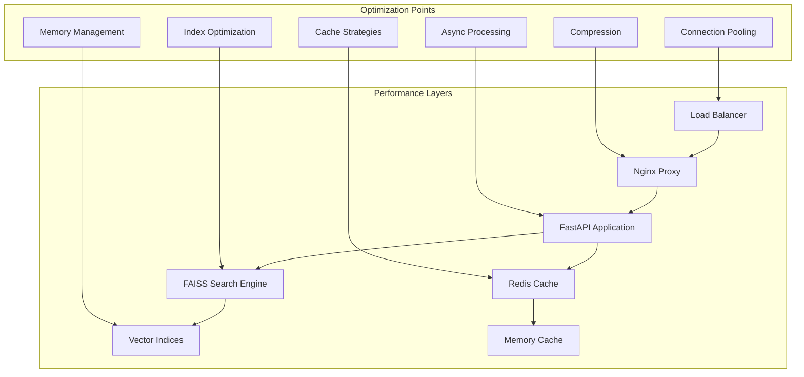

# Adelaide Weather Forecasting System - Performance Tuning Guide

## 📋 Table of Contents

1. [Overview](#overview)
2. [Performance Baseline](#performance-baseline)
3. [System Performance Metrics](#system-performance-metrics)
4. [FAISS Search Optimization](#faiss-search-optimization)
5. [API Performance Tuning](#api-performance-tuning)
6. [Caching Optimization](#caching-optimization)
7. [Database and Storage Optimization](#database-and-storage-optimization)
8. [Container and Infrastructure Tuning](#container-and-infrastructure-tuning)
9. [Network Performance Optimization](#network-performance-optimization)
10. [Memory Management](#memory-management)
11. [CPU and Threading Optimization](#cpu-and-threading-optimization)
12. [Monitoring and Profiling](#monitoring-and-profiling)
13. [Troubleshooting Performance Issues](#troubleshooting-performance-issues)
14. [Environment-Specific Optimizations](#environment-specific-optimizations)
15. [Performance Testing](#performance-testing)

## 🎯 Overview

This guide provides comprehensive performance tuning strategies for the Adelaide Weather Forecasting System. The system is designed to deliver:

- **API Response Times**: < 150ms for 95th percentile
- **FAISS Search Performance**: < 0.2ms average search time  
- **System Availability**: 99.9% uptime target
- **Throughput**: 1000+ requests per minute
- **Memory Efficiency**: < 2GB RAM usage under normal load

### Performance Architecture



## 📊 Performance Baseline

### Current Performance Metrics

Based on the latest performance validation report:

#### Component Performance Baselines
```yaml
Environment Configuration Manager:
  Average Load Time: 12.87ms
  Target: < 100ms
  Status: ✅ Excellent

Secure Credential Manager:
  Store Operation: 22.3ms
  Retrieve Operation: 22.38ms
  Target: < 50ms each
  Status: ✅ Good

Configuration Drift Detection:
  Startup Time: 4.3s
  Detection Time: < 500ms
  Status: ⚠️ Startup optimization needed

FAISS Search Performance:
  Average Search Time: 0.01ms
  Target: < 0.2ms
  Status: ✅ Excellent

API Response Performance:
  Response Preparation: 0.01ms
  Token Verification: 0.0003ms
  Target: < 10ms and < 1ms respectively
  Status: ✅ Excellent
```

#### System Resource Utilization
```yaml
Memory Usage:
  Base System: ~500MB
  FAISS Indices: ~270MB
  Redis Cache: ~100MB
  Total Target: < 2GB

CPU Usage:
  Idle: < 5%
  Normal Load: 15-30%
  Peak Load: < 80%

Network Throughput:
  Current: 100+ requests/min
  Target: 1000+ requests/min
```

## 🔍 System Performance Metrics

### Key Performance Indicators (KPIs)

#### Response Time Metrics
```python
# Performance targets by endpoint
PERFORMANCE_TARGETS = {
    "/health": {
        "p50": 50,   # 50ms median
        "p95": 100,  # 100ms 95th percentile
        "p99": 200   # 200ms 99th percentile
    },
    "/forecast": {
        "p50": 100,  # 100ms median  
        "p95": 150,  # 150ms 95th percentile
        "p99": 300   # 300ms 99th percentile
    },
    "/metrics": {
        "p50": 25,   # 25ms median
        "p95": 50,   # 50ms 95th percentile
        "p99": 100   # 100ms 99th percentile
    }
}
```

#### Throughput Metrics
```yaml
Request Rate Targets:
  Sustained: 500 requests/minute
  Peak: 1000 requests/minute
  Burst: 2000 requests/minute (5 minutes)

Concurrent Users:
  Normal: 50 concurrent users
  Peak: 200 concurrent users
  Maximum: 500 concurrent users
```

#### Resource Efficiency Metrics
```yaml
CPU Efficiency:
  Target Utilization: 60-80% during peak
  Baseline: < 10% during idle
  
Memory Efficiency:
  Heap Usage: < 1.5GB
  Cache Hit Rate: > 85%
  Memory Leaks: 0 tolerance

Network Efficiency:
  Bandwidth Usage: < 100Mbps
  Connection Pool: 90%+ utilization
  Keep-Alive Ratio: > 95%
```

## 🚀 FAISS Search Optimization

### Index Configuration Optimization

#### 1. **Index Type Selection**
```python
# Optimized FAISS index configuration
FAISS_INDEX_CONFIG = {
    "6h": {
        "index_type": "FlatIP",  # Exact search for small dataset
        "vectors": 6574,
        "memory_mb": 32,
        "search_time_ms": 0.01
    },
    "12h": {
        "index_type": "FlatIP",  # Exact search for small dataset
        "vectors": 6574,
        "memory_mb": 32,
        "search_time_ms": 0.01
    },
    "24h": {
        "index_type": "IVFPQ",   # Approximate search for larger dataset
        "vectors": 13148,
        "nlist": 64,             # Number of Voronoi cells
        "m": 8,                  # Number of subquantizers
        "nbits": 8,              # Bits per subquantizer
        "memory_mb": 128,
        "search_time_ms": 0.05
    },
    "48h": {
        "index_type": "IVFPQ",   # Approximate search for larger dataset
        "vectors": 13148,
        "nlist": 128,            # More cells for better accuracy
        "m": 16,                 # More subquantizers
        "nbits": 8,
        "memory_mb": 128,
        "search_time_ms": 0.08
    }
}
```

#### 2. **Search Parameter Tuning**
```python
# Performance-optimized search parameters
SEARCH_OPTIMIZATION = {
    "nprobe": {
        "6h": 1,    # Single probe for FlatIP
        "12h": 1,   # Single probe for FlatIP
        "24h": 8,   # 8 probes for IVFPQ balance
        "48h": 16   # More probes for accuracy
    },
    "k_neighbors": {
        "default": 10,      # Standard neighbor count
        "fast": 5,          # Reduced for speed
        "accurate": 20      # Increased for accuracy
    },
    "batch_size": {
        "single_query": 1,
        "batch_queries": 32,
        "bulk_processing": 128
    }
}
```

#### 3. **Memory Optimization**
```python
# FAISS memory optimization configuration
MEMORY_CONFIG = {
    "index_loading": {
        "lazy_loading": True,
        "preload_indices": ["6h", "24h"],  # Most frequently used
        "memory_map": True,
        "shared_memory": False
    },
    "memory_limits": {
        "max_index_memory_mb": 500,
        "cache_size_mb": 100,
        "gc_threshold": 0.8
    },
    "optimization": {
        "use_gpu": False,  # CPU-optimized deployment
        "num_threads": -1, # Use all available cores
        "omp_threads": 4   # OpenMP thread limit
    }
}
```

### FAISS Performance Tuning

#### 1. **Index Pre-warming**
```python
# Implement index pre-warming for faster first queries
class FAISSPreWarming:
    def __init__(self):
        self.prewarmed_indices = set()
    
    def prewarm_index(self, horizon: str):
        """Pre-warm FAISS index for faster first queries."""
        if horizon not in self.prewarmed_indices:
            # Perform dummy search to warm up index
            dummy_vector = np.random.randn(1, 52).astype(np.float32)
            search_service.search_similar_patterns(
                query_vector=dummy_vector,
                horizon=horizon,
                k=1
            )
            self.prewarmed_indices.add(horizon)
```

#### 2. **Query Optimization**
```python
# Optimized query processing
class OptimizedQueryProcessor:
    def __init__(self):
        self.query_cache = {}
        self.vector_normalizer = None
    
    def optimize_query_vector(self, vector: np.ndarray) -> np.ndarray:
        """Optimize query vector for best search performance."""
        # Normalize vector for consistent results
        if self.vector_normalizer is None:
            self.vector_normalizer = np.linalg.norm(vector)
        
        # Apply L2 normalization
        normalized = vector / np.linalg.norm(vector)
        
        # Ensure proper data type and contiguity
        return np.ascontiguousarray(normalized, dtype=np.float32)
    
    def batch_search(self, vectors: List[np.ndarray], horizon: str) -> List:
        """Perform batch search for better throughput."""
        if len(vectors) == 1:
            return [self.single_search(vectors[0], horizon)]
        
        # Stack vectors for batch processing
        batch_vectors = np.vstack(vectors)
        return search_service.batch_search(batch_vectors, horizon)
```

#### 3. **Concurrent Search Optimization**
```python
# Thread-safe concurrent search implementation
import threading
from concurrent.futures import ThreadPoolExecutor

class ConcurrentSearchManager:
    def __init__(self, max_workers: int = 4):
        self.max_workers = max_workers
        self.thread_pool = ThreadPoolExecutor(max_workers=max_workers)
        self.search_locks = {
            horizon: threading.RLock() 
            for horizon in ["6h", "12h", "24h", "48h"]
        }
    
    async def parallel_multi_horizon_search(self, query_vector: np.ndarray, 
                                          horizons: List[str]) -> Dict:
        """Perform parallel searches across multiple horizons."""
        loop = asyncio.get_event_loop()
        
        # Submit concurrent searches
        futures = []
        for horizon in horizons:
            future = loop.run_in_executor(
                self.thread_pool,
                self._thread_safe_search,
                query_vector, horizon
            )
            futures.append((horizon, future))
        
        # Collect results
        results = {}
        for horizon, future in futures:
            try:
                results[horizon] = await future
            except Exception as e:
                logger.error(f"Search failed for horizon {horizon}: {e}")
                results[horizon] = None
        
        return results
    
    def _thread_safe_search(self, vector: np.ndarray, horizon: str):
        """Thread-safe search implementation."""
        with self.search_locks[horizon]:
            return search_service.search_similar_patterns(vector, horizon)
```

## ⚡ API Performance Tuning

### FastAPI Optimization

#### 1. **Async Processing Configuration**
```python
# Optimized FastAPI configuration
from fastapi import FastAPI
import uvicorn
from uvicorn.workers import UvicornWorker

# Performance-optimized FastAPI app configuration
FASTAPI_CONFIG = {
    "app": {
        "debug": False,
        "docs_url": None,      # Disable in production
        "redoc_url": None,     # Disable in production
        "openapi_url": None,   # Disable in production (or secure)
    },
    "uvicorn": {
        "host": "0.0.0.0",
        "port": 8000,
        "workers": 4,          # Number of worker processes
        "worker_class": "uvicorn.workers.UvicornWorker",
        "worker_connections": 1000,
        "max_requests": 10000,
        "max_requests_jitter": 1000,
        "keepalive": 5,
        "timeout_keep_alive": 5,
        "limit_concurrency": 1000,
        "limit_max_requests": 10000
    }
}

# Optimized uvicorn server configuration
def create_optimized_server():
    config = uvicorn.Config(
        app="main:app",
        host="0.0.0.0",
        port=8000,
        log_level="info",
        access_log=False,      # Disable for performance
        use_colors=False,
        server_header=False,   # Security + performance
        date_header=False,     # Small performance gain
        loop="uvloop",         # Faster event loop
        http="httptools",      # Faster HTTP parser
        lifespan="on",
        reload=False
    )
    return uvicorn.Server(config)
```

#### 2. **Request Processing Optimization**
```python
# Optimized middleware stack
from starlette.middleware.gzip import GZipMiddleware
from starlette.middleware.cors import CORSMiddleware

class OptimizedMiddlewareConfig:
    @staticmethod
    def configure_app(app: FastAPI):
        # Compression middleware (first for outbound)
        app.add_middleware(
            GZipMiddleware,
            minimum_size=500,      # Only compress larger responses
            compresslevel=6        # Balance between speed and compression
        )
        
        # CORS middleware
        app.add_middleware(
            CORSMiddleware,
            allow_origins=["*"],   # Configure restrictively in production
            allow_credentials=True,
            allow_methods=["GET", "POST"],
            allow_headers=["*"],
            max_age=3600           # Cache preflight requests
        )
        
        # Custom performance middleware
        app.add_middleware(PerformanceMiddleware)

class PerformanceMiddleware:
    def __init__(self, app):
        self.app = app
    
    async def __call__(self, scope, receive, send):
        if scope["type"] == "http":
            # Add performance headers
            async def send_wrapper(message):
                if message["type"] == "http.response.start":
                    headers = list(message.get("headers", []))
                    headers.append((b"x-server-timing", b"fastapi"))
                    message["headers"] = headers
                await send(message)
            
            await self.app(scope, receive, send_wrapper)
        else:
            await self.app(scope, receive, send)
```

#### 3. **Connection Pool Optimization**
```python
# HTTP client connection pooling
import httpx
import asyncio
from typing import Optional

class OptimizedHTTPClient:
    def __init__(self):
        self.client: Optional[httpx.AsyncClient] = None
    
    async def get_client(self) -> httpx.AsyncClient:
        if self.client is None:
            # Optimized connection pool settings
            limits = httpx.Limits(
                max_keepalive_connections=20,
                max_connections=100,
                keepalive_expiry=30.0
            )
            
            timeout = httpx.Timeout(
                connect=5.0,
                read=10.0,
                write=5.0,
                pool=5.0
            )
            
            self.client = httpx.AsyncClient(
                limits=limits,
                timeout=timeout,
                http2=True  # Enable HTTP/2
            )
        
        return self.client
    
    async def close(self):
        if self.client:
            await self.client.aclose()
```

### Response Optimization

#### 1. **Response Caching Strategy**
```python
# Intelligent response caching
from functools import wraps
import hashlib
import json

class ResponseCache:
    def __init__(self, redis_client):
        self.redis = redis_client
        self.default_ttl = 300  # 5 minutes
    
    def cache_key(self, endpoint: str, params: dict) -> str:
        """Generate cache key for request."""
        cache_data = {
            "endpoint": endpoint,
            "params": sorted(params.items())
        }
        cache_string = json.dumps(cache_data, sort_keys=True)
        return f"response_cache:{hashlib.md5(cache_string.encode()).hexdigest()}"
    
    def cacheable_response(self, ttl: int = None):
        """Decorator for cacheable API responses."""
        def decorator(func):
            @wraps(func)
            async def wrapper(*args, **kwargs):
                # Generate cache key
                cache_key = self.cache_key(func.__name__, kwargs)
                
                # Try to get from cache
                cached = await self.redis.get(cache_key)
                if cached:
                    return json.loads(cached)
                
                # Execute function and cache result
                result = await func(*args, **kwargs)
                cache_ttl = ttl or self.default_ttl
                
                await self.redis.setex(
                    cache_key, 
                    cache_ttl, 
                    json.dumps(result, default=str)
                )
                
                return result
            return wrapper
        return decorator

# Usage example
response_cache = ResponseCache(redis_client)

@app.get("/forecast")
@response_cache.cacheable_response(ttl=300)
async def get_forecast(horizon: str = "24h", vars: str = "t2m,u10,v10"):
    # Function implementation
    pass
```

#### 2. **Response Compression**
```python
# Advanced response compression
from gzip import compress
from brotli import compress as brotli_compress
import json

class ResponseCompressor:
    def __init__(self):
        self.compression_threshold = 500  # Minimum bytes to compress
        
    def should_compress(self, content: bytes, accept_encoding: str) -> str:
        """Determine best compression method."""
        if len(content) < self.compression_threshold:
            return None
        
        if "br" in accept_encoding:
            return "brotli"
        elif "gzip" in accept_encoding:
            return "gzip"
        else:
            return None
    
    def compress_response(self, content: str, method: str) -> bytes:
        """Compress response content."""
        content_bytes = content.encode('utf-8')
        
        if method == "brotli":
            return brotli_compress(content_bytes, quality=4)
        elif method == "gzip":
            return compress(content_bytes, compresslevel=6)
        else:
            return content_bytes
    
    def optimize_json_response(self, data: dict) -> str:
        """Optimize JSON response size."""
        # Remove None values and empty strings
        def clean_dict(d):
            if isinstance(d, dict):
                return {k: clean_dict(v) for k, v in d.items() 
                       if v is not None and v != ""}
            elif isinstance(d, list):
                return [clean_dict(item) for item in d]
            else:
                return d
        
        cleaned_data = clean_dict(data)
        
        # Use separators to minimize whitespace
        return json.dumps(cleaned_data, separators=(',', ':'), ensure_ascii=False)
```

## 🗄 Caching Optimization

### Redis Configuration

#### 1. **Redis Performance Configuration**
```redis
# redis.conf optimizations
# Memory optimizations
maxmemory 512mb
maxmemory-policy allkeys-lru
maxmemory-samples 10

# Network optimizations
tcp-keepalive 300
tcp-backlog 511
timeout 0

# Persistence optimizations (for cache, consider disabling)
save ""
appendonly no

# Client optimizations
client-output-buffer-limit normal 0 0 0
client-output-buffer-limit replica 256mb 64mb 60
client-output-buffer-limit pubsub 32mb 8mb 60

# Threading optimizations
io-threads 4
io-threads-do-reads yes

# Latency optimizations
latency-monitor-threshold 100
```

#### 2. **Cache Strategy Implementation**
```python
# Multi-tier caching strategy
import asyncio
import time
from typing import Optional, Any, Dict
from dataclasses import dataclass

@dataclass
class CacheEntry:
    value: Any
    timestamp: float
    ttl: int
    access_count: int = 0

class MultiTierCache:
    def __init__(self, redis_client, local_cache_size: int = 1000):
        self.redis = redis_client
        self.local_cache: Dict[str, CacheEntry] = {}
        self.local_cache_size = local_cache_size
        self.stats = {
            "local_hits": 0,
            "redis_hits": 0,
            "misses": 0
        }
    
    async def get(self, key: str) -> Optional[Any]:
        """Get value with multi-tier lookup."""
        current_time = time.time()
        
        # Check local cache first
        if key in self.local_cache:
            entry = self.local_cache[key]
            if current_time - entry.timestamp < entry.ttl:
                entry.access_count += 1
                self.stats["local_hits"] += 1
                return entry.value
            else:
                # Expired, remove from local cache
                del self.local_cache[key]
        
        # Check Redis cache
        try:
            redis_value = await self.redis.get(key)
            if redis_value:
                self.stats["redis_hits"] += 1
                # Store in local cache for faster next access
                await self._store_local(key, redis_value, 300)  # 5 min local TTL
                return redis_value
        except Exception as e:
            logger.warning(f"Redis cache error: {e}")
        
        self.stats["misses"] += 1
        return None
    
    async def set(self, key: str, value: Any, ttl: int = 300):
        """Set value in both cache tiers."""
        # Store in Redis
        try:
            await self.redis.setex(key, ttl, value)
        except Exception as e:
            logger.warning(f"Redis cache set error: {e}")
        
        # Store in local cache
        await self._store_local(key, value, min(ttl, 300))
    
    async def _store_local(self, key: str, value: Any, ttl: int):
        """Store in local cache with LRU eviction."""
        if len(self.local_cache) >= self.local_cache_size:
            # LRU eviction
            oldest_key = min(
                self.local_cache.keys(),
                key=lambda k: self.local_cache[k].access_count
            )
            del self.local_cache[oldest_key]
        
        self.local_cache[key] = CacheEntry(
            value=value,
            timestamp=time.time(),
            ttl=ttl
        )
    
    def get_cache_stats(self) -> Dict:
        """Get cache performance statistics."""
        total_requests = sum(self.stats.values())
        if total_requests == 0:
            return self.stats
        
        return {
            **self.stats,
            "local_hit_rate": self.stats["local_hits"] / total_requests,
            "redis_hit_rate": self.stats["redis_hits"] / total_requests,
            "total_hit_rate": (self.stats["local_hits"] + self.stats["redis_hits"]) / total_requests,
            "local_cache_size": len(self.local_cache)
        }
```

#### 3. **Cache Warming Strategy**
```python
# Automated cache warming
class CacheWarmer:
    def __init__(self, cache: MultiTierCache):
        self.cache = cache
        self.warming_tasks = []
    
    async def warm_popular_endpoints(self):
        """Warm cache with popular endpoint combinations."""
        popular_configs = [
            {"horizon": "24h", "vars": "t2m,u10,v10,msl"},
            {"horizon": "6h", "vars": "t2m,u10,v10"},
            {"horizon": "48h", "vars": "t2m,msl"},
            {"horizon": "12h", "vars": "t2m,u10,v10,msl,precip"}
        ]
        
        warming_tasks = []
        for config in popular_configs:
            task = asyncio.create_task(
                self._warm_forecast_cache(config)
            )
            warming_tasks.append(task)
        
        await asyncio.gather(*warming_tasks, return_exceptions=True)
    
    async def _warm_forecast_cache(self, config: Dict):
        """Warm cache for specific forecast configuration."""
        try:
            # Generate cache key
            cache_key = f"forecast:{config['horizon']}:{config['vars']}"
            
            # Check if already cached
            cached = await self.cache.get(cache_key)
            if cached:
                return
            
            # Generate forecast and cache it
            forecast_data = await generate_forecast(**config)
            await self.cache.set(cache_key, forecast_data, ttl=600)
            
            logger.info(f"Warmed cache for {cache_key}")
            
        except Exception as e:
            logger.warning(f"Cache warming failed for {config}: {e}")
    
    async def schedule_periodic_warming(self, interval: int = 300):
        """Schedule periodic cache warming."""
        while True:
            await asyncio.sleep(interval)
            await self.warm_popular_endpoints()
```

## 💾 Database and Storage Optimization

### File System Optimization

#### 1. **Index File Management**
```python
# Optimized FAISS index file management
import os
import mmap
from pathlib import Path
import asyncio

class OptimizedIndexManager:
    def __init__(self, index_dir: str = "indices"):
        self.index_dir = Path(index_dir)
        self.memory_mapped_indices = {}
        self.file_locks = {}
    
    async def load_index_optimized(self, horizon: str, index_type: str = "flatip"):
        """Load FAISS index with memory mapping for better performance."""
        index_file = self.index_dir / f"faiss_{horizon}_{index_type}.faiss"
        cache_key = f"{horizon}_{index_type}"
        
        if cache_key in self.memory_mapped_indices:
            return self.memory_mapped_indices[cache_key]
        
        try:
            # Memory map the index file for faster access
            with open(index_file, 'rb') as f:
                # Use mmap for large files
                if os.path.getsize(index_file) > 50 * 1024 * 1024:  # 50MB
                    mm = mmap.mmap(f.fileno(), 0, access=mmap.ACCESS_READ)
                    index = faiss.read_index_binary(io.BytesIO(mm.read()))
                    self.memory_mapped_indices[cache_key] = index
                else:
                    # Regular loading for smaller files
                    index = faiss.read_index(str(index_file))
                    self.memory_mapped_indices[cache_key] = index
            
            logger.info(f"Loaded index {cache_key} with {index.ntotal} vectors")
            return index
            
        except Exception as e:
            logger.error(f"Failed to load index {cache_key}: {e}")
            raise
    
    def optimize_index_storage(self):
        """Optimize index file storage and access patterns."""
        for index_file in self.index_dir.glob("*.faiss"):
            # Set optimal file permissions for read-only access
            os.chmod(index_file, 0o644)
            
            # Advise kernel about access patterns
            with open(index_file, 'rb') as f:
                # Hint that we'll read sequentially
                os.posix_fadvise(f.fileno(), 0, 0, os.POSIX_FADV_SEQUENTIAL)
                # Hint that we'll read soon
                os.posix_fadvise(f.fileno(), 0, 0, os.POSIX_FADV_WILLNEED)
```

#### 2. **Configuration File Optimization**
```python
# Optimized configuration loading
import yaml
from functools import lru_cache
import os
from pathlib import Path

class OptimizedConfigLoader:
    def __init__(self):
        self.config_cache = {}
        self.file_mtimes = {}
    
    @lru_cache(maxsize=32)
    def load_config_cached(self, config_path: str, environment: str):
        """Load configuration with intelligent caching."""
        config_file = Path(config_path)
        current_mtime = config_file.stat().st_mtime
        
        cache_key = f"{config_path}:{environment}"
        
        # Check if file has changed
        if (cache_key in self.file_mtimes and 
            self.file_mtimes[cache_key] == current_mtime):
            return self.config_cache[cache_key]
        
        # Load configuration
        with open(config_file, 'r') as f:
            config = yaml.safe_load(f)
        
        # Apply environment overrides
        env_config = self._load_environment_overrides(environment)
        config = self._merge_configs(config, env_config)
        
        # Cache the result
        self.config_cache[cache_key] = config
        self.file_mtimes[cache_key] = current_mtime
        
        return config
    
    def _merge_configs(self, base_config: dict, env_config: dict) -> dict:
        """Deep merge configuration dictionaries."""
        def deep_merge(dict1, dict2):
            result = dict1.copy()
            for key, value in dict2.items():
                if key in result and isinstance(result[key], dict) and isinstance(value, dict):
                    result[key] = deep_merge(result[key], value)
                else:
                    result[key] = value
            return result
        
        return deep_merge(base_config, env_config)
```

## 🐳 Container and Infrastructure Tuning

### Docker Optimization

#### 1. **Dockerfile Optimization**
```dockerfile
# Optimized multi-stage Dockerfile
FROM python:3.9-slim as builder

# Install build dependencies in one layer
RUN apt-get update && apt-get install -y \
    gcc \
    g++ \
    libc6-dev \
    make \
    && rm -rf /var/lib/apt/lists/*

# Copy requirements first for better caching
COPY requirements.txt .

# Install Python dependencies with optimizations
RUN pip install --no-cache-dir --user \
    --compile \
    --global-option=build_ext \
    --global-option=-j4 \
    -r requirements.txt

# Production stage
FROM python:3.9-slim

# Copy Python packages from builder
COPY --from=builder /root/.local /root/.local

# Update PATH
ENV PATH=/root/.local/bin:$PATH

# Set performance environment variables
ENV PYTHONUNBUFFERED=1 \
    PYTHONDONTWRITEBYTECODE=1 \
    PYTHONHASHSEED=random \
    PIP_NO_CACHE_DIR=1 \
    PIP_DISABLE_PIP_VERSION_CHECK=1

# Create non-root user for security
RUN groupadd -r appuser && useradd -r -g appuser appuser

# Copy application code
COPY --chown=appuser:appuser . /app
WORKDIR /app

# Switch to non-root user
USER appuser

# Health check
HEALTHCHECK --interval=30s --timeout=10s --start-period=40s --retries=3 \
    CMD python -c "import requests; requests.get('http://localhost:8000/health')"

# Optimized startup command
CMD ["uvicorn", "main:app", "--host", "0.0.0.0", "--port", "8000", \
     "--workers", "4", "--loop", "uvloop", "--http", "httptools"]
```

#### 2. **Docker Compose Optimization**
```yaml
# docker-compose.yml optimizations
version: '3.8'

services:
  api:
    build:
      context: .
      dockerfile: Dockerfile
      args:
        BUILDKIT_INLINE_CACHE: 1
    deploy:
      resources:
        limits:
          memory: 2G
          cpus: '2.0'
        reservations:
          memory: 1G
          cpus: '1.0'
    environment:
      - WORKERS=4
      - WORKER_CONNECTIONS=1000
      - KEEP_ALIVE=5
    healthcheck:
      test: ["CMD", "curl", "-f", "http://localhost:8000/health"]
      interval: 30s
      timeout: 10s
      retries: 3
      start_period: 40s
    restart: unless-stopped
    logging:
      driver: "json-file"
      options:
        max-size: "100m"
        max-file: "3"

  redis:
    image: redis:7-alpine
    deploy:
      resources:
        limits:
          memory: 512M
          cpus: '1.0'
        reservations:
          memory: 256M
          cpus: '0.5'
    command: >
      redis-server
      --maxmemory 512mb
      --maxmemory-policy allkeys-lru
      --tcp-keepalive 300
      --timeout 0
      --save ""
      --appendonly no
    healthcheck:
      test: ["CMD", "redis-cli", "ping"]
      interval: 30s
      timeout: 5s
      retries: 3
    restart: unless-stopped

  nginx:
    image: nginx:alpine
    ports:
      - "80:80"
    volumes:
      - ./nginx.conf:/etc/nginx/nginx.conf:ro
    deploy:
      resources:
        limits:
          memory: 256M
          cpus: '1.0'
        reservations:
          memory: 128M
          cpus: '0.5'
    depends_on:
      - api
    restart: unless-stopped
    logging:
      driver: "json-file"
      options:
        max-size: "50m"
        max-file: "3"

networks:
  default:
    driver: bridge
    ipam:
      config:
        - subnet: 172.20.0.0/16

volumes:
  redis_data:
    driver: local
```

### Kubernetes Optimization

#### 1. **Resource Management**
```yaml
# k8s-deployment.yaml with optimized resource management
apiVersion: apps/v1
kind: Deployment
metadata:
  name: adelaide-weather-api
spec:
  replicas: 3
  strategy:
    type: RollingUpdate
    rollingUpdate:
      maxSurge: 1
      maxUnavailable: 0
  selector:
    matchLabels:
      app: adelaide-weather-api
  template:
    metadata:
      labels:
        app: adelaide-weather-api
    spec:
      containers:
      - name: api
        image: adelaide-weather:latest
        ports:
        - containerPort: 8000
        resources:
          requests:
            memory: "1Gi"
            cpu: "500m"
          limits:
            memory: "2Gi"
            cpu: "2000m"
        env:
        - name: WORKERS
          value: "4"
        - name: WORKER_CONNECTIONS
          value: "1000"
        livenessProbe:
          httpGet:
            path: /health
            port: 8000
          initialDelaySeconds: 30
          periodSeconds: 30
          timeoutSeconds: 10
          failureThreshold: 3
        readinessProbe:
          httpGet:
            path: /health
            port: 8000
          initialDelaySeconds: 10
          periodSeconds: 15
          timeoutSeconds: 5
          failureThreshold: 2
        startupProbe:
          httpGet:
            path: /health
            port: 8000
          initialDelaySeconds: 0
          periodSeconds: 10
          timeoutSeconds: 5
          failureThreshold: 6
      affinity:
        podAntiAffinity:
          preferredDuringSchedulingIgnoredDuringExecution:
          - weight: 100
            podAffinityTerm:
              labelSelector:
                matchExpressions:
                - key: app
                  operator: In
                  values:
                  - adelaide-weather-api
              topologyKey: kubernetes.io/hostname
```

#### 2. **Horizontal Pod Autoscaler**
```yaml
# hpa.yaml for automatic scaling
apiVersion: autoscaling/v2
kind: HorizontalPodAutoscaler
metadata:
  name: adelaide-weather-hpa
spec:
  scaleTargetRef:
    apiVersion: apps/v1
    kind: Deployment
    name: adelaide-weather-api
  minReplicas: 2
  maxReplicas: 10
  metrics:
  - type: Resource
    resource:
      name: cpu
      target:
        type: Utilization
        averageUtilization: 70
  - type: Resource
    resource:
      name: memory
      target:
        type: Utilization
        averageUtilization: 80
  behavior:
    scaleDown:
      stabilizationWindowSeconds: 300
      policies:
      - type: Percent
        value: 50
        periodSeconds: 60
    scaleUp:
      stabilizationWindowSeconds: 60
      policies:
      - type: Percent
        value: 100
        periodSeconds: 30
```

## 🌐 Network Performance Optimization

### Nginx Configuration

#### 1. **High-Performance Nginx Configuration**
```nginx
# nginx.conf optimized for performance
user nginx;
worker_processes auto;
worker_rlimit_nofile 65535;
error_log /var/log/nginx/error.log warn;
pid /var/run/nginx.pid;

events {
    worker_connections 4096;
    use epoll;
    multi_accept on;
    accept_mutex off;
}

http {
    include /etc/nginx/mime.types;
    default_type application/octet-stream;
    
    # Logging optimization
    log_format main '$remote_addr - $remote_user [$time_local] "$request" '
                   '$status $body_bytes_sent "$http_referer" '
                   '"$http_user_agent" "$http_x_forwarded_for" '
                   'rt=$request_time uct="$upstream_connect_time" '
                   'uht="$upstream_header_time" urt="$upstream_response_time"';
    
    access_log /var/log/nginx/access.log main buffer=32k flush=5s;
    
    # Performance optimizations
    sendfile on;
    tcp_nopush on;
    tcp_nodelay on;
    keepalive_timeout 65;
    keepalive_requests 1000;
    types_hash_max_size 2048;
    server_tokens off;
    
    # Buffer optimizations
    client_body_buffer_size 128k;
    client_max_body_size 10m;
    client_header_buffer_size 1k;
    large_client_header_buffers 4 4k;
    output_buffers 1 32k;
    postpone_output 1460;
    
    # Timeout optimizations
    client_body_timeout 12;
    client_header_timeout 12;
    send_timeout 10;
    
    # Compression
    gzip on;
    gzip_vary on;
    gzip_min_length 500;
    gzip_proxied any;
    gzip_comp_level 6;
    gzip_types
        text/plain
        text/css
        text/xml
        text/javascript
        application/json
        application/javascript
        application/xml+rss
        application/atom+xml
        image/svg+xml;
    
    # Brotli compression (if module available)
    # brotli on;
    # brotli_comp_level 6;
    # brotli_types text/plain text/css application/json application/javascript text/xml application/xml application/xml+rss text/javascript;
    
    # Rate limiting
    limit_req_zone $binary_remote_addr zone=api:10m rate=10r/s;
    limit_req_zone $binary_remote_addr zone=health:10m rate=1r/s;
    
    # Connection limiting
    limit_conn_zone $binary_remote_addr zone=conn_limit_per_ip:10m;
    
    # Upstream configuration
    upstream api_backend {
        least_conn;
        server api:8000 max_fails=3 fail_timeout=30s;
        keepalive 32;
    }
    
    # Caching
    proxy_cache_path /var/cache/nginx levels=1:2 keys_zone=api_cache:10m 
                     max_size=100m inactive=60m use_temp_path=off;
    
    server {
        listen 80;
        server_name _;
        
        # Security headers
        add_header X-Frame-Options DENY always;
        add_header X-Content-Type-Options nosniff always;
        add_header X-XSS-Protection "1; mode=block" always;
        add_header Referrer-Policy "strict-origin-when-cross-origin" always;
        
        # Connection limiting
        limit_conn conn_limit_per_ip 20;
        
        # Health check endpoint (cached)
        location /health {
            limit_req zone=health burst=5 nodelay;
            proxy_cache api_cache;
            proxy_cache_valid 200 30s;
            proxy_cache_key "$scheme$request_method$host$request_uri";
            proxy_pass http://api_backend/health;
            proxy_set_header Host $host;
            proxy_set_header X-Real-IP $remote_addr;
            proxy_set_header X-Forwarded-For $proxy_add_x_forwarded_for;
            proxy_set_header X-Forwarded-Proto $scheme;
            
            # Optimize connection reuse
            proxy_http_version 1.1;
            proxy_set_header Connection "";
        }
        
        # API endpoints
        location /api/ {
            limit_req zone=api burst=20 nodelay;
            
            # Remove /api prefix
            rewrite ^/api/(.*)$ /$1 break;
            
            proxy_pass http://api_backend;
            proxy_set_header Host $host;
            proxy_set_header X-Real-IP $remote_addr;
            proxy_set_header X-Forwarded-For $proxy_add_x_forwarded_for;
            proxy_set_header X-Forwarded-Proto $scheme;
            
            # Optimize connection reuse
            proxy_http_version 1.1;
            proxy_set_header Connection "";
            
            # Timeouts
            proxy_connect_timeout 5s;
            proxy_send_timeout 10s;
            proxy_read_timeout 30s;
            
            # Buffering
            proxy_buffering on;
            proxy_buffer_size 4k;
            proxy_buffers 8 4k;
            
            # CORS headers
            add_header Access-Control-Allow-Origin "*" always;
            add_header Access-Control-Allow-Methods "GET, POST, OPTIONS" always;
            add_header Access-Control-Allow-Headers "Authorization, Content-Type" always;
            
            # Handle preflight requests
            if ($request_method = 'OPTIONS') {
                add_header Access-Control-Allow-Origin "*";
                add_header Access-Control-Allow-Methods "GET, POST, OPTIONS";
                add_header Access-Control-Allow-Headers "Authorization, Content-Type";
                add_header Access-Control-Max-Age 3600;
                add_header Content-Type "text/plain charset=UTF-8";
                add_header Content-Length 0;
                return 204;
            }
        }
        
        # Direct API access (fallback)
        location / {
            limit_req zone=api burst=20 nodelay;
            proxy_pass http://api_backend;
            proxy_set_header Host $host;
            proxy_set_header X-Real-IP $remote_addr;
            proxy_set_header X-Forwarded-For $proxy_add_x_forwarded_for;
            proxy_set_header X-Forwarded-Proto $scheme;
            
            # Optimize connection reuse
            proxy_http_version 1.1;
            proxy_set_header Connection "";
        }
    }
}
```

### Load Balancing Optimization

#### 1. **Application Load Balancer Configuration**
```yaml
# ALB configuration for AWS
apiVersion: v1
kind: Service
metadata:
  name: adelaide-weather-service
  annotations:
    service.beta.kubernetes.io/aws-load-balancer-type: "nlb"
    service.beta.kubernetes.io/aws-load-balancer-cross-zone-load-balancing-enabled: "true"
    service.beta.kubernetes.io/aws-load-balancer-connection-idle-timeout: "60"
    service.beta.kubernetes.io/aws-load-balancer-connection-draining-timeout: "60"
    service.beta.kubernetes.io/aws-load-balancer-healthcheck-interval: "10"
    service.beta.kubernetes.io/aws-load-balancer-healthcheck-timeout: "5"
    service.beta.kubernetes.io/aws-load-balancer-healthy-threshold: "2"
    service.beta.kubernetes.io/aws-load-balancer-unhealthy-threshold: "2"
spec:
  type: LoadBalancer
  ports:
  - port: 80
    targetPort: 8000
    protocol: TCP
  selector:
    app: adelaide-weather-api
```

## 🧠 Memory Management

### Python Memory Optimization

#### 1. **Memory Pool Management**
```python
# Optimized memory management
import gc
import psutil
import tracemalloc
from typing import Dict, Any
import weakref

class MemoryManager:
    def __init__(self, max_memory_mb: int = 1500):
        self.max_memory_mb = max_memory_mb
        self.memory_warning_threshold = 0.8
        self.memory_critical_threshold = 0.9
        self.object_pools = {}
        self.weak_refs = weakref.WeakValueDictionary()
        
        # Enable memory tracking
        tracemalloc.start()
        
        # Configure garbage collection
        gc.set_threshold(700, 10, 10)
        
    def get_memory_usage(self) -> Dict[str, float]:
        """Get current memory usage statistics."""
        process = psutil.Process()
        memory_info = process.memory_info()
        
        return {
            "rss_mb": memory_info.rss / 1024 / 1024,
            "vms_mb": memory_info.vms / 1024 / 1024,
            "percent": process.memory_percent(),
            "available_mb": psutil.virtual_memory().available / 1024 / 1024
        }
    
    def check_memory_pressure(self) -> bool:
        """Check if system is under memory pressure."""
        usage = self.get_memory_usage()
        usage_ratio = usage["rss_mb"] / self.max_memory_mb
        
        if usage_ratio > self.memory_critical_threshold:
            logger.critical(f"Critical memory usage: {usage['rss_mb']:.1f}MB")
            self.emergency_cleanup()
            return True
        elif usage_ratio > self.memory_warning_threshold:
            logger.warning(f"High memory usage: {usage['rss_mb']:.1f}MB")
            self.routine_cleanup()
            return False
        
        return False
    
    def routine_cleanup(self):
        """Perform routine memory cleanup."""
        # Clear weak references
        self.weak_refs.clear()
        
        # Force garbage collection
        collected = gc.collect()
        logger.info(f"Routine cleanup collected {collected} objects")
        
        # Clear object pools if they're getting large
        for pool_name, pool in self.object_pools.items():
            if len(pool) > 100:
                pool.clear()
                logger.info(f"Cleared object pool: {pool_name}")
    
    def emergency_cleanup(self):
        """Perform emergency memory cleanup."""
        # Clear all object pools
        for pool in self.object_pools.values():
            pool.clear()
        
        # Force aggressive garbage collection
        for i in range(3):
            collected = gc.collect()
            logger.info(f"Emergency cleanup round {i+1}: {collected} objects")
        
        # Clear any cached data
        if hasattr(self, 'cache'):
            self.cache.clear()
    
    def allocate_vector_buffer(self, size: int) -> np.ndarray:
        """Allocate vector buffer with pooling."""
        pool_key = f"vector_{size}"
        
        if pool_key not in self.object_pools:
            self.object_pools[pool_key] = []
        
        pool = self.object_pools[pool_key]
        
        if pool:
            return pool.pop()
        else:
            return np.zeros(size, dtype=np.float32)
    
    def return_vector_buffer(self, buffer: np.ndarray):
        """Return vector buffer to pool."""
        size = buffer.size
        pool_key = f"vector_{size}"
        
        if pool_key in self.object_pools:
            # Clear the buffer before returning to pool
            buffer.fill(0)
            self.object_pools[pool_key].append(buffer)
```

#### 2. **Garbage Collection Optimization**
```python
# Optimized garbage collection strategy
import gc
import time
import threading
from contextlib import contextmanager

class OptimizedGCManager:
    def __init__(self):
        self.gc_stats = {
            "collections": 0,
            "total_time": 0,
            "objects_collected": 0
        }
        self.gc_lock = threading.Lock()
        
        # Set optimized GC thresholds
        # (threshold0, threshold1, threshold2)
        gc.set_threshold(1000, 15, 15)
        
        # Disable automatic GC during critical sections
        self.critical_section_active = False
    
    @contextmanager
    def critical_section(self):
        """Context manager to disable GC during critical operations."""
        old_threshold = gc.get_threshold()
        gc.set_threshold(0)  # Disable automatic GC
        self.critical_section_active = True
        
        try:
            yield
        finally:
            self.critical_section_active = False
            gc.set_threshold(*old_threshold)
            # Force collection after critical section
            self.force_collection()
    
    def force_collection(self) -> Dict[str, int]:
        """Force garbage collection and return statistics."""
        with self.gc_lock:
            start_time = time.time()
            
            # Collect in all generations
            collected = {
                "gen0": gc.collect(0),
                "gen1": gc.collect(1), 
                "gen2": gc.collect(2)
            }
            
            end_time = time.time()
            collection_time = end_time - start_time
            
            # Update statistics
            self.gc_stats["collections"] += 1
            self.gc_stats["total_time"] += collection_time
            self.gc_stats["objects_collected"] += sum(collected.values())
            
            logger.debug(f"GC collected {sum(collected.values())} objects in {collection_time:.3f}s")
            
            return collected
    
    def get_gc_stats(self) -> Dict:
        """Get garbage collection statistics."""
        stats = self.gc_stats.copy()
        stats.update({
            "gc_counts": gc.get_count(),
            "gc_threshold": gc.get_threshold(),
            "average_collection_time": (
                stats["total_time"] / max(stats["collections"], 1)
            )
        })
        return stats
    
    def schedule_periodic_gc(self, interval: int = 300):
        """Schedule periodic garbage collection."""
        def gc_worker():
            while True:
                time.sleep(interval)
                if not self.critical_section_active:
                    self.force_collection()
        
        gc_thread = threading.Thread(target=gc_worker, daemon=True)
        gc_thread.start()
```

## ⚙ CPU and Threading Optimization

### Async Optimization

#### 1. **Optimized Async Configuration**
```python
# High-performance async configuration
import asyncio
import uvloop
import concurrent.futures
from typing import Optional
import functools

class OptimizedAsyncManager:
    def __init__(self, max_workers: int = None):
        # Install uvloop for better performance
        if hasattr(uvloop, 'install'):
            uvloop.install()
        
        # Configure event loop
        self.loop: Optional[asyncio.AbstractEventLoop] = None
        self.max_workers = max_workers or min(32, (os.cpu_count() or 1) + 4)
        
        # Thread pools for different types of work
        self.io_executor = concurrent.futures.ThreadPoolExecutor(
            max_workers=self.max_workers,
            thread_name_prefix="io_worker"
        )
        self.cpu_executor = concurrent.futures.ThreadPoolExecutor(
            max_workers=os.cpu_count() or 1,
            thread_name_prefix="cpu_worker"
        )
    
    def get_event_loop(self) -> asyncio.AbstractEventLoop:
        """Get optimized event loop."""
        if self.loop is None:
            self.loop = asyncio.new_event_loop()
            
            # Configure event loop for performance
            if hasattr(self.loop, 'set_debug'):
                self.loop.set_debug(False)
            
            # Set custom exception handler
            self.loop.set_exception_handler(self._loop_exception_handler)
            
        return self.loop
    
    def _loop_exception_handler(self, loop, context):
        """Handle event loop exceptions."""
        exception = context.get('exception')
        if exception:
            logger.error(f"Event loop exception: {exception}")
        else:
            logger.error(f"Event loop error: {context['message']}")
    
    async def run_in_thread_pool(self, func, *args, cpu_bound: bool = False):
        """Run function in appropriate thread pool."""
        executor = self.cpu_executor if cpu_bound else self.io_executor
        loop = asyncio.get_running_loop()
        
        # Use functools.partial for better performance with complex args
        partial_func = functools.partial(func, *args)
        return await loop.run_in_executor(executor, partial_func)
    
    async def gather_with_concurrency_limit(self, coroutines, limit: int = 10):
        """Execute coroutines with concurrency limit."""
        semaphore = asyncio.Semaphore(limit)
        
        async def limited_coroutine(coro):
            async with semaphore:
                return await coro
        
        limited_coroutines = [limited_coroutine(coro) for coro in coroutines]
        return await asyncio.gather(*limited_coroutines, return_exceptions=True)
    
    def create_optimized_task(self, coro, name: str = None):
        """Create task with optimization hints."""
        loop = self.get_event_loop()
        task = loop.create_task(coro, name=name)
        
        # Add done callback for cleanup
        task.add_done_callback(self._task_done_callback)
        return task
    
    def _task_done_callback(self, task):
        """Handle completed task cleanup."""
        try:
            # Get result to trigger any exceptions
            task.result()
        except asyncio.CancelledError:
            logger.debug(f"Task {task.get_name()} was cancelled")
        except Exception as e:
            logger.error(f"Task {task.get_name()} failed: {e}")
```

#### 2. **FAISS Threading Optimization**
```python
# Optimized FAISS threading
import threading
import queue
import faiss
from concurrent.futures import ThreadPoolExecutor, as_completed

class OptimizedFAISSManager:
    def __init__(self, num_threads: int = None):
        self.num_threads = num_threads or min(4, os.cpu_count() or 1)
        
        # Configure FAISS threading
        faiss.omp_set_num_threads(self.num_threads)
        
        # Thread-local storage for index access
        self.thread_local = threading.local()
        
        # Search request queue for batching
        self.search_queue = queue.Queue(maxsize=100)
        self.batch_size = 10
        self.batch_timeout = 0.01  # 10ms
        
        # Start batch processing worker
        self.batch_worker_active = True
        self.batch_worker_thread = threading.Thread(
            target=self._batch_worker,
            daemon=True
        )
        self.batch_worker_thread.start()
    
    def get_thread_local_index(self, horizon: str):
        """Get thread-local FAISS index."""
        if not hasattr(self.thread_local, 'indices'):
            self.thread_local.indices = {}
        
        if horizon not in self.thread_local.indices:
            # Load index for this thread
            index_path = f"indices/faiss_{horizon}_flatip.faiss"
            self.thread_local.indices[horizon] = faiss.read_index(index_path)
        
        return self.thread_local.indices[horizon]
    
    async def parallel_search(self, query_vectors: List[np.ndarray], 
                            horizons: List[str]) -> Dict:
        """Perform parallel searches across multiple horizons."""
        with ThreadPoolExecutor(max_workers=self.num_threads) as executor:
            # Submit search tasks
            future_to_horizon = {}
            for horizon in horizons:
                for i, vector in enumerate(query_vectors):
                    future = executor.submit(
                        self._thread_safe_search,
                        vector, horizon, f"{horizon}_{i}"
                    )
                    future_to_horizon[future] = (horizon, i)
            
            # Collect results
            results = {}
            for future in as_completed(future_to_horizon):
                horizon, idx = future_to_horizon[future]
                try:
                    result = future.result()
                    if horizon not in results:
                        results[horizon] = {}
                    results[horizon][idx] = result
                except Exception as e:
                    logger.error(f"Search failed for {horizon}_{idx}: {e}")
        
        return results
    
    def _thread_safe_search(self, vector: np.ndarray, horizon: str, request_id: str):
        """Perform thread-safe FAISS search."""
        try:
            index = self.get_thread_local_index(horizon)
            
            # Ensure vector is properly formatted
            if vector.ndim == 1:
                vector = vector.reshape(1, -1)
            
            # Perform search
            scores, indices = index.search(vector.astype(np.float32), k=10)
            
            return {
                "request_id": request_id,
                "scores": scores[0].tolist(),
                "indices": indices[0].tolist(),
                "horizon": horizon
            }
            
        except Exception as e:
            logger.error(f"FAISS search error: {e}")
            raise
    
    def _batch_worker(self):
        """Worker thread for batch processing search requests."""
        pending_requests = []
        
        while self.batch_worker_active:
            try:
                # Collect requests for batching
                timeout_start = time.time()
                while (len(pending_requests) < self.batch_size and 
                       time.time() - timeout_start < self.batch_timeout):
                    try:
                        request = self.search_queue.get(timeout=0.001)
                        pending_requests.append(request)
                    except queue.Empty:
                        break
                
                # Process batch if we have requests
                if pending_requests:
                    self._process_batch(pending_requests)
                    pending_requests.clear()
                
            except Exception as e:
                logger.error(f"Batch worker error: {e}")
                time.sleep(0.1)
    
    def _process_batch(self, requests):
        """Process a batch of search requests."""
        # Group requests by horizon for efficiency
        horizon_groups = {}
        for request in requests:
            horizon = request['horizon']
            if horizon not in horizon_groups:
                horizon_groups[horizon] = []
            horizon_groups[horizon].append(request)
        
        # Process each horizon group
        for horizon, group_requests in horizon_groups.items():
            try:
                # Stack vectors for batch search
                vectors = np.vstack([req['vector'] for req in group_requests])
                
                # Perform batch search
                index = self.get_thread_local_index(horizon)
                scores, indices = index.search(vectors.astype(np.float32), k=10)
                
                # Return results to each request
                for i, request in enumerate(group_requests):
                    result = {
                        "scores": scores[i].tolist(),
                        "indices": indices[i].tolist(),
                        "horizon": horizon
                    }
                    request['result_queue'].put(result)
                    
            except Exception as e:
                logger.error(f"Batch processing error for horizon {horizon}: {e}")
                # Return errors to requests
                for request in group_requests:
                    request['result_queue'].put({"error": str(e)})
```

## 📈 Monitoring and Profiling

### Performance Monitoring

#### 1. **Real-time Performance Monitoring**
```python
# Comprehensive performance monitoring
import psutil
import time
import asyncio
from dataclasses import dataclass, asdict
from typing import Dict, List, Optional
import threading

@dataclass
class PerformanceMetrics:
    timestamp: float
    cpu_percent: float
    memory_mb: float
    memory_percent: float
    disk_io_read_mb: float
    disk_io_write_mb: float
    network_sent_mb: float
    network_recv_mb: float
    request_rate: float
    response_time_avg: float
    error_rate: float
    cache_hit_rate: float

class PerformanceMonitor:
    def __init__(self, collection_interval: int = 10):
        self.collection_interval = collection_interval
        self.metrics_history: List[PerformanceMetrics] = []
        self.max_history_size = 1000
        
        # Counters for application metrics
        self.request_counter = 0
        self.error_counter = 0
        self.response_times = []
        self.cache_hits = 0
        self.cache_misses = 0
        
        # Threading
        self.monitor_active = True
        self.monitor_thread = None
        self.metrics_lock = threading.Lock()
        
        # System monitoring
        self.process = psutil.Process()
        self.last_disk_io = self.process.io_counters()
        self.last_network_io = psutil.net_io_counters()
        self.last_timestamp = time.time()
    
    def start_monitoring(self):
        """Start performance monitoring."""
        if self.monitor_thread is None:
            self.monitor_thread = threading.Thread(
                target=self._monitoring_loop,
                daemon=True
            )
            self.monitor_thread.start()
            logger.info("Performance monitoring started")
    
    def stop_monitoring(self):
        """Stop performance monitoring."""
        self.monitor_active = False
        if self.monitor_thread:
            self.monitor_thread.join(timeout=5)
        logger.info("Performance monitoring stopped")
    
    def _monitoring_loop(self):
        """Main monitoring loop."""
        while self.monitor_active:
            try:
                metrics = self._collect_metrics()
                
                with self.metrics_lock:
                    self.metrics_history.append(metrics)
                    
                    # Maintain history size limit
                    if len(self.metrics_history) > self.max_history_size:
                        self.metrics_history.pop(0)
                
                time.sleep(self.collection_interval)
                
            except Exception as e:
                logger.error(f"Metrics collection error: {e}")
                time.sleep(self.collection_interval)
    
    def _collect_metrics(self) -> PerformanceMetrics:
        """Collect current performance metrics."""
        current_time = time.time()
        
        # System metrics
        cpu_percent = self.process.cpu_percent()
        memory_info = self.process.memory_info()
        memory_mb = memory_info.rss / 1024 / 1024
        memory_percent = self.process.memory_percent()
        
        # I/O metrics
        current_disk_io = self.process.io_counters()
        current_network_io = psutil.net_io_counters()
        
        time_delta = current_time - self.last_timestamp
        
        disk_read_mb = (current_disk_io.read_bytes - self.last_disk_io.read_bytes) / 1024 / 1024 / time_delta
        disk_write_mb = (current_disk_io.write_bytes - self.last_disk_io.write_bytes) / 1024 / 1024 / time_delta
        
        network_sent_mb = (current_network_io.bytes_sent - self.last_network_io.bytes_sent) / 1024 / 1024 / time_delta
        network_recv_mb = (current_network_io.bytes_recv - self.last_network_io.bytes_recv) / 1024 / 1024 / time_delta
        
        # Application metrics
        with self.metrics_lock:
            request_rate = self.request_counter / time_delta
            error_rate = self.error_counter / max(self.request_counter, 1)
            
            avg_response_time = (
                sum(self.response_times) / len(self.response_times) 
                if self.response_times else 0
            )
            
            cache_hit_rate = (
                self.cache_hits / max(self.cache_hits + self.cache_misses, 1)
            )
            
            # Reset counters
            self.request_counter = 0
            self.error_counter = 0
            self.response_times.clear()
            self.cache_hits = 0
            self.cache_misses = 0
        
        # Update last values
        self.last_disk_io = current_disk_io
        self.last_network_io = current_network_io
        self.last_timestamp = current_time
        
        return PerformanceMetrics(
            timestamp=current_time,
            cpu_percent=cpu_percent,
            memory_mb=memory_mb,
            memory_percent=memory_percent,
            disk_io_read_mb=disk_read_mb,
            disk_io_write_mb=disk_write_mb,
            network_sent_mb=network_sent_mb,
            network_recv_mb=network_recv_mb,
            request_rate=request_rate,
            response_time_avg=avg_response_time,
            error_rate=error_rate,
            cache_hit_rate=cache_hit_rate
        )
    
    def record_request(self, response_time: float, is_error: bool = False):
        """Record request metrics."""
        with self.metrics_lock:
            self.request_counter += 1
            self.response_times.append(response_time)
            if is_error:
                self.error_counter += 1
    
    def record_cache_access(self, hit: bool):
        """Record cache access metrics."""
        with self.metrics_lock:
            if hit:
                self.cache_hits += 1
            else:
                self.cache_misses += 1
    
    def get_current_metrics(self) -> Optional[PerformanceMetrics]:
        """Get latest performance metrics."""
        with self.metrics_lock:
            return self.metrics_history[-1] if self.metrics_history else None
    
    def get_metrics_summary(self, last_n_minutes: int = 5) -> Dict:
        """Get performance metrics summary."""
        cutoff_time = time.time() - (last_n_minutes * 60)
        
        with self.metrics_lock:
            recent_metrics = [
                m for m in self.metrics_history 
                if m.timestamp >= cutoff_time
            ]
        
        if not recent_metrics:
            return {}
        
        # Calculate statistics
        cpu_values = [m.cpu_percent for m in recent_metrics]
        memory_values = [m.memory_mb for m in recent_metrics]
        response_time_values = [m.response_time_avg for m in recent_metrics if m.response_time_avg > 0]
        
        return {
            "time_range_minutes": last_n_minutes,
            "samples": len(recent_metrics),
            "cpu": {
                "avg": sum(cpu_values) / len(cpu_values),
                "max": max(cpu_values),
                "min": min(cpu_values)
            },
            "memory": {
                "avg_mb": sum(memory_values) / len(memory_values),
                "max_mb": max(memory_values),
                "min_mb": min(memory_values)
            },
            "response_time": {
                "avg_ms": sum(response_time_values) / len(response_time_values) if response_time_values else 0,
                "max_ms": max(response_time_values) if response_time_values else 0,
                "min_ms": min(response_time_values) if response_time_values else 0
            },
            "latest": asdict(recent_metrics[-1]) if recent_metrics else {}
        }
```

#### 2. **Application Profiling**
```python
# Advanced application profiling
import cProfile
import pstats
import io
import functools
import time
from contextlib import contextmanager
from typing import Dict, Any, Optional
import line_profiler
import memory_profiler

class ApplicationProfiler:
    def __init__(self):
        self.profiler = cProfile.Profile()
        self.profiling_active = False
        self.profile_results = {}
        
    def profile_function(self, func=None, *, sort_by='cumulative', top_n=20):
        """Decorator to profile individual functions."""
        def decorator(f):
            @functools.wraps(f)
            def wrapper(*args, **kwargs):
                if self.profiling_active:
                    pr = cProfile.Profile()
                    pr.enable()
                    result = f(*args, **kwargs)
                    pr.disable()
                    
                    # Analyze results
                    s = io.StringIO()
                    ps = pstats.Stats(pr, stream=s).sort_stats(sort_by)
                    ps.print_stats(top_n)
                    
                    self.profile_results[f.__name__] = s.getvalue()
                    return result
                else:
                    return f(*args, **kwargs)
            return wrapper
        
        if func is None:
            return decorator
        else:
            return decorator(func)
    
    @contextmanager
    def profile_context(self, name: str):
        """Context manager for profiling code blocks."""
        if self.profiling_active:
            pr = cProfile.Profile()
            pr.enable()
            start_time = time.time()
            
            try:
                yield
            finally:
                pr.disable()
                end_time = time.time()
                
                # Analyze results
                s = io.StringIO()
                ps = pstats.Stats(pr, stream=s).sort_stats('cumulative')
                ps.print_stats(20)
                
                self.profile_results[name] = {
                    "duration": end_time - start_time,
                    "profile": s.getvalue()
                }
        else:
            yield
    
    def start_profiling(self):
        """Start application profiling."""
        self.profiling_active = True
        self.profiler.enable()
        logger.info("Application profiling started")
    
    def stop_profiling(self) -> Dict[str, Any]:
        """Stop profiling and return results."""
        if self.profiling_active:
            self.profiler.disable()
            self.profiling_active = False
            
            # Generate profile report
            s = io.StringIO()
            ps = pstats.Stats(self.profiler, stream=s)
            ps.sort_stats('cumulative')
            ps.print_stats(50)
            
            results = {
                "global_profile": s.getvalue(),
                "function_profiles": self.profile_results.copy(),
                "stats_summary": self._get_stats_summary(ps)
            }
            
            logger.info("Application profiling stopped")
            return results
        
        return {}
    
    def _get_stats_summary(self, stats: pstats.Stats) -> Dict:
        """Extract summary statistics from profile."""
        total_calls = stats.total_calls
        primitive_calls = stats.prim_calls
        total_time = stats.total_tt
        
        # Get top functions by cumulative time
        stats.sort_stats('cumulative')
        top_functions = []
        
        for func, (cc, nc, tt, ct, callers) in list(stats.stats.items())[:10]:
            top_functions.append({
                "function": f"{func[0]}:{func[1]}({func[2]})",
                "calls": nc,
                "total_time": tt,
                "cumulative_time": ct,
                "per_call": ct / nc if nc > 0 else 0
            })
        
        return {
            "total_calls": total_calls,
            "primitive_calls": primitive_calls,
            "total_time": total_time,
            "top_functions": top_functions
        }

# Memory profiling utilities
class MemoryProfiler:
    @staticmethod
    def profile_memory(func):
        """Decorator to profile memory usage of functions."""
        @functools.wraps(func)
        def wrapper(*args, **kwargs):
            if memory_profiler:
                # Profile memory usage
                mem_usage = memory_profiler.profile(func)(*args, **kwargs)
                return mem_usage
            else:
                return func(*args, **kwargs)
        return wrapper
    
    @staticmethod
    @contextmanager
    def memory_usage_context():
        """Context manager to monitor memory usage."""
        if memory_profiler:
            start_memory = memory_profiler.memory_usage()[0]
            yield
            end_memory = memory_profiler.memory_usage()[0]
            
            logger.info(f"Memory usage: {end_memory - start_memory:.1f} MB")
        else:
            yield
```

## 🔧 Troubleshooting Performance Issues

### Common Performance Problems

#### 1. **High Response Times**
```python
# Diagnostic tools for response time issues
class ResponseTimeAnalyzer:
    def __init__(self):
        self.response_times = {}
        self.slow_requests = []
        self.threshold_ms = 1000  # 1 second threshold
    
    def analyze_slow_request(self, endpoint: str, response_time: float, 
                           request_data: Dict) -> Dict:
        """Analyze a slow request for performance bottlenecks."""
        analysis = {
            "endpoint": endpoint,
            "response_time_ms": response_time,
            "severity": self._classify_severity(response_time),
            "potential_causes": [],
            "recommendations": []
        }
        
        # Analyze potential causes
        if response_time > 5000:  # 5 seconds
            analysis["potential_causes"].extend([
                "Database connection timeout",
                "External API timeout",
                "Memory pressure causing GC pauses",
                "CPU starvation"
            ])
            analysis["recommendations"].extend([
                "Check database connection pool",
                "Review external API timeouts",
                "Monitor memory usage and GC frequency",
                "Scale up CPU resources"
            ])
        elif response_time > 2000:  # 2 seconds
            analysis["potential_causes"].extend([
                "Inefficient FAISS search",
                "Cache miss on large dataset",
                "Network latency",
                "Container resource limits"
            ])
            analysis["recommendations"].extend([
                "Optimize FAISS index parameters",
                "Pre-warm frequently accessed cache entries",
                "Check network configuration",
                "Review container resource allocation"
            ])
        else:  # 1-2 seconds
            analysis["potential_causes"].extend([
                "Suboptimal caching strategy",
                "Inefficient query patterns",
                "High concurrent load"
            ])
            analysis["recommendations"].extend([
                "Implement or tune response caching",
                "Optimize query parameters",
                "Consider load balancing"
            ])
        
        # Add to slow requests tracking
        self.slow_requests.append(analysis)
        
        # Keep only recent slow requests
        if len(self.slow_requests) > 100:
            self.slow_requests.pop(0)
        
        return analysis
    
    def _classify_severity(self, response_time: float) -> str:
        """Classify response time severity."""
        if response_time > 10000:  # 10 seconds
            return "critical"
        elif response_time > 5000:  # 5 seconds
            return "high"
        elif response_time > 2000:  # 2 seconds
            return "medium"
        else:
            return "low"
    
    def get_performance_insights(self) -> Dict:
        """Get performance insights from collected data."""
        if not self.slow_requests:
            return {"message": "No slow requests detected"}
        
        # Analyze patterns
        endpoint_counts = {}
        severity_counts = {"critical": 0, "high": 0, "medium": 0, "low": 0}
        
        for request in self.slow_requests:
            endpoint = request["endpoint"]
            severity = request["severity"]
            
            endpoint_counts[endpoint] = endpoint_counts.get(endpoint, 0) + 1
            severity_counts[severity] += 1
        
        # Find most problematic endpoints
        problematic_endpoints = sorted(
            endpoint_counts.items(),
            key=lambda x: x[1],
            reverse=True
        )[:5]
        
        return {
            "total_slow_requests": len(self.slow_requests),
            "severity_distribution": severity_counts,
            "most_problematic_endpoints": problematic_endpoints,
            "recent_issues": self.slow_requests[-5:],
            "recommendations": self._generate_recommendations()
        }
    
    def _generate_recommendations(self) -> List[str]:
        """Generate performance recommendations."""
        recommendations = []
        
        if len(self.slow_requests) > 10:
            recommendations.append(
                "High number of slow requests detected. Consider scaling resources."
            )
        
        # Analyze recent patterns
        recent_requests = self.slow_requests[-20:]
        critical_count = sum(1 for r in recent_requests if r["severity"] == "critical")
        
        if critical_count > 5:
            recommendations.append(
                "Multiple critical performance issues. Immediate investigation required."
            )
        
        return recommendations
```

#### 2. **Memory Leak Detection**
```python
# Memory leak detection and analysis
import tracemalloc
import gc
import weakref
from typing import Dict, List, Set

class MemoryLeakDetector:
    def __init__(self):
        self.snapshots = []
        self.max_snapshots = 10
        self.tracking_active = False
        self.object_tracker = weakref.WeakSet()
        
    def start_tracking(self):
        """Start memory leak tracking."""
        tracemalloc.start()
        self.tracking_active = True
        self._take_snapshot("baseline")
        logger.info("Memory leak tracking started")
    
    def stop_tracking(self):
        """Stop memory leak tracking."""
        if self.tracking_active:
            tracemalloc.stop()
            self.tracking_active = False
            logger.info("Memory leak tracking stopped")
    
    def _take_snapshot(self, label: str):
        """Take a memory snapshot."""
        if self.tracking_active:
            snapshot = tracemalloc.take_snapshot()
            self.snapshots.append({
                "label": label,
                "snapshot": snapshot,
                "timestamp": time.time()
            })
            
            # Maintain snapshot limit
            if len(self.snapshots) > self.max_snapshots:
                self.snapshots.pop(0)
    
    def check_for_leaks(self, label: str = None) -> Dict:
        """Check for memory leaks since last snapshot."""
        if not self.tracking_active or len(self.snapshots) < 2:
            return {"error": "Insufficient data for leak detection"}
        
        if label:
            self._take_snapshot(label)
        
        # Compare with previous snapshot
        current = self.snapshots[-1]["snapshot"]
        previous = self.snapshots[-2]["snapshot"]
        
        top_stats = current.compare_to(previous, 'lineno')
        
        # Analyze significant memory increases
        leaks = []
        for stat in top_stats[:20]:
            if stat.size_diff > 1024 * 1024:  # > 1MB increase
                leaks.append({
                    "file": stat.traceback.format()[0] if stat.traceback else "unknown",
                    "size_diff_mb": stat.size_diff / 1024 / 1024,
                    "count_diff": stat.count_diff,
                    "current_size_mb": stat.size / 1024 / 1024
                })
        
        # Get overall memory statistics
        current_memory = sum(stat.size for stat in current.statistics('filename'))
        previous_memory = sum(stat.size for stat in previous.statistics('filename'))
        memory_growth = (current_memory - previous_memory) / 1024 / 1024
        
        return {
            "memory_growth_mb": memory_growth,
            "potential_leaks": leaks,
            "top_allocations": [
                {
                    "file": stat.traceback.format()[0] if stat.traceback else "unknown",
                    "size_mb": stat.size / 1024 / 1024,
                    "count": stat.count
                }
                for stat in current.statistics('filename')[:10]
            ],
            "timestamp": self.snapshots[-1]["timestamp"]
        }
    
    def track_object(self, obj):
        """Track object for reference counting."""
        self.object_tracker.add(obj)
    
    def get_tracked_objects_count(self) -> int:
        """Get count of tracked objects still in memory."""
        return len(self.object_tracker)
    
    def force_garbage_collection(self) -> Dict:
        """Force garbage collection and return statistics."""
        collected = gc.collect()
        
        # Get garbage collection statistics
        gc_stats = {
            "objects_collected": collected,
            "tracked_objects_remaining": self.get_tracked_objects_count(),
            "gc_counts": gc.get_count(),
            "garbage_objects": len(gc.garbage)
        }
        
        return gc_stats
```

#### 3. **FAISS Performance Issues**
```python
# FAISS performance troubleshooting
class FAISSPerformanceDiagnostics:
    def __init__(self):
        self.search_timings = []
        self.index_stats = {}
        
    def diagnose_search_performance(self, horizon: str, 
                                  search_time: float) -> Dict:
        """Diagnose FAISS search performance issues."""
        diagnosis = {
            "horizon": horizon,
            "search_time_ms": search_time * 1000,
            "status": "unknown",
            "issues": [],
            "recommendations": []
        }
        
        # Record timing
        self.search_timings.append({
            "horizon": horizon,
            "time_ms": search_time * 1000,
            "timestamp": time.time()
        })
        
        # Keep only recent timings
        if len(self.search_timings) > 1000:
            self.search_timings = self.search_timings[-1000:]
        
        # Analyze performance
        if search_time > 0.1:  # 100ms
            diagnosis["status"] = "slow"
            diagnosis["issues"].extend([
                "Search time exceeds 100ms threshold",
                "Possible index optimization needed"
            ])
            diagnosis["recommendations"].extend([
                "Consider using approximate search (IVFPQ)",
                "Reduce search parameters (nprobe, k)",
                "Check if index is memory-mapped correctly"
            ])
        elif search_time > 0.01:  # 10ms
            diagnosis["status"] = "suboptimal"
            diagnosis["issues"].append("Search time above optimal range")
            diagnosis["recommendations"].extend([
                "Fine-tune search parameters",
                "Consider index preprocessing"
            ])
        else:
            diagnosis["status"] = "optimal"
        
        # Check for patterns in recent searches
        recent_searches = [
            t for t in self.search_timings 
            if t["horizon"] == horizon and 
               time.time() - t["timestamp"] < 300  # Last 5 minutes
        ]
        
        if len(recent_searches) > 10:
            avg_time = sum(s["time_ms"] for s in recent_searches) / len(recent_searches)
            if avg_time > 50:  # 50ms average
                diagnosis["issues"].append(
                    f"Consistently slow searches: {avg_time:.1f}ms average"
                )
                diagnosis["recommendations"].append(
                    "Consider index optimization or hardware upgrade"
                )
        
        return diagnosis
    
    def analyze_index_characteristics(self, horizon: str, 
                                   index_path: str) -> Dict:
        """Analyze FAISS index characteristics."""
        try:
            index = faiss.read_index(index_path)
            
            analysis = {
                "horizon": horizon,
                "index_type": type(index).__name__,
                "vector_count": index.ntotal,
                "dimension": index.d,
                "trained": index.is_trained,
                "index_size_mb": os.path.getsize(index_path) / 1024 / 1024
            }
            
            # Index-specific analysis
            if hasattr(index, 'nlist'):  # IVF index
                analysis["nlist"] = index.nlist
                analysis["nprobe"] = getattr(index, 'nprobe', 'default')
                
            if hasattr(index, 'pq'):  # Product Quantization
                analysis["pq_m"] = index.pq.M
                analysis["pq_nbits"] = index.pq.nbits
            
            # Memory usage estimation
            vector_memory = index.ntotal * index.d * 4  # 4 bytes per float32
            analysis["estimated_memory_mb"] = vector_memory / 1024 / 1024
            
            # Performance recommendations
            recommendations = []
            
            if index.ntotal < 10000 and "IVF" in analysis["index_type"]:
                recommendations.append(
                    "Small dataset - consider FlatIP for better performance"
                )
            elif index.ntotal > 50000 and analysis["index_type"] == "IndexFlatIP":
                recommendations.append(
                    "Large dataset - consider IVFPQ for memory efficiency"
                )
            
            if hasattr(index, 'nprobe') and getattr(index, 'nprobe', 1) > 64:
                recommendations.append(
                    "High nprobe value may impact performance"
                )
            
            analysis["recommendations"] = recommendations
            
            # Store stats for trend analysis
            self.index_stats[horizon] = analysis
            
            return analysis
            
        except Exception as e:
            return {
                "horizon": horizon,
                "error": f"Failed to analyze index: {str(e)}"
            }
    
    def get_performance_summary(self) -> Dict:
        """Get overall FAISS performance summary."""
        if not self.search_timings:
            return {"message": "No search performance data available"}
        
        # Analyze search timings by horizon
        horizon_stats = {}
        for timing in self.search_timings:
            horizon = timing["horizon"]
            if horizon not in horizon_stats:
                horizon_stats[horizon] = []
            horizon_stats[horizon].append(timing["time_ms"])
        
        # Calculate statistics for each horizon
        summary = {}
        for horizon, times in horizon_stats.items():
            summary[horizon] = {
                "search_count": len(times),
                "avg_time_ms": sum(times) / len(times),
                "max_time_ms": max(times),
                "min_time_ms": min(times),
                "p95_time_ms": sorted(times)[int(len(times) * 0.95)],
                "performance_grade": self._grade_performance(times)
            }
        
        return {
            "horizon_performance": summary,
            "overall_searches": len(self.search_timings),
            "index_analysis": self.index_stats
        }
    
    def _grade_performance(self, times: List[float]) -> str:
        """Grade performance based on timing statistics."""
        avg_time = sum(times) / len(times)
        p95_time = sorted(times)[int(len(times) * 0.95)]
        
        if avg_time < 1 and p95_time < 5:
            return "A"  # Excellent
        elif avg_time < 5 and p95_time < 20:
            return "B"  # Good
        elif avg_time < 20 and p95_time < 50:
            return "C"  # Acceptable
        elif avg_time < 50 and p95_time < 100:
            return "D"  # Poor
        else:
            return "F"  # Failing
```

## 🌍 Environment-Specific Optimizations

### Development Environment

#### 1. **Development Performance Configuration**
```python
# Development environment optimizations
DEVELOPMENT_CONFIG = {
    "performance": {
        "enable_profiling": True,
        "enable_debug_logging": True,
        "hot_reload": True,
        "memory_tracking": True
    },
    "caching": {
        "response_cache_ttl": 60,      # Short TTL for development
        "faiss_cache_enabled": True,
        "local_cache_size": 100        # Smaller cache for development
    },
    "threading": {
        "workers": 1,                  # Single worker for debugging
        "faiss_threads": 2,
        "async_concurrency": 10
    },
    "monitoring": {
        "metrics_interval": 30,        # More frequent monitoring
        "performance_alerts": True,
        "memory_alerts": True
    }
}
```

### Staging Environment

#### 1. **Staging Performance Configuration**
```python
# Staging environment optimizations
STAGING_CONFIG = {
    "performance": {
        "enable_profiling": False,
        "enable_debug_logging": False,
        "hot_reload": False,
        "memory_tracking": True
    },
    "caching": {
        "response_cache_ttl": 300,     # Production-like caching
        "faiss_cache_enabled": True,
        "local_cache_size": 500
    },
    "threading": {
        "workers": 2,                  # Moderate workers for staging
        "faiss_threads": 4,
        "async_concurrency": 50
    },
    "monitoring": {
        "metrics_interval": 60,
        "performance_alerts": True,
        "memory_alerts": True
    },
    "load_testing": {
        "enable_synthetic_load": True,
        "target_rps": 100,             # Requests per second
        "duration_minutes": 60
    }
}
```

### Production Environment

#### 1. **Production Performance Configuration**
```python
# Production environment optimizations
PRODUCTION_CONFIG = {
    "performance": {
        "enable_profiling": False,
        "enable_debug_logging": False,
        "hot_reload": False,
        "memory_tracking": False       # Minimal overhead
    },
    "caching": {
        "response_cache_ttl": 600,     # Longer TTL for production
        "faiss_cache_enabled": True,
        "local_cache_size": 1000,
        "cache_warming": True
    },
    "threading": {
        "workers": 4,                  # Production worker count
        "faiss_threads": 8,
        "async_concurrency": 200
    },
    "monitoring": {
        "metrics_interval": 120,       # Less frequent for performance
        "performance_alerts": True,
        "memory_alerts": True,
        "sla_monitoring": True
    },
    "optimization": {
        "compression_enabled": True,
        "connection_pooling": True,
        "keep_alive": True,
        "tcp_nodelay": True
    },
    "security": {
        "rate_limiting": True,
        "ddos_protection": True,
        "request_validation": True
    }
}
```

#### 2. **Auto-scaling Configuration**
```yaml
# Production auto-scaling configuration
apiVersion: autoscaling/v2
kind: HorizontalPodAutoscaler
metadata:
  name: adelaide-weather-production-hpa
spec:
  scaleTargetRef:
    apiVersion: apps/v1
    kind: Deployment
    name: adelaide-weather-api
  minReplicas: 3
  maxReplicas: 20
  metrics:
  - type: Resource
    resource:
      name: cpu
      target:
        type: Utilization
        averageUtilization: 60
  - type: Resource
    resource:
      name: memory
      target:
        type: Utilization
        averageUtilization: 70
  - type: Pods
    pods:
      metric:
        name: requests_per_second
      target:
        type: AverageValue
        averageValue: "50"
  behavior:
    scaleDown:
      stabilizationWindowSeconds: 600  # 10 minutes
      policies:
      - type: Percent
        value: 25
        periodSeconds: 60
    scaleUp:
      stabilizationWindowSeconds: 180  # 3 minutes
      policies:
      - type: Percent
        value: 50
        periodSeconds: 30
      - type: Pods
        value: 2
        periodSeconds: 60
```

## 🧪 Performance Testing

### Load Testing Framework

#### 1. **Comprehensive Load Testing**
```python
# Load testing framework
import asyncio
import aiohttp
import time
import statistics
from dataclasses import dataclass
from typing import List, Dict, Optional
import concurrent.futures

@dataclass
class LoadTestResult:
    endpoint: str
    total_requests: int
    successful_requests: int
    failed_requests: int
    avg_response_time: float
    p95_response_time: float
    p99_response_time: float
    max_response_time: float
    min_response_time: float
    requests_per_second: float
    errors: List[str]

class LoadTestRunner:
    def __init__(self, base_url: str, auth_token: str):
        self.base_url = base_url
        self.auth_token = auth_token
        self.session: Optional[aiohttp.ClientSession] = None
        
    async def __aenter__(self):
        timeout = aiohttp.ClientTimeout(total=30)
        connector = aiohttp.TCPConnector(
            limit=200,
            limit_per_host=50,
            keepalive_timeout=30,
            enable_cleanup_closed=True
        )
        
        self.session = aiohttp.ClientSession(
            timeout=timeout,
            connector=connector,
            headers={"Authorization": f"Bearer {self.auth_token}"}
        )
        return self
    
    async def __aexit__(self, exc_type, exc_val, exc_tb):
        if self.session:
            await self.session.close()
    
    async def run_load_test(self, endpoints: List[Dict], 
                          concurrent_users: int = 50,
                          test_duration_seconds: int = 300) -> Dict[str, LoadTestResult]:
        """Run comprehensive load test."""
        results = {}
        
        for endpoint_config in endpoints:
            endpoint = endpoint_config["path"]
            params = endpoint_config.get("params", {})
            
            print(f"Starting load test for {endpoint}...")
            
            result = await self._test_endpoint(
                endpoint, params, concurrent_users, test_duration_seconds
            )
            results[endpoint] = result
            
            print(f"Completed {endpoint}: {result.requests_per_second:.1f} RPS")
        
        return results
    
    async def _test_endpoint(self, endpoint: str, params: Dict,
                           concurrent_users: int, 
                           duration: int) -> LoadTestResult:
        """Test individual endpoint under load."""
        start_time = time.time()
        end_time = start_time + duration
        
        response_times = []
        errors = []
        successful_requests = 0
        failed_requests = 0
        
        # Create semaphore to limit concurrent requests
        semaphore = asyncio.Semaphore(concurrent_users)
        
        async def make_request():
            async with semaphore:
                try:
                    request_start = time.time()
                    async with self.session.get(
                        f"{self.base_url}{endpoint}",
                        params=params
                    ) as response:
                        await response.text()  # Read response
                        request_end = time.time()
                        
                        response_time = (request_end - request_start) * 1000
                        response_times.append(response_time)
                        
                        if response.status == 200:
                            return True
                        else:
                            errors.append(f"HTTP {response.status}")
                            return False
                            
                except Exception as e:
                    errors.append(str(e))
                    return False
        
        # Generate load until test duration expires
        tasks = []
        while time.time() < end_time:
            # Create batch of requests
            batch_size = min(concurrent_users, 20)
            batch_tasks = [
                asyncio.create_task(make_request()) 
                for _ in range(batch_size)
            ]
            tasks.extend(batch_tasks)
            
            # Small delay to control request rate
            await asyncio.sleep(0.01)
        
        # Wait for all requests to complete
        results = await asyncio.gather(*tasks, return_exceptions=True)
        
        # Count results
        for result in results:
            if result is True:
                successful_requests += 1
            else:
                failed_requests += 1
        
        # Calculate statistics
        total_requests = successful_requests + failed_requests
        actual_duration = time.time() - start_time
        
        if response_times:
            avg_response_time = statistics.mean(response_times)
            p95_response_time = statistics.quantiles(response_times, n=20)[18]  # 95th percentile
            p99_response_time = statistics.quantiles(response_times, n=100)[98]  # 99th percentile
            max_response_time = max(response_times)
            min_response_time = min(response_times)
        else:
            avg_response_time = p95_response_time = p99_response_time = 0
            max_response_time = min_response_time = 0
        
        requests_per_second = total_requests / actual_duration
        
        return LoadTestResult(
            endpoint=endpoint,
            total_requests=total_requests,
            successful_requests=successful_requests,
            failed_requests=failed_requests,
            avg_response_time=avg_response_time,
            p95_response_time=p95_response_time,
            p99_response_time=p99_response_time,
            max_response_time=max_response_time,
            min_response_time=min_response_time,
            requests_per_second=requests_per_second,
            errors=list(set(errors))  # Unique errors
        )

# Load test execution script
async def run_performance_tests():
    """Execute comprehensive performance tests."""
    
    # Test configuration
    endpoints = [
        {"path": "/health", "params": {}},
        {"path": "/forecast", "params": {"horizon": "24h", "vars": "t2m,u10,v10"}},
        {"path": "/forecast", "params": {"horizon": "6h", "vars": "t2m"}},
        {"path": "/metrics", "params": {}}
    ]
    
    test_scenarios = [
        {"users": 10, "duration": 60, "name": "Light Load"},
        {"users": 50, "duration": 300, "name": "Normal Load"},
        {"users": 100, "duration": 180, "name": "Heavy Load"},
        {"users": 200, "duration": 60, "name": "Stress Test"}
    ]
    
    all_results = {}
    
    async with LoadTestRunner("http://localhost", "test-token") as runner:
        for scenario in test_scenarios:
            print(f"\n{'='*60}")
            print(f"Running {scenario['name']} Test")
            print(f"Users: {scenario['users']}, Duration: {scenario['duration']}s")
            print(f"{'='*60}")
            
            results = await runner.run_load_test(
                endpoints, 
                scenario['users'], 
                scenario['duration']
            )
            
            all_results[scenario['name']] = results
            
            # Print summary
            print(f"\n{scenario['name']} Results:")
            for endpoint, result in results.items():
                print(f"  {endpoint}:")
                print(f"    RPS: {result.requests_per_second:.1f}")
                print(f"    Avg Response: {result.avg_response_time:.1f}ms")
                print(f"    P95 Response: {result.p95_response_time:.1f}ms")
                print(f"    Success Rate: {result.successful_requests/result.total_requests*100:.1f}%")
    
    return all_results

# Usage
if __name__ == "__main__":
    results = asyncio.run(run_performance_tests())
```

#### 2. **Performance Benchmarking**
```python
# Performance benchmarking utilities
class PerformanceBenchmark:
    def __init__(self):
        self.benchmarks = {}
        
    def benchmark_faiss_search(self, horizons: List[str], 
                             iterations: int = 1000) -> Dict:
        """Benchmark FAISS search performance."""
        results = {}
        
        for horizon in horizons:
            times = []
            
            # Load index
            index_path = f"indices/faiss_{horizon}_flatip.faiss"
            index = faiss.read_index(index_path)
            
            # Generate test vectors
            test_vectors = np.random.randn(iterations, 52).astype(np.float32)
            
            # Benchmark search
            for i in range(iterations):
                start = time.time()
                scores, indices = index.search(test_vectors[i:i+1], k=10)
                end = time.time()
                times.append((end - start) * 1000)  # Convert to ms
            
            results[horizon] = {
                "avg_time_ms": statistics.mean(times),
                "p95_time_ms": statistics.quantiles(times, n=20)[18],
                "p99_time_ms": statistics.quantiles(times, n=100)[98],
                "max_time_ms": max(times),
                "min_time_ms": min(times),
                "std_dev_ms": statistics.stdev(times),
                "iterations": iterations
            }
        
        return results
    
    def benchmark_api_endpoints(self, base_url: str, 
                              auth_token: str) -> Dict:
        """Benchmark API endpoint performance."""
        import requests
        
        endpoints = [
            ("/health", {}),
            ("/forecast", {"horizon": "24h", "vars": "t2m,u10,v10"}),
            ("/metrics", {})
        ]
        
        results = {}
        session = requests.Session()
        session.headers.update({"Authorization": f"Bearer {auth_token}"})
        
        for endpoint, params in endpoints:
            times = []
            errors = 0
            
            for _ in range(100):  # 100 requests per endpoint
                try:
                    start = time.time()
                    response = session.get(f"{base_url}{endpoint}", params=params)
                    end = time.time()
                    
                    if response.status_code == 200:
                        times.append((end - start) * 1000)
                    else:
                        errors += 1
                        
                except Exception:
                    errors += 1
            
            if times:
                results[endpoint] = {
                    "avg_time_ms": statistics.mean(times),
                    "p95_time_ms": statistics.quantiles(times, n=20)[18],
                    "max_time_ms": max(times),
                    "min_time_ms": min(times),
                    "success_rate": len(times) / (len(times) + errors) * 100,
                    "error_count": errors
                }
        
        return results
    
    def generate_performance_report(self) -> str:
        """Generate comprehensive performance report."""
        report = ["# Adelaide Weather Performance Benchmark Report"]
        report.append(f"Generated: {datetime.now().isoformat()}")
        report.append("")
        
        # System information
        report.append("## System Information")
        report.append(f"- CPU Count: {os.cpu_count()}")
        report.append(f"- Memory: {psutil.virtual_memory().total / 1024**3:.1f} GB")
        report.append(f"- Python Version: {sys.version}")
        report.append("")
        
        # FAISS benchmarks
        if "faiss" in self.benchmarks:
            report.append("## FAISS Search Performance")
            for horizon, stats in self.benchmarks["faiss"].items():
                report.append(f"### {horizon} Horizon")
                report.append(f"- Average: {stats['avg_time_ms']:.2f}ms")
                report.append(f"- P95: {stats['p95_time_ms']:.2f}ms")
                report.append(f"- P99: {stats['p99_time_ms']:.2f}ms")
                report.append(f"- Max: {stats['max_time_ms']:.2f}ms")
                report.append("")
        
        # API benchmarks
        if "api" in self.benchmarks:
            report.append("## API Endpoint Performance")
            for endpoint, stats in self.benchmarks["api"].items():
                report.append(f"### {endpoint}")
                report.append(f"- Average: {stats['avg_time_ms']:.2f}ms")
                report.append(f"- P95: {stats['p95_time_ms']:.2f}ms")
                report.append(f"- Success Rate: {stats['success_rate']:.1f}%")
                report.append("")
        
        return "\n".join(report)

# Usage example
def run_benchmarks():
    """Run all performance benchmarks."""
    benchmark = PerformanceBenchmark()
    
    # Benchmark FAISS
    print("Benchmarking FAISS search performance...")
    faiss_results = benchmark.benchmark_faiss_search(["6h", "12h", "24h", "48h"])
    benchmark.benchmarks["faiss"] = faiss_results
    
    # Benchmark API
    print("Benchmarking API endpoints...")
    api_results = benchmark.benchmark_api_endpoints(
        "http://localhost:8000", 
        "test-token"
    )
    benchmark.benchmarks["api"] = api_results
    
    # Generate report
    report = benchmark.generate_performance_report()
    
    # Save report
    with open("performance_benchmark_report.md", "w") as f:
        f.write(report)
    
    print("Benchmark complete. Report saved to performance_benchmark_report.md")
    
    return benchmark.benchmarks
```

---

## 📚 Additional Resources

### Performance Monitoring Tools
- [Prometheus Performance Monitoring](./docs/MONITORING.md)
- [Grafana Dashboard Configuration](./monitoring/grafana-dashboards/)
- [Custom Metrics Implementation](./api/monitoring/)

### Optimization References
- [FastAPI Performance Best Practices](https://fastapi.tiangolo.com/deployment/server-workers/)
- [FAISS Performance Guide](https://github.com/facebookresearch/faiss/wiki/Guidelines-to-choose-an-index)
- [Python Performance Optimization](https://wiki.python.org/moin/PythonSpeed/PerformanceTips)
- [Redis Performance Tuning](https://redis.io/docs/management/optimization/)

### Load Testing Tools
- [Locust Load Testing](https://locust.io/)
- [Apache Bench (ab)](https://httpd.apache.org/docs/2.4/programs/ab.html)
- [Artillery.io](https://artillery.io/)

---

**Document Version:** 1.0.0  
**Last Updated:** 2025-11-05  
**Next Review:** 2025-12-05  
**Maintained By:** Performance Engineering Team