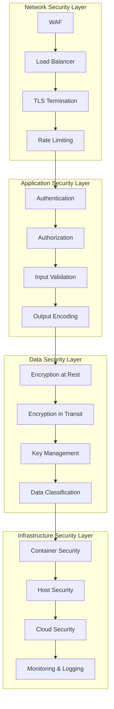
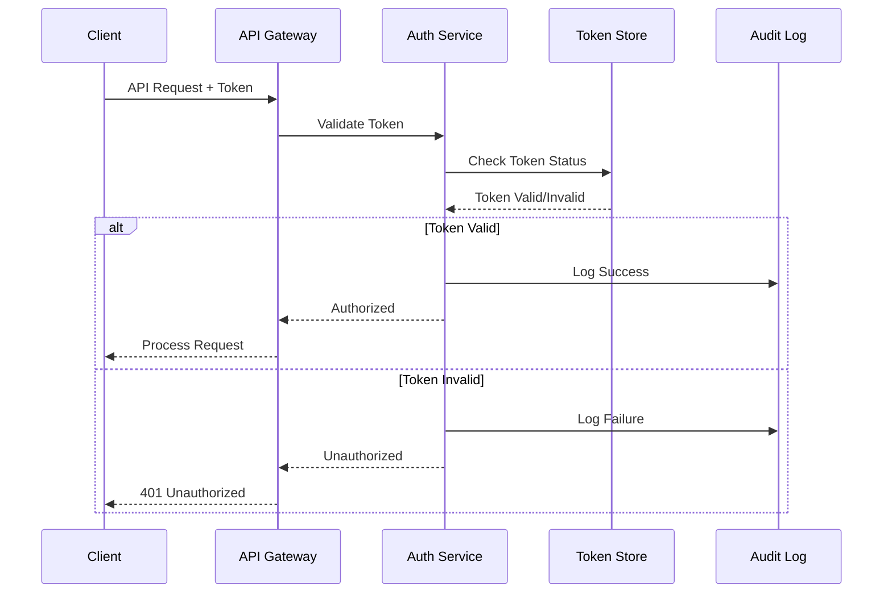
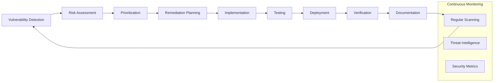
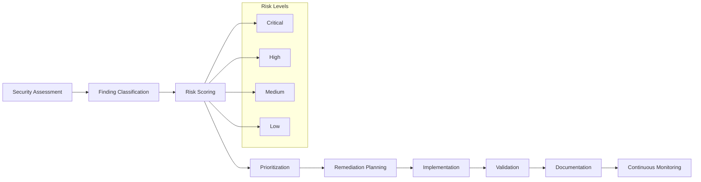

# Adelaide Weather Forecasting System - Security and Compliance Documentation

## 📋 Table of Contents

1. [Security Overview](#security-overview)
2. [Security Architecture](#security-architecture)
3. [Authentication and Authorization](#authentication-and-authorization)
4. [Data Protection and Encryption](#data-protection-and-encryption)
5. [Network Security](#network-security)
6. [Application Security](#application-security)
7. [Infrastructure Security](#infrastructure-security)
8. [Security Monitoring and Incident Response](#security-monitoring-and-incident-response)
9. [Compliance Framework](#compliance-framework)
10. [Security Operations](#security-operations)
11. [Audit and Assessment](#audit-and-assessment)
12. [Security Policies and Procedures](#security-policies-and-procedures)

## 🛡 Security Overview

The Adelaide Weather Forecasting System implements a comprehensive security framework based on industry best practices and zero-trust principles. Our security strategy encompasses multiple layers of protection, from network-level controls to application-specific security measures.

### Security Principles

#### 1. **Zero Trust Architecture**
- No implicit trust for any entity inside or outside the network
- Continuous verification and validation of all access requests
- Least privilege access principles
- Comprehensive monitoring and logging

#### 2. **Defense in Depth**
- Multiple layers of security controls
- Redundant security measures at each layer
- Fail-safe defaults and graceful degradation
- Comprehensive security monitoring

#### 3. **Security by Design**
- Security considerations integrated from inception
- Secure development lifecycle practices
- Regular security assessments and testing
- Continuous security improvement

#### 4. **Compliance First**
- Built-in compliance with industry standards
- Comprehensive audit trails
- Regular compliance assessments
- Automated compliance monitoring

## 🏗 Security Architecture

### Multi-Layer Security Model



### Security Zones

#### 1. **DMZ (Demilitarized Zone)**
```yaml
DMZ Components:
├── Web Application Firewall (WAF)
├── Load Balancer with SSL termination
├── DDoS protection services
├── Rate limiting and traffic shaping
└── Public-facing monitoring endpoints

Security Controls:
├── Intrusion detection systems
├── Network access control lists
├── Traffic monitoring and analysis
├── Automated threat response
└── Regular vulnerability scanning
```

#### 2. **Application Zone**
```yaml
Application Components:
├── API Gateway with authentication
├── Application servers (containerized)
├── Microservices with service mesh
├── Application load balancers
└── Service discovery mechanisms

Security Controls:
├── Mutual TLS between services
├── Service-to-service authentication
├── Application-level firewalls
├── Runtime application protection
└── Container security scanning
```

#### 3. **Data Zone**
```yaml
Data Components:
├── Encrypted databases
├── Secure key-value stores
├── File storage with encryption
├── Backup and recovery systems
└── Data processing pipelines

Security Controls:
├── Database access controls
├── Data loss prevention (DLP)
├── Encryption key management
├── Data masking and anonymization
└── Secure backup procedures
```

#### 4. **Management Zone**
```yaml
Management Components:
├── Identity and access management
├── Certificate management
├── Secrets management
├── Configuration management
└── Monitoring and logging systems

Security Controls:
├── Privileged access management
├── Multi-factor authentication
├── Audit logging and monitoring
├── Security incident management
└── Compliance reporting
```

## 🔐 Authentication and Authorization

### Enterprise Authentication Framework

#### 1. **Token-Based Authentication**
```python
# Secure token management implementation
Token Security Features:
├── Cryptographic Generation
│   ├── 256-bit entropy using secrets module
│   ├── Multiple character sets for complexity
│   ├── Secure random number generation
│   └── Pattern analysis prevention
├── Token Validation
│   ├── Length validation (32-128 characters)
│   ├── Entropy assessment (minimum 128 bits)
│   ├── Character composition analysis
│   └── Weakness pattern detection
├── Token Rotation
│   ├── Automated rotation schedules
│   ├── Emergency rotation procedures
│   ├── Backup and rollback capabilities
│   └── Audit trail maintenance
└── Token Storage
    ├── Encrypted storage using AES-256-GCM
    ├── Environment-specific isolation
    ├── Automatic expiration handling
    └── Secure deletion procedures
```

#### 2. **Advanced Token Management**
```bash
# Token rotation and management procedures
# Generate cryptographically secure token
python3 api/token_rotation_cli.py generate --length 64 --entropy-check

# Automated rotation with backup
python3 api/token_rotation_cli.py rotate --user admin --backup

# Emergency rotation procedures
python3 api/token_rotation_cli.py rotate --emergency --notify-all

# Token strength validation
python3 api/token_rotation_cli.py validate --comprehensive

# Audit trail review
python3 api/token_rotation_cli.py audit --operation rotate_token --days 30
```

#### 3. **Authorization Framework**
```yaml
Authorization Levels:
├── Public Access
│   ├── Health check endpoints
│   ├── System information
│   ├── API documentation
│   └── Status pages
├── Authenticated Access
│   ├── Weather forecast endpoints
│   ├── Basic health monitoring
│   ├── User-specific data
│   └── Standard API features
├── Administrative Access
│   ├── System configuration
│   ├── Performance analytics
│   ├── Security monitoring
│   └── User management
└── Privileged Access
    ├── Credential management
    ├── System administration
    ├── Security configuration
    └── Audit log access
```

### Multi-Factor Authentication (MFA)

#### 1. **MFA Implementation Strategy**
```yaml
MFA Components:
├── Primary Factor (Something you know)
│   ├── Secure API tokens
│   ├── Password policies
│   ├── Security questions
│   └── PIN-based access
├── Secondary Factor (Something you have)
│   ├── TOTP (Time-based OTP)
│   ├── Hardware security keys
│   ├── Mobile app authentication
│   └── SMS verification (backup)
├── Tertiary Factor (Something you are)
│   ├── Biometric authentication
│   ├── Behavioral analysis
│   ├── Device fingerprinting
│   └── Risk-based authentication
└── Adaptive Authentication
    ├── Risk scoring algorithms
    ├── Location-based validation
    ├── Device trust assessment
    └── Behavioral pattern analysis
```

#### 2. **Authentication Flow**


## 🔒 Data Protection and Encryption

### Comprehensive Encryption Strategy

#### 1. **Encryption at Rest**
```python
# Advanced encryption implementation
Encryption at Rest:
├── Credential Storage
│   ├── AES-256-GCM encryption
│   ├── PBKDF2 key derivation (100,000 iterations)
│   ├── Unique salt per credential
│   └── Secure key rotation procedures
├── Configuration Files
│   ├── Sensitive data encryption
│   ├── Configuration signing
│   ├── Integrity verification
│   └── Version control encryption
├── Log Files
│   ├── Audit log encryption
│   ├── PII data masking
│   ├── Secure log rotation
│   └── Tamper detection
└── Backup Data
    ├── Full backup encryption
    ├── Incremental backup encryption
    ├── Cross-region encryption
    └── Recovery key management
```

#### 2. **Encryption in Transit**
```yaml
Transit Encryption:
├── External Communications
│   ├── TLS 1.3 for all HTTPS traffic
│   ├── Certificate pinning
│   ├── Perfect Forward Secrecy
│   └── HSTS enforcement
├── Internal Communications
│   ├── Mutual TLS (mTLS) between services
│   ├── Service mesh encryption
│   ├── Database connection encryption
│   └── Message queue encryption
├── API Communications
│   ├── HTTPS-only enforcement
│   ├── Strong cipher suites
│   ├── Certificate validation
│   └── Secure headers implementation
└── Monitoring Communications
    ├── Encrypted metrics transmission
    ├── Secure log aggregation
    ├── Encrypted alerting
    └── Secure dashboard access
```

#### 3. **Key Management System**
```python
# Enterprise key management implementation
Key Management:
├── Key Generation
│   ├── Hardware security module (HSM) support
│   ├── Cryptographically secure random generation
│   ├── Key strength validation
│   └── Algorithm compliance verification
├── Key Storage
│   ├── Secure key vaults (AWS KMS, Azure Key Vault)
│   ├── Hardware security modules
│   ├── Split knowledge implementation
│   └── Access control enforcement
├── Key Rotation
│   ├── Automated rotation schedules
│   ├── Emergency rotation procedures
│   ├── Key versioning and rollback
│   └── Impact assessment
├── Key Distribution
│   ├── Secure key exchange protocols
│   ├── Authentication of key recipients
│   ├── Key escrow procedures
│   └── Emergency key recovery
└── Key Lifecycle Management
    ├── Key generation policies
    ├── Usage monitoring and auditing
    ├── Key retirement procedures
    └── Destruction verification
```

### Data Classification and Handling

#### 1. **Data Classification Framework**
```yaml
Data Classification Levels:
├── Public Data
│   ├── API documentation
│   ├── System status information
│   ├── General weather data
│   └── Marketing materials
├── Internal Data
│   ├── System configuration
│   ├── Performance metrics
│   ├── Operational procedures
│   └── Internal documentation
├── Confidential Data
│   ├── API tokens and credentials
│   ├── Security configurations
│   ├── Audit logs
│   └── Customer information
└── Restricted Data
    ├── Cryptographic keys
    ├── Authentication secrets
    ├── Security incident data
    └── Compliance documentation

Handling Requirements:
├── Access Controls: Role-based access
├── Encryption: Classification-appropriate encryption
├── Audit: Comprehensive access logging
├── Retention: Data lifecycle management
└── Disposal: Secure data destruction
```

#### 2. **Data Loss Prevention (DLP)**
```yaml
DLP Implementation:
├── Data Discovery
│   ├── Automated data classification
│   ├── Sensitive data identification
│   ├── Pattern recognition algorithms
│   └── Regular data inventory
├── Data Monitoring
│   ├── Real-time data access monitoring
│   ├── Anomaly detection algorithms
│   ├── Behavioral analysis
│   └── Risk scoring
├── Data Protection
│   ├── Encryption enforcement
│   ├── Access control validation
│   ├── Data masking and tokenization
│   └── Secure deletion procedures
└── Incident Response
    ├── Automated alert generation
    ├── Incident escalation procedures
    ├── Forensic data collection
    └── Recovery procedures
```

## 🌐 Network Security

### Network Architecture Security

#### 1. **Network Segmentation**
```yaml
Network Segmentation Strategy:
├── Public Network (DMZ)
│   ├── Load balancers and proxies
│   ├── WAF and DDoS protection
│   ├── CDN endpoints
│   └── Public-facing monitoring
├── Application Network
│   ├── API gateways
│   ├── Application servers
│   ├── Service mesh
│   └── Load balancers
├── Data Network
│   ├── Database clusters
│   ├── Cache servers
│   ├── File storage
│   └── Backup systems
├── Management Network
│   ├── Monitoring systems
│   ├── Log aggregation
│   ├── Configuration management
│   └── Administrative access
└── Security Network
    ├── Security tools and scanners
    ├── SIEM and log analysis
    ├── Incident response systems
    └── Forensic analysis tools
```

#### 2. **Firewall and Network Controls**
```yaml
Network Security Controls:
├── Web Application Firewall (WAF)
│   ├── OWASP Top 10 protection
│   ├── Custom rule sets
│   ├── Rate limiting and throttling
│   └── Geo-blocking capabilities
├── Network Firewalls
│   ├── Stateful packet inspection
│   ├── Application-layer filtering
│   ├── Intrusion prevention
│   └── Deep packet inspection
├── Access Control Lists (ACLs)
│   ├── Port-based restrictions
│   ├── Protocol filtering
│   ├── Source/destination controls
│   └── Time-based access rules
├── VPN and Remote Access
│   ├── Site-to-site VPN tunnels
│   ├── Client VPN access
│   ├── Multi-factor authentication
│   └── Session monitoring
└── Network Monitoring
    ├── Traffic analysis and logging
    ├── Anomaly detection
    ├── Intrusion detection systems
    └── Security event correlation
```

#### 3. **DDoS Protection**
```yaml
DDoS Mitigation:
├── Cloud-Based Protection
│   ├── CloudFlare DDoS protection
│   ├── AWS Shield Advanced
│   ├── Azure DDoS Protection
│   └── Google Cloud Armor
├── Rate Limiting
│   ├── API endpoint rate limits
│   ├── IP-based rate limiting
│   ├── Burst protection
│   └── Adaptive rate limiting
├── Traffic Shaping
│   ├── Traffic prioritization
│   ├── Quality of Service (QoS)
│   ├── Bandwidth management
│   └── Connection limiting
├── Behavioral Analysis
│   ├── Traffic pattern analysis
│   ├── Anomaly detection
│   ├── Bot detection
│   └── Legitimate traffic identification
└── Incident Response
    ├── Automated mitigation
    ├── Manual override capabilities
    ├── Escalation procedures
    └── Recovery protocols
```

## 🔧 Application Security

### Secure Development Practices

#### 1. **Secure Coding Standards**
```python
# Application security implementation
Security Measures:
├── Input Validation and Sanitization
│   ├── Schema-based validation (Pydantic)
│   ├── Type checking and conversion
│   ├── Length and format validation
│   ├── Whitelist-based filtering
│   └── SQL injection prevention
├── Output Encoding and Escaping
│   ├── Context-aware output encoding
│   ├── XSS prevention measures
│   ├── JSON response sanitization
│   └── HTTP header injection prevention
├── Authentication Security
│   ├── Secure token generation
│   ├── Session management
│   ├── Password policy enforcement
│   └── Account lockout mechanisms
├── Authorization Controls
│   ├── Role-based access control
│   ├── Resource-level permissions
│   ├── API endpoint protection
│   └── Privilege escalation prevention
└── Error Handling
    ├── Secure error messages
    ├── Information disclosure prevention
    ├── Stack trace sanitization
    └── Logging without sensitive data
```

#### 2. **Security Headers Implementation**
```python
# Comprehensive security headers
Security Headers:
├── Content Security Policy (CSP)
│   ├── Script source restrictions
│   ├── Style source limitations
│   ├── Image source controls
│   └── Frame ancestor restrictions
├── HTTP Strict Transport Security (HSTS)
│   ├── Max-age configuration
│   ├── Subdomain inclusion
│   ├── Preload directive
│   └── SSL/TLS enforcement
├── X-Frame-Options
│   ├── Clickjacking prevention
│   ├── Frame embedding controls
│   └── Iframe protection
├── X-Content-Type-Options
│   ├── MIME sniffing prevention
│   ├── Content type enforcement
│   └── Security bypassing prevention
├── X-XSS-Protection
│   ├── XSS filtering activation
│   ├── Block mode configuration
│   └── Reflected XSS prevention
└── Referrer-Policy
    ├── Referrer information control
    ├── Privacy protection
    └── Information leakage prevention
```

#### 3. **API Security Framework**
```yaml
API Security Controls:
├── Authentication Mechanisms
│   ├── Bearer token authentication
│   ├── API key management
│   ├── OAuth 2.0 support
│   └── JWT token validation
├── Authorization Controls
│   ├── Endpoint-level permissions
│   ├── Resource-based access
│   ├── Rate limiting per user
│   └── Scope-based restrictions
├── Input Validation
│   ├── Request schema validation
│   ├── Parameter sanitization
│   ├── File upload restrictions
│   └── Content-type validation
├── Rate Limiting and Throttling
│   ├── Global rate limits
│   ├── Per-endpoint limits
│   ├── User-specific quotas
│   └── Burst protection
├── CORS Configuration
│   ├── Origin whitelist management
│   ├── Method restrictions
│   ├── Header controls
│   └── Credential policies
└── API Versioning Security
    ├── Backward compatibility
    ├── Deprecation management
    ├── Version-specific security
    └── Migration procedures
```

### Application Vulnerability Management

#### 1. **Vulnerability Assessment**
```yaml
Assessment Framework:
├── Static Application Security Testing (SAST)
│   ├── Source code analysis
│   ├── Security vulnerability detection
│   ├── Code quality assessment
│   └── Compliance checking
├── Dynamic Application Security Testing (DAST)
│   ├── Runtime vulnerability scanning
│   ├── Penetration testing automation
│   ├── API security testing
│   └── Web application scanning
├── Interactive Application Security Testing (IAST)
│   ├── Real-time vulnerability detection
│   ├── Code coverage analysis
│   ├── False positive reduction
│   └── Contextual vulnerability assessment
├── Software Composition Analysis (SCA)
│   ├── Open source vulnerability scanning
│   ├── License compliance checking
│   ├── Dependency analysis
│   └── Supply chain security
└── Container Security Scanning
    ├── Base image vulnerability analysis
    ├── Container configuration assessment
    ├── Runtime security monitoring
    └── Compliance validation
```

#### 2. **Vulnerability Remediation Process**


## 🏢 Infrastructure Security

### Container and Kubernetes Security

#### 1. **Container Security Best Practices**
```yaml
Container Security:
├── Base Image Security
│   ├── Minimal base images (Alpine, Distroless)
│   ├── Regular image updates
│   ├── Vulnerability scanning
│   └── Trusted registry usage
├── Container Configuration
│   ├── Non-root user execution
│   ├── Read-only file systems
│   ├── Resource limitations
│   └── Security context configuration
├── Runtime Security
│   ├── Runtime protection (Falco)
│   ├── Behavior monitoring
│   ├── Anomaly detection
│   └── Incident response
├── Image Signing and Verification
│   ├── Digital signature validation
│   ├── Content trust verification
│   ├── Supply chain security
│   └── Registry authentication
└── Container Networking
    ├── Network policies
    ├── Service mesh security
    ├── Traffic encryption
    └── Microsegmentation
```

#### 2. **Kubernetes Security Configuration**
```yaml
Kubernetes Security:
├── Pod Security Standards
│   ├── Pod Security Policies (deprecated)
│   ├── Pod Security Standards (current)
│   ├── Admission controllers
│   └── Security contexts
├── Network Policies
│   ├── Default deny policies
│   ├── Namespace isolation
│   ├── Service-to-service controls
│   └── Ingress/egress rules
├── RBAC (Role-Based Access Control)
│   ├── Service account management
│   ├── Role and ClusterRole definitions
│   ├── RoleBinding configurations
│   └── Least privilege principles
├── Secrets Management
│   ├── Kubernetes secrets encryption
│   ├── External secret management
│   ├── Secret rotation procedures
│   └── Access control policies
├── Admission Control
│   ├── Validating admission webhooks
│   ├── Mutating admission webhooks
│   ├── OPA (Open Policy Agent) integration
│   └── Custom security policies
└── Cluster Hardening
    ├── API server security
    ├── etcd encryption and access
    ├── Node security configuration
    └── Control plane protection
```

#### 3. **Cloud Security Configuration**
```yaml
Cloud Security (Multi-Cloud):
├── AWS Security
│   ├── IAM roles and policies
│   ├── VPC and security groups
│   ├── KMS key management
│   ├── CloudTrail auditing
│   ├── GuardDuty threat detection
│   └── Config compliance monitoring
├── Azure Security
│   ├── Azure AD integration
│   ├── Virtual network security
│   ├── Key Vault management
│   ├── Security Center monitoring
│   ├── Sentinel SIEM integration
│   └── Policy compliance
├── GCP Security
│   ├── Cloud IAM configuration
│   ├── VPC security controls
│   ├── Cloud KMS integration
│   ├── Cloud Security Command Center
│   ├── Cloud Logging and monitoring
│   └── Binary Authorization
└── Multi-Cloud Security
    ├── Consistent security policies
    ├── Cross-cloud identity management
    ├── Unified monitoring and alerting
    └── Compliance across platforms
```

## 📊 Security Monitoring and Incident Response

### Security Information and Event Management (SIEM)

#### 1. **Security Event Collection**
```yaml
Event Sources:
├── Application Logs
│   ├── Authentication events
│   ├── Authorization failures
│   ├── Input validation errors
│   ├── Security exceptions
│   └── Performance anomalies
├── Infrastructure Logs
│   ├── System access logs
│   ├── Network traffic logs
│   ├── Container security events
│   ├── Cloud service logs
│   └── Load balancer logs
├── Security Tool Logs
│   ├── WAF logs and alerts
│   ├── IDS/IPS events
│   ├── Vulnerability scanner results
│   ├── Antimalware alerts
│   └── DLP violations
├── Audit Logs
│   ├── Administrative actions
│   ├── Configuration changes
│   ├── Privilege escalations
│   ├── Data access logs
│   └── Compliance events
└── External Threat Intelligence
    ├── Threat feeds
    ├── IOC (Indicators of Compromise)
    ├── Vulnerability databases
    ├── Security advisories
    └── Industry threat reports
```

#### 2. **Security Analytics and Correlation**
```python
# Security event correlation and analysis
Security Analytics:
├── Real-time Event Processing
│   ├── Stream processing (Apache Kafka)
│   ├── Event normalization
│   ├── Pattern matching
│   └── Anomaly detection algorithms
├── Behavioral Analysis
│   ├── User behavior analytics (UBA)
│   ├── Entity behavior analytics (EBA)
│   ├── Machine learning models
│   └── Risk scoring algorithms
├── Threat Detection
│   ├── Signature-based detection
│   ├── Anomaly-based detection
│   ├── Machine learning detection
│   └── Threat intelligence correlation
├── Incident Correlation
│   ├── Multi-event correlation
│   ├── Timeline reconstruction
│   ├── Impact assessment
│   └── Root cause analysis
└── Automated Response
    ├── Alert generation
    ├── Containment actions
    ├── Notification procedures
    └── Evidence collection
```

#### 3. **Security Dashboards and Reporting**
```yaml
Security Dashboards:
├── Executive Dashboard
│   ├── Security posture overview
│   ├── Risk metrics and trends
│   ├── Compliance status
│   └── Incident summary
├── SOC (Security Operations Center) Dashboard
│   ├── Real-time security events
│   ├── Alert queue management
│   ├── Incident tracking
│   └── Threat intelligence feeds
├── Technical Dashboard
│   ├── System security status
│   ├── Vulnerability metrics
│   ├── Performance indicators
│   └── Configuration compliance
├── Compliance Dashboard
│   ├── Regulatory compliance status
│   ├── Audit findings tracking
│   ├── Policy compliance metrics
│   └── Certification status
└── Custom Dashboards
    ├── Business-specific metrics
    ├── Team-specific views
    ├── Application-specific security
    └── Infrastructure-focused monitoring
```

### Incident Response Framework

#### 1. **Incident Classification and Response**
```yaml
Incident Classification:
├── Critical Incidents (P1)
│   ├── Active security breach
│   ├── Data exfiltration
│   ├── System compromise
│   ├── Service outage due to attack
│   └── Response Time: < 15 minutes
├── High Priority Incidents (P2)
│   ├── Attempted security breach
│   ├── Malware detection
│   ├── Privilege escalation
│   ├── DDoS attacks
│   └── Response Time: < 1 hour
├── Medium Priority Incidents (P3)
│   ├── Security policy violations
│   ├── Suspicious activity
│   ├── Configuration drift
│   ├── Failed authentication patterns
│   └── Response Time: < 4 hours
└── Low Priority Incidents (P4)
    ├── Security warnings
    ├── Policy compliance issues
    ├── Monitoring alerts
    ├── Informational events
    └── Response Time: < 24 hours

Response Procedures:
├── Detection and Analysis
├── Containment and Eradication
├── Recovery and Post-Incident Activity
└── Lessons Learned and Improvement
```

#### 2. **Incident Response Playbooks**
```yaml
Security Playbooks:
├── Data Breach Response
│   ├── Immediate containment procedures
│   ├── Forensic data collection
│   ├── Legal and regulatory notification
│   ├── Communication procedures
│   └── Recovery and remediation
├── Malware Incident Response
│   ├── System isolation procedures
│   ├── Malware analysis and identification
│   ├── Affected system identification
│   ├── Cleanup and restoration
│   └── Prevention improvement
├── DDoS Attack Response
│   ├── Traffic analysis and filtering
│   ├── Upstream mitigation activation
│   ├── Service protection measures
│   ├── Communication procedures
│   └── Post-attack analysis
├── Insider Threat Response
│   ├── Activity monitoring and analysis
│   ├── Evidence preservation
│   ├── HR and legal coordination
│   ├── Access revocation procedures
│   └── Investigation support
└── Supply Chain Compromise
    ├── Vendor security assessment
    ├── Component isolation
    ├── Alternative source identification
    ├── Impact assessment
    └── Recovery procedures
```

## 📋 Compliance Framework

### Regulatory Compliance

#### 1. **Industry Standards Compliance**
```yaml
Compliance Standards:
├── ISO 27001 (Information Security Management)
│   ├── Security policy framework
│   ├── Risk management procedures
│   ├── Continuous improvement process
│   ├── Management review procedures
│   └── Certification maintenance
├── SOC 2 (Service Organization Control)
│   ├── Security principle compliance
│   ├── Availability controls
│   ├── Processing integrity
│   ├── Confidentiality measures
│   └── Privacy protection
├── NIST Cybersecurity Framework
│   ├── Identify: Asset management
│   ├── Protect: Access control
│   ├── Detect: Continuous monitoring
│   ├── Respond: Incident response
│   └── Recover: Recovery planning
├── OWASP Security Standards
│   ├── Top 10 vulnerability mitigation
│   ├── Secure coding practices
│   ├── Application security testing
│   ├── API security implementation
│   └── DevSecOps integration
└── Cloud Security Standards
    ├── CSA CCM (Cloud Controls Matrix)
    ├── FedRAMP compliance (if applicable)
    ├── Cloud-specific certifications
    └── Multi-cloud governance
```

#### 2. **Data Protection Regulations**
```yaml
Data Protection Compliance:
├── GDPR (General Data Protection Regulation)
│   ├── Data subject rights implementation
│   ├── Consent management procedures
│   ├── Data breach notification (72 hours)
│   ├── Privacy by design principles
│   ├── Data protection impact assessments
│   └── Data protection officer appointment
├── CCPA (California Consumer Privacy Act)
│   ├── Consumer rights implementation
│   ├── Data deletion procedures
│   ├── Opt-out mechanisms
│   ├── Third-party data sharing disclosure
│   └── Consumer request handling
├── PIPEDA (Personal Information Protection)
│   ├── Privacy policy transparency
│   ├── Consent requirements
│   ├── Data breach notification
│   ├── Individual access rights
│   └── Accountability measures
└── Industry-Specific Regulations
    ├── HIPAA (Healthcare data)
    ├── PCI DSS (Payment data)
    ├── FERPA (Educational records)
    └── Financial services regulations
```

#### 3. **Compliance Monitoring and Reporting**
```python
# Automated compliance monitoring
Compliance Automation:
├── Continuous Compliance Monitoring
│   ├── Real-time policy validation
│   ├── Configuration drift detection
│   ├── Access control verification
│   ├── Data handling compliance
│   └── Audit trail maintenance
├── Automated Evidence Collection
│   ├── Control effectiveness testing
│   ├── Security control screenshots
│   ├── Log file preservation
│   ├── Configuration documentation
│   └── Process execution records
├── Compliance Reporting
│   ├── Automated report generation
│   ├── Executive summary dashboards
│   ├── Detailed compliance metrics
│   ├── Exception reporting
│   └── Trend analysis
├── Risk Assessment Integration
│   ├── Compliance risk scoring
│   ├── Gap analysis automation
│   ├── Remediation tracking
│   ├── Risk treatment monitoring
│   └── Continuous risk evaluation
└── Audit Preparation
    ├── Evidence management systems
    ├── Audit trail organization
    ├── Documentation generation
    ├── Interview preparation
    └── Remediation planning
```

## 🔧 Security Operations

### Security Operations Center (SOC)

#### 1. **SOC Structure and Responsibilities**
```yaml
SOC Organization:
├── Tier 1 - Security Analysts
│   ├── Initial alert triage
│   ├── Event correlation
│   ├── Basic incident response
│   ├── Documentation maintenance
│   └── Escalation procedures
├── Tier 2 - Senior Security Analysts
│   ├── Complex incident investigation
│   ├── Threat hunting activities
│   ├── Deep forensic analysis
│   ├── Tool configuration
│   └── Procedure development
├── Tier 3 - Security Engineers
│   ├── Architecture security review
│   ├── Security tool development
│   ├── Advanced threat research
│   ├── Integration projects
│   └── Technical leadership
├── SOC Manager
│   ├── Operational oversight
│   ├── Resource management
│   ├── Stakeholder communication
│   ├── Performance metrics
│   └── Strategic planning
└── Security Architect
    ├── Security design review
    ├── Technology evaluation
    ├── Standard development
    ├── Risk assessment
    └── Compliance oversight
```

#### 2. **Security Operations Procedures**
```yaml
Operational Procedures:
├── Daily Operations
│   ├── Security event review
│   ├── Alert queue management
│   ├── Incident status updates
│   ├── Threat intelligence review
│   └── System health checks
├── Weekly Operations
│   ├── Vulnerability assessment review
│   ├── Security metrics analysis
│   ├── Tool configuration updates
│   ├── Training and awareness
│   └── Process improvement
├── Monthly Operations
│   ├── Security posture assessment
│   ├── Compliance status review
│   ├── Risk assessment updates
│   ├── Vendor security reviews
│   └── Incident trend analysis
├── Quarterly Operations
│   ├── Security architecture review
│   ├── Penetration testing
│   ├── Business continuity testing
│   ├── Policy review and updates
│   └── Strategic planning
└── Annual Operations
    ├── Comprehensive security audit
    ├── Compliance certification
    ├── Security strategy review
    ├── Budget planning
    └── Technology roadmap
```

#### 3. **Security Metrics and KPIs**
```yaml
Security Metrics:
├── Operational Metrics
│   ├── Mean time to detection (MTTD)
│   ├── Mean time to response (MTTR)
│   ├── Alert volume and accuracy
│   ├── Incident resolution time
│   └── False positive rates
├── Security Effectiveness Metrics
│   ├── Vulnerability remediation time
│   ├── Security control effectiveness
│   ├── Threat detection accuracy
│   ├── Security training completion
│   └── Compliance score
├── Business Impact Metrics
│   ├── Security-related downtime
│   ├── Data breach prevention
│   ├── Cost of security incidents
│   ├── Compliance penalty avoidance
│   └── Business enablement metrics
├── Risk Metrics
│   ├── Risk assessment scores
│   ├── Risk treatment effectiveness
│   ├── Residual risk levels
│   ├── Risk trend analysis
│   └── Third-party risk scores
└── Continuous Improvement Metrics
    ├── Process improvement rate
    ├── Tool automation percentage
    ├── Team skill development
    ├── Innovation implementation
    └── Customer satisfaction
```

### Security Automation and Orchestration

#### 1. **Security Orchestration, Automation and Response (SOAR)**
```yaml
SOAR Implementation:
├── Incident Response Automation
│   ├── Automated alert triage
│   ├── Evidence collection automation
│   ├── Containment action execution
│   ├── Notification automation
│   └── Documentation generation
├── Threat Intelligence Automation
│   ├── IOC feed integration
│   ├── Threat data enrichment
│   ├── Automated threat hunting
│   ├── Risk scoring automation
│   └── Contextual analysis
├── Vulnerability Management Automation
│   ├── Automated vulnerability scanning
│   ├── Risk-based prioritization
│   ├── Patch management automation
│   ├── Compliance verification
│   └── Exception tracking
├── Security Tool Integration
│   ├── SIEM integration
│   ├── Endpoint detection integration
│   ├── Network security tool integration
│   ├── Cloud security integration
│   └── Custom tool development
└── Workflow Orchestration
    ├── Multi-tool coordination
    ├── Approval workflow automation
    ├── Escalation procedures
    ├── Task assignment
    └── Progress tracking
```

#### 2. **Security Tool Stack**
```yaml
Security Tools:
├── Detection and Monitoring
│   ├── SIEM platforms
│   ├── Network monitoring tools
│   ├── Endpoint detection and response
│   ├── Cloud security platforms
│   └── Application security monitoring
├── Vulnerability Management
│   ├── Vulnerability scanners
│   ├── Patch management systems
│   ├── Configuration management
│   ├── Security assessment tools
│   └── Risk management platforms
├── Incident Response
│   ├── Incident management platforms
│   ├── Forensic analysis tools
│   ├── Threat hunting platforms
│   ├── Malware analysis sandboxes
│   └── Communication tools
├── Security Testing
│   ├── Penetration testing tools
│   ├── Application security testing
│   ├── Infrastructure testing
│   ├── Social engineering testing
│   └── Red team exercises
└── Compliance and Governance
    ├── GRC platforms
    ├── Policy management systems
    ├── Audit management tools
    ├── Risk assessment platforms
    └── Compliance reporting tools
```

## 🔍 Audit and Assessment

### Security Auditing Framework

#### 1. **Internal Security Audits**
```yaml
Internal Audit Program:
├── Quarterly Security Reviews
│   ├── Access control audits
│   ├── Configuration compliance checks
│   ├── Process adherence validation
│   ├── Policy compliance assessment
│   └── Control effectiveness testing
├── Annual Comprehensive Audits
│   ├── Complete security posture review
│   ├── Risk assessment validation
│   ├── Business continuity testing
│   ├── Incident response exercises
│   └── Strategic alignment assessment
├── Continuous Monitoring
│   ├── Automated compliance checking
│   ├── Real-time security monitoring
│   ├── Configuration drift detection
│   ├── Policy violation tracking
│   └── Performance metric monitoring
├── Special Purpose Audits
│   ├── Post-incident reviews
│   ├── Change impact assessments
│   ├── Vendor security reviews
│   ├── New system security validation
│   └── Merger and acquisition due diligence
└── Audit Documentation
    ├── Audit plans and procedures
    ├── Evidence collection and management
    ├── Finding documentation
    ├── Remediation tracking
    └── Executive reporting
```

#### 2. **External Security Assessments**
```yaml
External Assessment Program:
├── Third-Party Security Audits
│   ├── Independent security assessment
│   ├── Compliance certification audits
│   ├── Industry-specific assessments
│   ├── Regulatory compliance audits
│   └── Customer security assessments
├── Penetration Testing
│   ├── External network testing
│   ├── Web application testing
│   ├── Social engineering testing
│   ├── Physical security testing
│   └── Wireless security testing
├── Red Team Exercises
│   ├── Adversarial simulation
│   ├── Multi-vector attacks
│   ├── Extended engagement testing
│   ├── Detection evasion testing
│   └── Response capability testing
├── Bug Bounty Programs
│   ├── Crowdsourced security testing
│   ├── Continuous vulnerability discovery
│   ├── Reward-based incentives
│   ├── Responsible disclosure programs
│   └── Community engagement
└── Vendor Security Assessments
    ├── Third-party vendor evaluations
    ├── Supply chain security reviews
    ├── Service provider assessments
    ├── Cloud service security reviews
    └── Software supplier evaluations
```

#### 3. **Assessment Reporting and Remediation**


## 📚 Security Policies and Procedures

### Information Security Policy Framework

#### 1. **Core Security Policies**
```yaml
Policy Structure:
├── Information Security Policy (Master)
│   ├── Security governance structure
│   ├── Roles and responsibilities
│   ├── Policy enforcement procedures
│   ├── Exception management
│   └── Policy review and updates
├── Access Control Policy
│   ├── User account management
│   ├── Privileged access controls
│   ├── Authentication requirements
│   ├── Authorization procedures
│   └── Access review processes
├── Data Protection Policy
│   ├── Data classification standards
│   ├── Data handling procedures
│   ├── Privacy protection measures
│   ├── Data retention requirements
│   └── Secure disposal procedures
├── Incident Response Policy
│   ├── Incident classification
│   ├── Response procedures
│   ├── Notification requirements
│   ├── Evidence handling
│   └── Recovery procedures
├── Business Continuity Policy
│   ├── Continuity planning
│   ├── Disaster recovery procedures
│   ├── Emergency response
│   ├── Communication procedures
│   └── Testing and maintenance
└── Third-Party Security Policy
    ├── Vendor security requirements
    ├── Due diligence procedures
    ├── Contract security clauses
    ├── Ongoing monitoring
    └── Termination procedures
```

#### 2. **Security Standards and Guidelines**
```yaml
Standards and Guidelines:
├── Technical Security Standards
│   ├── Encryption standards
│   ├── Network security configuration
│   ├── System hardening guidelines
│   ├── Application security standards
│   └── Cloud security requirements
├── Operational Security Standards
│   ├── Security monitoring standards
│   ├── Incident handling procedures
│   ├── Change management security
│   ├── Backup and recovery standards
│   └── Security testing requirements
├── Personnel Security Standards
│   ├── Background check requirements
│   ├── Security awareness training
│   ├── Access provisioning procedures
│   ├── Separation of duties
│   └── Insider threat prevention
├── Physical Security Standards
│   ├── Facility access controls
│   ├── Equipment security
│   ├── Environmental controls
│   ├── Media handling procedures
│   └── Visitor management
└── Compliance Standards
    ├── Regulatory compliance requirements
    ├── Industry standard adherence
    ├── Audit preparation procedures
    ├── Documentation requirements
    └── Reporting standards
```

#### 3. **Security Training and Awareness**
```yaml
Training Program:
├── Security Awareness Training
│   ├── Annual mandatory training
│   ├── Role-specific training modules
│   ├── Phishing simulation exercises
│   ├── Security best practices
│   └── Incident reporting procedures
├── Technical Security Training
│   ├── Secure coding practices
│   ├── Security tool usage
│   ├── Threat detection techniques
│   ├── Incident response procedures
│   └── Compliance requirements
├── Leadership Security Training
│   ├── Security governance
│   ├── Risk management
│   ├── Business continuity
│   ├── Compliance oversight
│   └── Strategic security planning
├── Specialized Training
│   ├── Privacy protection training
│   ├── Industry-specific requirements
│   ├── Vendor management security
│   ├── Cloud security training
│   └── Emerging threat awareness
└── Training Effectiveness
    ├── Knowledge assessments
    ├── Simulation exercises
    ├── Performance metrics
    ├── Continuous improvement
    └── Compliance tracking
```

---

## 📞 Security Contacts and Support

### Emergency Security Contacts

```yaml
Security Emergency Contacts:
├── Security Operations Center (SOC)
│   ├── 24/7 Hotline: +1-XXX-XXX-XXXX
│   ├── Email: security-emergency@company.com
│   ├── Slack: #security-emergency
│   └── Response Time: < 15 minutes
├── Chief Information Security Officer (CISO)
│   ├── Phone: +1-XXX-XXX-XXXX
│   ├── Email: ciso@company.com
│   ├── Escalation: Critical incidents only
│   └── Response Time: < 1 hour
├── Incident Response Team
│   ├── Team Lead: security-ir-lead@company.com
│   ├── Technical Lead: security-tech-lead@company.com
│   ├── Legal Counsel: legal@company.com
│   └── Communications: pr@company.com
└── External Resources
    ├── Cybersecurity Consultant: consultant@securityfirm.com
    ├── Legal Counsel: lawyer@lawfirm.com
    ├── Law Enforcement: FBI Cyber Division
    └── Regulatory Bodies: Relevant regulatory contacts
```

### Security Resources

```yaml
Security Documentation:
├── Security Policies: /docs/security/policies/
├── Incident Response Playbooks: /docs/security/playbooks/
├── Security Architecture: /docs/security/architecture/
├── Compliance Documentation: /docs/security/compliance/
└── Training Materials: /docs/security/training/

Security Tools Access:
├── SIEM Dashboard: https://siem.company.com
├── Vulnerability Scanner: https://vuln.company.com
├── Security Metrics: https://security-metrics.company.com
├── Incident Management: https://incidents.company.com
└── Security Awareness Portal: https://security-training.company.com
```

---

**Document Version:** 2.0.0  
**Last Updated:** 2025-11-05  
**Next Review:** 2025-12-05  
**Classification:** Confidential  
**Owner:** Chief Information Security Officer  
**Approved By:** Executive Security Committee