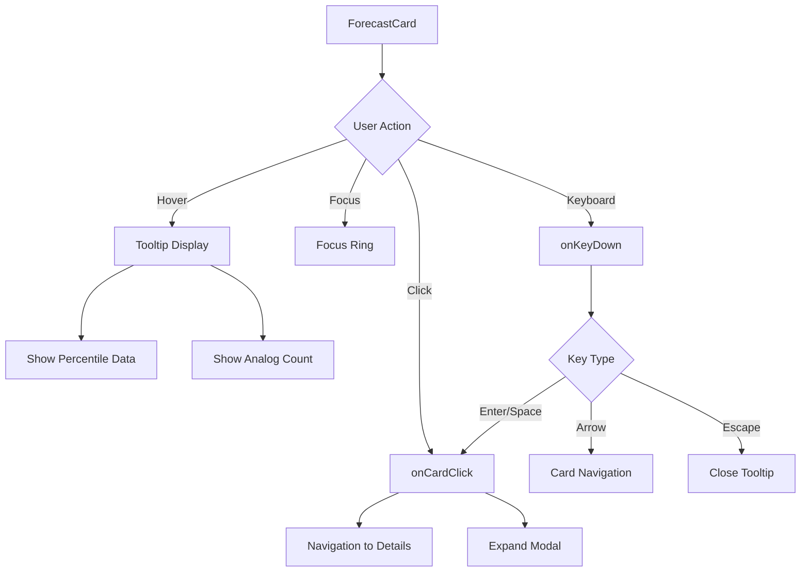
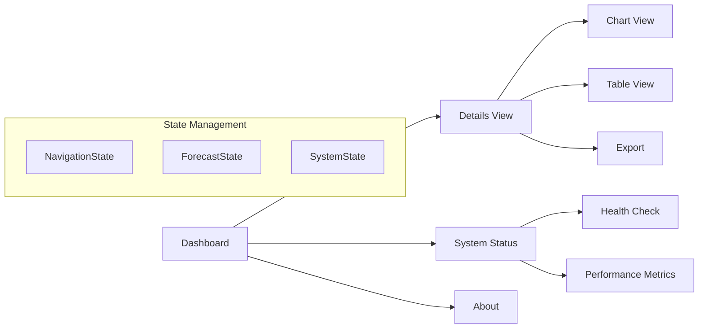
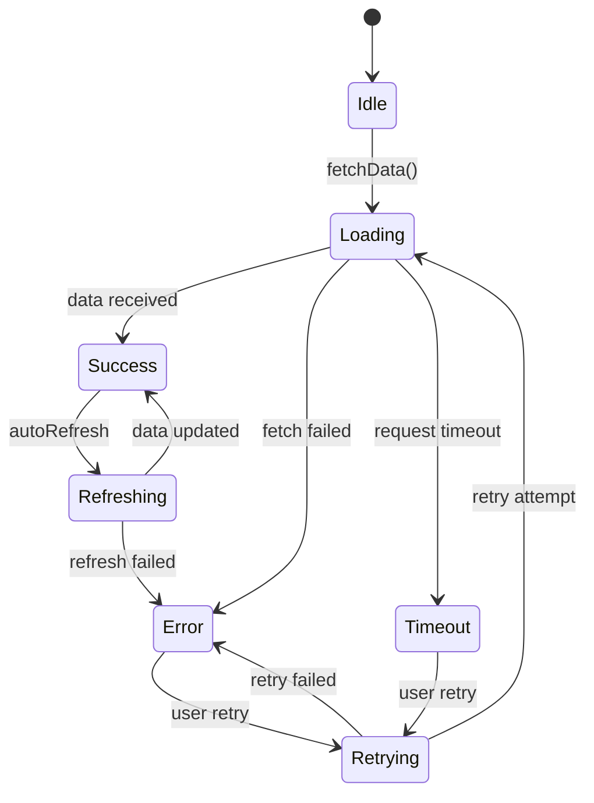

# Component Interaction Flows

Adelaide Weather Forecasting System

This document defines the interaction patterns and state flows between UI components to ensure consistent behavior and optimal user experience.

## Overview

The component interaction system is built around:

- **Event-driven communication** between components
- **Centralized state management** for shared data
- **Declarative data flow** with clear boundaries
- **Accessibility-first interaction patterns**

## Core Interaction Patterns

### 1. ForecastCard Interactions



#### State Transitions

```typescript
interface ForecastCardState {
  isHovered: boolean;
  isFocused: boolean;
  isExpanded: boolean;
  tooltipVisible: boolean;
}

// Interaction handlers
const handleCardClick = (horizon: string) => {
  analytics.track('forecast_card_click', { horizon });
  router.push(`/details/${horizon}`);
};

const handleCardHover = (show: boolean) => {
  setTooltipVisible(show);
  if (show) {
    preloadDetailData(horizon);
  }
};
```

### 2. Navigation Flow



#### Navigation State Machine

```typescript
type NavigationState =
  | { screen: 'dashboard'; data: null }
  | { screen: 'details'; data: { horizon: string; view: 'chart' | 'table' } }
  | { screen: 'status'; data: null }
  | { screen: 'about'; data: null };

const navigationReducer = (
  state: NavigationState,
  action: NavigationAction
) => {
  switch (action.type) {
    case 'NAVIGATE_TO_DASHBOARD':
      return { screen: 'dashboard', data: null };
    case 'NAVIGATE_TO_DETAILS':
      return {
        screen: 'details',
        data: { horizon: action.horizon, view: 'chart' }
      };
    // ... other cases
  }
};
```

### 3. Data Loading States



#### Loading State Management

```typescript
interface DataState<T> {
  data: T | null;
  loading: boolean;
  error: string | null;
  lastFetch: string | null;
  retryCount: number;
}

const dataReducer = <T>(
  state: DataState<T>,
  action: DataAction
): DataState<T> => {
  switch (action.type) {
    case 'FETCH_START':
      return { ...state, loading: true, error: null };
    case 'FETCH_SUCCESS':
      return {
        ...state,
        loading: false,
        data: action.payload,
        lastFetch: new Date().toISOString(),
        retryCount: 0
      };
    case 'FETCH_ERROR':
      return {
        ...state,
        loading: false,
        error: action.error,
        retryCount: state.retryCount + 1
      };
  }
};
```

## Component Communication Patterns

### 1. Parent-Child Communication

```typescript
// Parent component passes data and handlers
<ForecastCard
  {...forecastData}
  onClick={handleCardClick}
  onHover={handleCardHover}
  onExpand={handleCardExpand}
/>

// Child component emits events
const ForecastCard = ({ onClick, onHover, onExpand, ...props }) => {
  return (
    <div
      onClick={() => onClick(props.horizon)}
      onMouseEnter={() => onHover(true)}
      onMouseLeave={() => onHover(false)}
    >
      {/* card content */}
    </div>
  )
}
```

### 2. Sibling Communication via Shared State

```typescript
// Shared context for related components
const ForecastContext = createContext<{
  selectedHorizon: string | null
  setSelectedHorizon: (horizon: string) => void
  forecastData: Record<string, ForecastResponse>
}>()

// Components subscribe to shared state
const ForecastCard = () => {
  const { selectedHorizon, setSelectedHorizon } = useContext(ForecastContext)
  const isSelected = selectedHorizon === horizon

  return (
    <div
      className={cn("forecast-card", isSelected && "selected")}
      onClick={() => setSelectedHorizon(horizon)}
    >
      {/* content */}
    </div>
  )
}
```

### 3. Global State Updates

```typescript
// Action creators for global state updates
const forecastActions = {
  fetchForecast: (horizon: string) => async (dispatch: Dispatch) => {
    dispatch({ type: 'FETCH_START', horizon });
    try {
      const data = await api.getForecast(horizon);
      dispatch({ type: 'FETCH_SUCCESS', horizon, data });
    } catch (error) {
      dispatch({ type: 'FETCH_ERROR', horizon, error: error.message });
    }
  },

  refreshAll: () => async (dispatch: Dispatch) => {
    const horizons = ['6h', '12h', '24h', '48h'];
    await Promise.all(
      horizons.map(horizon => dispatch(forecastActions.fetchForecast(horizon)))
    );
  }
};
```

## Error Handling Patterns

### 1. Component-Level Error Boundaries

```typescript
class ForecastCardErrorBoundary extends React.Component {
  state = { hasError: false, error: null }

  static getDerivedStateFromError(error: Error) {
    return { hasError: true, error }
  }

  render() {
    if (this.state.hasError) {
      return (
        <div className="forecast-card-error">
          <Icon name="alert-triangle" />
          <p>Unable to load forecast</p>
          <Button onClick={() => this.setState({ hasError: false })}>
            Retry
          </Button>
        </div>
      )
    }

    return this.props.children
  }
}
```

### 2. Graceful Degradation

```typescript
const ForecastCard = ({ data, fallbackData, ...props }) => {
  // Use fallback data when primary data is unavailable
  const displayData = data?.available ? data : fallbackData

  // Show different UI states based on data quality
  if (!displayData) {
    return <ForecastCardSkeleton />
  }

  if (!data?.available) {
    return (
      <ForecastCard
        {...props}
        data={displayData}
        className="forecast-card--degraded"
        badge="Using cached data"
      />
    )
  }

  return <ForecastCard {...props} data={displayData} />
}
```

## Performance Optimization Patterns

### 1. Component Memoization

```typescript
const ForecastCard = React.memo(({
  horizon,
  temp,
  confidence,
  ...otherProps
}) => {
  // Expensive calculations
  const sparklineData = useMemo(() =>
    generateSparkline(temp, confidence),
    [temp, confidence]
  )

  // Stable event handlers
  const handleClick = useCallback(() => {
    onCardClick(horizon)
  }, [horizon, onCardClick])

  return (
    <div onClick={handleClick}>
      <Sparkline data={sparklineData} />
      {/* other content */}
    </div>
  )
}, (prevProps, nextProps) => {
  // Custom comparison for complex props
  return (
    prevProps.temp === nextProps.temp &&
    prevProps.confidence === nextProps.confidence &&
    prevProps.horizon === nextProps.horizon
  )
})
```

### 2. Virtualization for Large Lists

```typescript
const ForecastList = ({ forecasts }) => {
  const { virtualItems, totalSize, containerRef } = useVirtualizer({
    count: forecasts.length,
    getScrollElement: () => containerRef.current,
    estimateSize: () => 200,
    overscan: 2
  })

  return (
    <div ref={containerRef} style={{ height: '600px', overflow: 'auto' }}>
      <div style={{ height: totalSize, position: 'relative' }}>
        {virtualItems.map(item => (
          <div
            key={item.key}
            style={{
              position: 'absolute',
              top: item.start,
              left: 0,
              right: 0,
              height: item.size
            }}
          >
            <ForecastCard {...forecasts[item.index]} />
          </div>
        ))}
      </div>
    </div>
  )
}
```

## Accessibility Patterns

### 1. Keyboard Navigation

```typescript
const ForecastGrid = ({ forecasts }) => {
  const [focusedIndex, setFocusedIndex] = useState(0)
  const cardRefs = useRef<(HTMLDivElement | null)[]>([])

  const handleKeyDown = (event: KeyboardEvent) => {
    switch (event.key) {
      case 'ArrowRight':
        event.preventDefault()
        setFocusedIndex(prev => Math.min(prev + 1, forecasts.length - 1))
        break
      case 'ArrowLeft':
        event.preventDefault()
        setFocusedIndex(prev => Math.max(prev - 1, 0))
        break
      case 'Enter':
      case ' ':
        event.preventDefault()
        cardRefs.current[focusedIndex]?.click()
        break
    }
  }

  useEffect(() => {
    cardRefs.current[focusedIndex]?.focus()
  }, [focusedIndex])

  return (
    <div
      role="grid"
      onKeyDown={handleKeyDown}
      aria-label="Weather forecasts"
    >
      {forecasts.map((forecast, index) => (
        <ForecastCard
          key={forecast.horizon}
          ref={el => cardRefs.current[index] = el}
          {...forecast}
          tabIndex={index === focusedIndex ? 0 : -1}
          aria-selected={index === focusedIndex}
        />
      ))}
    </div>
  )
}
```

### 2. Screen Reader Support

```typescript
const ForecastCard = ({ temp, confidence, horizon, ...props }) => {
  const ariaLabel = useMemo(() => {
    const confidenceLevel = confidence > 70 ? 'high' :
                           confidence > 50 ? 'moderate' : 'low'

    return `Forecast for ${horizon}: ${temp} degrees Celsius with ${confidenceLevel} confidence`
  }, [temp, confidence, horizon])

  return (
    <div
      role="article"
      aria-label={ariaLabel}
      aria-describedby={`${horizon}-details`}
    >
      <div id={`${horizon}-details`} aria-hidden="true">
        {/* Visual content */}
      </div>

      {/* Screen reader only content */}
      <div className="sr-only">
        Temperature range: {p05} to {p95} degrees Celsius.
        Wind: {windSpeed} meters per second from {windDirection} degrees.
        Confidence: {confidence} percent based on {analogCount} similar patterns.
      </div>
    </div>
  )
}
```

## Testing Interaction Patterns

### 1. Component Integration Tests

```typescript
describe('ForecastCard Interactions', () => {
  test('handles click events correctly', async () => {
    const mockOnClick = jest.fn()
    render(<ForecastCard {...mockData} onClick={mockOnClick} />)

    await user.click(screen.getByRole('article'))

    expect(mockOnClick).toHaveBeenCalledWith(mockData.horizon)
  })

  test('shows tooltip on hover', async () => {
    render(<ForecastCard {...mockData} />)

    await user.hover(screen.getByRole('article'))

    expect(screen.getByRole('tooltip')).toBeVisible()
    expect(screen.getByText(/percentile data/i)).toBeInTheDocument()
  })

  test('supports keyboard navigation', async () => {
    render(<ForecastCard {...mockData} />)

    const card = screen.getByRole('article')
    card.focus()

    await user.keyboard('{Enter}')

    expect(mockOnClick).toHaveBeenCalled()
  })
})
```

### 2. Integration Flow Tests

```typescript
describe('Dashboard Integration Flow', () => {
  test('navigates from card to details view', async () => {
    const { container } = render(<Dashboard />)

    // Wait for forecasts to load
    await waitFor(() => {
      expect(screen.getByText('+6h')).toBeInTheDocument()
    })

    // Click on first forecast card
    await user.click(screen.getByText('+6h'))

    // Should navigate to details view
    await waitFor(() => {
      expect(screen.getByRole('main')).toHaveAttribute('data-page', 'details')
    })
  })

  test('handles error states gracefully', async () => {
    // Mock API error
    mockAPI.getForecast.mockRejectedValue(new Error('Network error'))

    render(<Dashboard />)

    await waitFor(() => {
      expect(screen.getByText(/unable to load forecast/i)).toBeInTheDocument()
    })

    // Retry button should work
    await user.click(screen.getByText(/retry/i))

    expect(mockAPI.getForecast).toHaveBeenCalledTimes(2)
  })
})
```

## Implementation Guidelines

### 1. Event Naming Convention

```typescript
// Use consistent event naming patterns
interface ComponentEvents {
  // User interactions
  onClick?: () => void;
  onHover?: (isHovered: boolean) => void;
  onFocus?: () => void;
  onBlur?: () => void;

  // Data events
  onDataLoad?: (data: any) => void;
  onDataError?: (error: Error) => void;
  onDataRefresh?: () => void;

  // State changes
  onExpand?: () => void;
  onCollapse?: () => void;
  onSelect?: (selected: boolean) => void;
}
```

### 2. State Management Best Practices

```typescript
// Keep component state minimal and focused
const ForecastCard = ({ data, onInteraction }) => {
  // Only store UI-specific state in component
  const [isHovered, setIsHovered] = useState(false)
  const [tooltipPosition, setTooltipPosition] = useState({ x: 0, y: 0 })

  // Derive computed values
  const confidenceLevel = useMemo(() =>
    getConfidenceLevel(data.confidence), [data.confidence]
  )

  // Delegate business logic to parent/context
  const handleClick = () => {
    onInteraction('click', { horizon: data.horizon })
  }

  return (
    <div
      onMouseEnter={() => setIsHovered(true)}
      onMouseLeave={() => setIsHovered(false)}
      onClick={handleClick}
    >
      {/* component content */}
    </div>
  )
}
```

### 3. Performance Monitoring

```typescript
// Track interaction performance
const withPerformanceTracking = (WrappedComponent) => {
  return (props) => {
    const renderStart = performance.now()

    useEffect(() => {
      const renderTime = performance.now() - renderStart
      analytics.track('component_render_time', {
        component: WrappedComponent.name,
        renderTime,
        props: Object.keys(props)
      })
    })

    return <WrappedComponent {...props} />
  }
}
```

This comprehensive interaction specification ensures consistent behavior across the application while maintaining optimal performance and accessibility standards.
