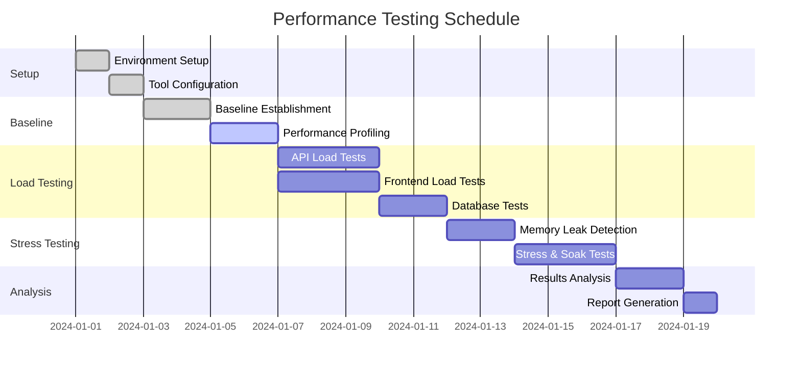

# Adelaide Weather Forecasting System - Performance Test Plan

## Executive Summary

This document outlines the comprehensive performance testing strategy for the Adelaide Weather Forecasting System, designed to ensure optimal performance under all operational conditions while maintaining strict quality gates for production deployment.

### Performance Objectives

- **API Response Times**: < 500ms (P95), < 1000ms (P99)
- **Frontend Core Web Vitals**: FCP < 1.5s, LCP < 2.5s, FID < 100ms, CLS < 0.1
- **Database Query Performance**: < 300ms for complex aggregations
- **FAISS Search Performance**: < 1ms (P95) for similarity searches
- **Memory Efficiency**: < 1GB heap, no memory leaks detected
- **Cache Performance**: > 60% hit rate

## Test Scope & Strategy

### 1. Frontend Performance Testing

#### 1.1 Core Web Vitals Monitoring
- **First Contentful Paint (FCP)**: < 1.5s
- **Largest Contentful Paint (LCP)**: < 2.5s  
- **First Input Delay (FID)**: < 100ms
- **Cumulative Layout Shift (CLS)**: < 0.1
- **Time to Interactive (TTI)**: < 3.5s

#### 1.2 Lighthouse CI Integration
- Automated audits on every deployment
- Performance budgets enforced
- Accessibility and SEO compliance
- Mobile and desktop testing scenarios

#### 1.3 Real User Monitoring (RUM)
- Browser-based performance collection
- Core Web Vitals tracking
- Error rate monitoring
- Geographic performance variations

### 2. API Performance Testing

#### 2.1 Load Testing Scenarios

**Normal Operation**
- Duration: 2 hours
- Concurrent Users: 50
- Request Pattern: Realistic weather forecast queries
- Target: < 500ms response time (P95)

**Peak Weather Events**
- Duration: 30 minutes
- Concurrent Users: 200
- Request Pattern: High-frequency forecast requests
- Target: Maintain performance under stress

**Stress Testing**
- Duration: 10 minutes
- Concurrent Users: 500
- Objective: Identify failure points and graceful degradation

**Soak Testing**
- Duration: 24 hours
- Concurrent Users: 25
- Objective: Memory leak detection and stability validation

#### 2.2 API Endpoint Coverage
- `/forecast` - Primary forecasting endpoint (all horizons)
- `/health` - System health monitoring
- `/performance` - Performance metrics collection
- `/metrics` - Prometheus metrics endpoint

### 3. Database Performance Testing

#### 3.1 Query Performance Categories
- **Simple Queries**: Metadata retrieval (< 50ms P95)
- **Complex Queries**: Multi-variable forecasts (< 200ms P95)
- **Aggregation Queries**: Statistical computations (< 300ms P95)

#### 3.2 TimescaleDB Optimization
- Hypertable performance validation
- Index effectiveness measurement
- Query plan analysis
- Connection pool efficiency

### 4. FAISS Performance Testing

#### 4.1 Similarity Search Performance
- **6h, 12h, 24h, 48h horizon searches**
- **Target**: < 1ms response time (P95)
- **Analog Quality**: Minimum 10 relevant analogs returned
- **Index Load Time**: < 1s for index initialization

#### 4.2 Search Complexity Scenarios
- Single variable searches (t2m)
- Multi-variable searches (t2m, u10, v10, z500)
- Complex meteorological searches (all variables + CAPE)

### 5. Memory & Resource Testing

#### 5.1 Memory Leak Detection
- Long-running session monitoring (24+ hours)
- Memory growth pattern analysis
- Garbage collection efficiency
- Resource cleanup validation

#### 5.2 Resource Utilization
- CPU usage under load
- Memory allocation patterns
- Network bandwidth optimization
- Disk I/O performance

## Test Implementation

### Infrastructure Requirements

```yaml
Test Environment:
  CPU: 4+ cores
  Memory: 8GB+ RAM
  Storage: SSD recommended
  Network: Stable internet connection
  
Docker Resources:
  API Container: 2GB memory limit
  Frontend Container: 1GB memory limit
  Database Container: 4GB memory limit
```

### Performance Testing Tools

#### Frontend Testing Stack
- **Lighthouse CI**: Core Web Vitals and performance audits
- **Playwright**: Browser automation for load testing
- **Web Vitals Library**: Real-time metric collection
- **Chrome DevTools**: Detailed performance profiling

#### API Testing Stack
- **Artillery.js**: Load testing and scenario simulation
- **Axios**: HTTP request performance measurement
- **Node.js Performance Hooks**: Precise timing measurement
- **Custom Collectors**: Specialized metric gathering

#### Monitoring & Analysis
- **Prometheus**: Metrics collection and storage
- **Grafana**: Real-time performance dashboards
- **Custom Reporters**: Detailed analysis and reporting

### Test Execution Schedule



## Performance Targets & SLAs

### Tier 1 - Critical Performance Metrics

| Metric | Target | Measurement | Frequency |
|--------|--------|-------------|-----------|
| API Response Time (P95) | < 500ms | Artillery.js | Continuous |
| Frontend FCP | < 1.5s | Lighthouse CI | Per deployment |
| Frontend LCP | < 2.5s | Lighthouse CI | Per deployment |
| Database Query Time (P95) | < 200ms | Custom monitoring | Continuous |
| FAISS Search Time (P95) | < 1ms | Embedded measurement | Continuous |
| Memory Usage | < 1GB heap | Process monitoring | Continuous |
| Error Rate | < 1% | Request tracking | Continuous |

### Tier 2 - Quality Metrics

| Metric | Target | Measurement | Frequency |
|--------|--------|-------------|-----------|
| Cache Hit Rate | > 60% | Performance endpoint | Hourly |
| Frontend TTI | < 3.5s | Lighthouse CI | Per deployment |
| Frontend CLS | < 0.1 | Lighthouse CI | Per deployment |
| Throughput | > 50 req/s | Load testing | Daily |
| Memory Leak Detection | No leaks | Long-running tests | Weekly |

## Test Automation & CI/CD Integration

### Continuous Integration Pipeline

```yaml
Performance Gates:
  - Unit Performance Tests (< 2 minutes)
  - API Response Time Validation (< 5 minutes)
  - Frontend Bundle Size Check (< 1 minute)
  - Lighthouse CI Audit (< 3 minutes)
  
Nightly Performance Suite:
  - Full load testing scenarios
  - Memory leak detection
  - Database performance validation
  - Regression analysis
  
Weekly Comprehensive Testing:
  - 24-hour soak tests
  - Stress testing to failure
  - Performance trend analysis
  - Baseline updates
```

### GitHub Actions Workflow

```yaml
name: Performance Testing
on:
  push:
    branches: [main, develop]
  pull_request:
    branches: [main]
  schedule:
    - cron: '0 2 * * *'  # Nightly at 2 AM

jobs:
  performance-gates:
    runs-on: ubuntu-latest
    steps:
      - uses: actions/checkout@v3
      - name: Setup Node.js
        uses: actions/setup-node@v3
        with:
          node-version: '18'
      
      - name: Install dependencies
        run: npm install
        
      - name: Start services
        run: docker-compose up -d
        
      - name: Wait for services
        run: ./tests/performance/scripts/wait-for-services.sh
        
      - name: Run performance benchmarks
        run: npm run test:performance:benchmarks
        
      - name: Run Lighthouse CI
        run: npm run test:performance:lighthouse
        
      - name: Frontend load testing
        run: npm run test:performance:frontend
        
      - name: Analyze results
        run: npm run test:performance:analyze
        
      - name: Upload results
        uses: actions/upload-artifact@v3
        with:
          name: performance-results
          path: tests/performance/reports/
```

## Monitoring & Alerting

### Real-time Performance Monitoring

```yaml
Prometheus Metrics:
  - http_request_duration_seconds
  - memory_usage_bytes
  - cache_hit_rate
  - database_query_duration_seconds
  - faiss_search_duration_seconds
  
Grafana Dashboards:
  - API Performance Overview
  - Frontend Core Web Vitals
  - Database Performance
  - Memory & Resource Usage
  - Cache Efficiency
  
Alert Rules:
  - API P95 > 500ms (Warning)
  - API P95 > 1000ms (Critical)
  - Memory usage > 80% (Warning)
  - Memory usage > 90% (Critical)
  - Error rate > 1% (Warning)
  - Error rate > 5% (Critical)
```

### Performance Regression Detection

- **Baseline Comparison**: Automatic comparison with established baselines
- **Trend Analysis**: Statistical analysis of performance trends
- **Anomaly Detection**: Machine learning-based anomaly identification
- **Alert Integration**: Slack/email notifications for regressions

## Load Testing Scenarios

### Scenario 1: Normal Business Operations
```yaml
Name: Normal Operations
Duration: 2 hours
Users: 50 concurrent
Pattern: Realistic usage (40% basic forecasts, 30% complex, 20% health checks, 10% metrics)
Success Criteria:
  - P95 response time < 500ms
  - Error rate < 1%
  - Cache hit rate > 60%
```

### Scenario 2: Peak Weather Events
```yaml
Name: Peak Weather Event
Duration: 30 minutes
Users: 200 concurrent
Pattern: High-frequency forecast requests (80% forecast, 20% other)
Success Criteria:
  - P95 response time < 750ms
  - Error rate < 2%
  - System stability maintained
```

### Scenario 3: Stress Testing
```yaml
Name: Stress Test
Duration: 10 minutes
Users: 500 concurrent
Pattern: Maximum load until failure
Success Criteria:
  - Graceful degradation
  - Error messages instead of crashes
  - Recovery within 60 seconds
```

### Scenario 4: Soak Testing
```yaml
Name: Soak Test
Duration: 24 hours
Users: 25 concurrent
Pattern: Continuous moderate load
Success Criteria:
  - No memory leaks detected
  - Performance stability maintained
  - No resource exhaustion
```

## Data Collection & Analysis

### Key Performance Indicators (KPIs)

1. **Response Time Distribution**
   - Average, median, P95, P99 response times
   - Trend analysis over time
   - Comparison with SLA targets

2. **Throughput Metrics**
   - Requests per second
   - Concurrent user capacity
   - Peak load handling

3. **Error Analysis**
   - Error rate percentages
   - Error type categorization
   - Recovery time analysis

4. **Resource Utilization**
   - CPU usage patterns
   - Memory consumption trends
   - Network bandwidth utilization

5. **Cache Performance**
   - Hit/miss ratios
   - Cache effectiveness
   - Memory usage optimization

### Reporting & Documentation

#### Automated Reports
- Daily performance summaries
- Weekly trend analysis
- Monthly comprehensive reports
- Regression detection alerts

#### Manual Analysis
- Performance bottleneck identification
- Optimization recommendations
- Capacity planning insights
- Architecture improvement suggestions

## Risk Assessment & Mitigation

### Performance Risks

| Risk | Impact | Probability | Mitigation Strategy |
|------|--------|-------------|-------------------|
| API response time degradation | High | Medium | Continuous monitoring, caching optimization |
| Memory leaks in long-running processes | High | Low | Regular leak detection, automated restarts |
| Database query performance degradation | Medium | Medium | Query optimization, index monitoring |
| Frontend bundle size growth | Medium | High | Bundle size monitoring, code splitting |
| Cache inefficiency | Medium | Low | Cache hit rate monitoring, TTL optimization |

### Contingency Plans

1. **Performance Degradation Response**
   - Automatic scaling triggers
   - Cache warm-up procedures
   - Database connection pool adjustments

2. **Load Spike Handling**
   - Circuit breaker patterns
   - Rate limiting activation
   - Graceful degradation modes

3. **Resource Exhaustion**
   - Automatic garbage collection
   - Process restart procedures
   - Load balancer failover

## Success Criteria

### Performance Test Success

A performance test suite run is considered successful when:

1. **All Tier 1 metrics meet targets** (100% compliance required)
2. **At least 90% of Tier 2 metrics meet targets**
3. **No critical performance regressions detected**
4. **Memory leak tests pass** (< 50MB growth over 24 hours)
5. **Error rates remain below 1%** across all test scenarios

### Production Readiness

The system is considered production-ready when:

1. **Three consecutive successful performance test runs**
2. **24-hour soak test passes without issues**
3. **Stress test demonstrates graceful degradation**
4. **All monitoring and alerting systems operational**
5. **Performance documentation complete and reviewed**

## Maintenance & Updates

### Regular Maintenance Tasks

- **Weekly**: Baseline validation and updates
- **Monthly**: Performance trend analysis
- **Quarterly**: Comprehensive performance review
- **Annually**: Performance testing strategy review

### Continuous Improvement

- Performance optimization based on test results
- Test scenario refinement based on production patterns
- Tool and methodology updates
- Team training and knowledge sharing

---

*This performance test plan is a living document that will be updated based on system evolution, performance insights, and operational experience.*